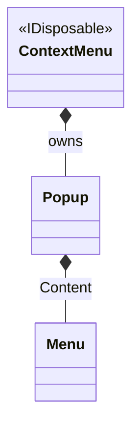

# ContextMenu

## Overview

`ContextMenu` shows a vertical menu at any cell position you choose and closes
through light dismiss when the user interacts outside of it. Attach one to a
control through `ControlBase.ContextMenu` so it opens on right-click, or open it
yourself at an explicit position with `Show`. Build the menu with `MenuItem`
objects directly, or compose one with `MenuBuilder` and hand it to the
`ContextMenu(Menu)` constructor.

## Inheritance

`ContextMenu` is not a `ControlBase`. It is a standalone coordinator that
implements `IDisposable` and privately owns a `Popup`, which in turn hosts the
managed `Menu` as its `Content`:



## API

| Member                         | Type                  | Default        | Description                                                                                                                                                                          |
| ------------------------------ | --------------------- | -------------- | ------------------------------------------------------------------------------------------------------------------------------------------------------------------------------------ |
| `ContextMenu()`                | —                     | —              | Initializes a closed context menu with its own empty vertical menu.                                                                                                                  |
| `ContextMenu(Menu menu)`       | —                     | —              | Initializes a closed context menu that adopts an already-built menu. Throws `ArgumentNullException` for a null menu and `ArgumentException` when the menu already belongs to a tree. |
| `Items`                        | `MenuEntryCollection` | Empty          | The typed collection of menu entries the menu manages.                                                                                                                               |
| `IsOpen`                       | `bool`                | `false`        | Reports the committed popup visibility. Read-only.                                                                                                                                   |
| `PopupChrome`                  | `PopupChrome`         | Theme-owned    | Gets or sets the owned popup's border and shadow together.                                                                                                                           |
| `Show(int row, int col)`       | `void`                | —              | Opens the menu at a zero-based root-cell position; a no-op until the menu is assigned to some `ControlBase.ContextMenu`.                                                             |
| `Close()`                      | `void`                | —              | Closes the menu and clears its fixed origin; safe to call again.                                                                                                                     |
| `ResetPopupChrome()`           | `void`                | —              | Returns the owned popup's border and shadow to `PopupChrome` ownership.                                                                                                              |
| `Opening`, `Closing`, `Closed` | `EventHandler`        | No subscribers | Lifecycle notifications raised in order around visibility changes.                                                                                                                   |

## Ownership

Assigning a menu to `ControlBase.ContextMenu` gives that control ownership of
the menu's retained popup presentation, an internal implementation detail not
exposed on the public API. Only one control can own a menu at a time: assigning
the same `ContextMenu` instance to a second control throws `ArgumentException`,
and the second control keeps whatever context menu it already had.

## Example


```csharp
var contextMenu = new ContextMenu();
```

```csharp
var contextMenu = new ContextMenu(
    MenuBuilder.Vertical()
        .Item("&Inspect")
        .Item("&Run", shortcut: "F5")
        .Build());
```

## Expected behavior

| Scope               | Observable evidence                                                       |
| ------------------- | ------------------------------------------------------------------------- |
| Public API          | Validation, defaults, state changes, and deterministic output.            |
| Integrated behavior | Cross-component behavior through the real ownership and routing boundary. |

- The menu owns its items, `Show` interprets its arguments as zero-based
  root-cell coordinates, calling `Show` while the menu is unattached does
  nothing, and detaching or replacing it from `Opening` supersedes that show
  request even if the same menu is reattached before the callback returns.
  `Opening`, `Closing`, and `Closed` fire in order, `Close` is idempotent, and
  disposing the menu cleans it up.
- The open surface is placed relative to the root, clips to it, renders with
  menu appearance, and draws elevated above ordinary content.
- Right-click opens the menu on its owning control, keyboard navigation works
  within it, invoking an item closes it, and a press outside dismisses it
  through light dismiss.
