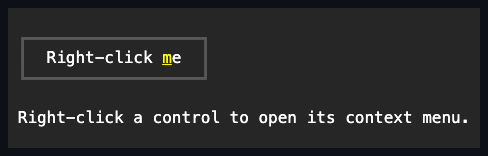

# ContextMenu

## ContextMenu contract

`ContextMenu` displays a vertical menu at an arbitrary cell position with light
dismiss.

## API

| Member                         | Default          | Contract                                                   |
| ------------------------------ | ---------------- | ---------------------------------------------------------- |
| `Items`                        | empty            | Typed managed menu entries.                                |
| `IsOpen`                       | `false`          | Read-only committed popup visibility.                      |
| `Presentation`                 | retained `Popup` | Presentation control used by the owning screen.            |
| `Opening`, `Closing`, `Closed` | no subscribers   | Ordered lifecycle notifications around visibility changes. |
| `Show(int row, int col)`       | —                | Opens at a zero-based root-cell position when attached.    |
| `Close()`                      | —                | Idempotently closes and clears the fixed origin.           |

## Ownership

Assigning a menu to `Control.ContextMenu` gives that control ownership of the menu's
presentation. A menu's presentation may be owned by only one control at a time; assigning
the same `IContextMenu` instance to a second control throws `ArgumentException` and leaves
the second control's existing context menu (if any) unchanged.

## Example



```csharp
var contextMenu = new ContextMenu();
```

## Expected behavior

| Layer       | Required evidence                                                                            |
| ----------- | -------------------------------------------------------------------------------------------- |
| Unit        | Item ownership, unattached no-op, coordinates, event order, close idempotence, and disposal. |
| Surface     | Root-relative placement, clipping, menu appearance, and elevated rendering.                  |
| Integration | Right-click opening, keyboard navigation, invocation close, and outside light dismiss.       |
