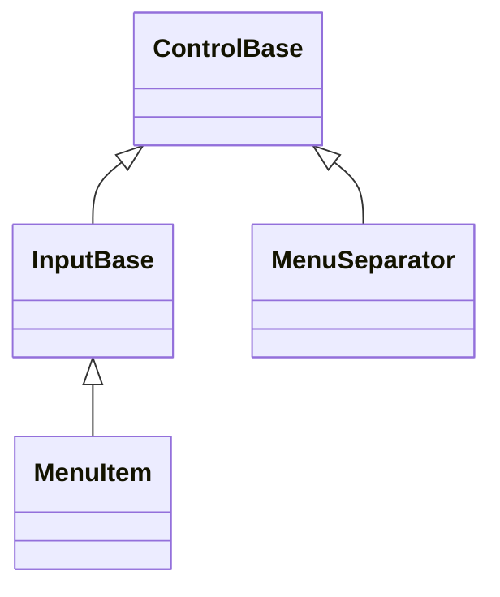
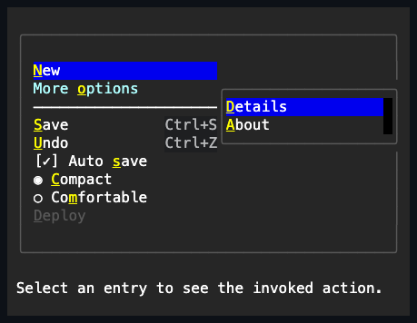

# MenuItem and MenuSeparator

## Overview

`MenuItem` is a sealed [`InputBase`](../input-base.md#overview) that represents
a command, check, or radio entry inside a [Menu](menu.md#overview). Its label
comes from the inherited `Text` property, which is the item's only caption
surface.

`MenuSeparator` is a distinct, unrelated, non-interactive entry role documented
alongside it, since both types populate the same `Menu.Items` collection.

## Inheritance



## API

| Member                       | Type                                     | Default                | Description                                                                                 |
| ---------------------------- | ---------------------------------------- | ---------------------- | ------------------------------------------------------------------------------------------- |
| Inherited `Text`             | `string`                                 | `""`                   | The item's label.                                                                           |
| `Kind`                       | `MenuItemKind`                           | `MenuItemKind.Command` | Chooses command, check, or radio activation semantics.                                      |
| `IsChecked`                  | `bool`                                   | `false`                | Holds the check state for the check and radio kinds.                                        |
| `GroupName`                  | `string?`                                | `null`                 | Scopes radio exclusivity within the containing menu.                                        |
| `StartAffix`                 | `Affix?`                                 | `null`                 | Optional leading edge-pinned decoration, inboard of the check/radio marker.                 |
| `EndAffix`                   | `Affix?`                                 | `null`                 | Optional trailing edge-pinned decoration, between the caption and the shortcut column.      |
| `ShortcutText`               | `string?`                                | `null`                 | Shows a dim, right-aligned hint; registers no key binding.                                  |
| `Shortcut`                   | `KeyGesture?`                            | `null`                 | A typed key chord that both derives `ShortcutText` and activates the item application-wide. |
| `Submenu`                    | `Menu?`                                  | `null`                 | An optional popup-layer child menu the item owns.                                           |
| `SubmenuChrome`              | `PopupChrome`                            | Theme-owned            | Gets or sets the submenu's owned popup border and shadow together.                          |
| `Style`                      | `MenuItemStyle?`                         | `null`                 | Gets or sets the complete local presentation, including the check and radio marker glyphs.  |
| `ActualStyle`                | `MenuItemStyle`                          | Resolved               | Read-only; the complete local, theme-owned, or code-owned presentation.                     |
| Inherited `Command`          | `ICommand?`                              | `null`                 | Runs after `Invoked`, when bound and `CanExecute` allows it.                                |
| Inherited `CommandParameter` | `object?`                                | `null`                 | The borrowed parameter passed to `Command` queries and execution.                           |
| `PerformInvoke()`            | `void`                                   | —                      | Invokes the item programmatically.                                                          |
| `ResetSubmenuChrome()`       | `void`                                   | —                      | Returns the submenu popup's border and shadow to `PopupChrome` ownership.                   |
| `Invoked`                    | `EventHandler<MenuItemInvokedEventArgs>` | No subscribers         | Raised after activation commits, once any check state has updated.                          |

## Behavior

- `Kind` is one of command, check, or radio.
- `IsChecked` applies only to the check and radio kinds. `GroupName` scopes
  radio selection within the containing menu.
- `Invoked` reports the committed activation after any check or radio state
  update. The bound `Command`, if any and if `CanExecute` allows it, runs after
  `Invoked` and after the menu's own `ItemInvoked` notification. An item with an
  open submenu never reaches this: activating it toggles the submenu instead,
  and no `Invoked` or `Command` fires. Every invocation event reports one
  defined keyboard, pointer, or programmatic activation cause.

A check or radio entry reserves one cell for its selection glyph plus one
separator cell in front of the caption. The caption is measured against the
remaining constraint and arranged through the common inherited caption slot, so
state changes do not move it, and a collapsed caption contributes no margin.
When a radio selection changes, every matching item's fields are staged before
the first `PropertyChanged(IsChecked)` callback runs, and a reentrant selection
suppresses the stale outer notifications.

Menu items stretch horizontally by default. In a vertical menu every item
therefore fills the shared menu width, which lets content, shortcut hints, and
separators line up as one aligned surface. An explicit alignment set by the
caller still wins.

An item's own `Invoked` subscribers finish before the menu forwards
`Menu.ItemInvoked`. Both callbacks observe the committed check or radio state.

## Style-resolved glyphs

Check and radio markers, and the separator's own rule glyph, resolve from
`ActualStyle` rather than from a per-property override on the control. Neither
`MenuItem` nor `MenuSeparator` exposes an individual glyph property or a
`Reset*Glyph` method: `MenuItemStyle` carries the complete immutable
`UncheckedGlyph`, `CheckedGlyph`, `RadioUncheckedGlyph`, and `RadioCheckedGlyph`
set, and `MenuSeparatorStyle` carries `Glyph`. When no local `Style` is
assigned, `ActualStyle` resolves the active theme's markers, falling back to the
library's code-owned defaults.

> [!NOTE]
>
> To override a marker, assign a complete local `Style` — for example
> `item.Style = item.ActualStyle with { CheckedGlyph = new Rune('✓') }` — rather
> than looking for a single-glyph property. Assigning `Style = null` returns the
> item to theme or code-owned ownership; there is no separate reset method for
> an individual marker.

## Affixes

`StartAffix` and `EndAffix` are optional per-instance
[affixes](../../concepts/styling.md#instance-content-affix), the same reserved
edge-pinned decoration [`Button`](../input/button.md#overview) exposes. A row's
complete leading-to-trailing layout is the check/radio marker, then
`StartAffix`, then the caption, then `EndAffix`, then the shortcut column:

```csharp
new MenuItem
{
    Text = "Wi-Fi",
    StartAffix = new Affix("📶"),
    ShortcutText = "Alt+W",
};
```

The gap between a present affix and the caption comes from `MenuItemStyle`'s own
`AffixGap` member - mirroring `InputStyle.AffixGap`'s shape and one-cell
code-owned default, since `MenuItemStyle` derives from `ControlStyle` directly
rather than from `InputStyle`. When the row is too narrow for everything, the
caption shrinks first, then `EndAffix` drops whole, then `StartAffix` - never a
partial cluster - re-evaluated against the item's actual bounds on every render,
exactly like Button's own affix priority. A same-width content or color swap on
either property repaints without remeasuring.

A vertical menu additionally negotiates one shared `StartAffix` column across
every owned row - see [Menu's own width rules](menu.md#behavior) - so a row
without its own `StartAffix` still leaves its caption aligned with a sibling row
that has one; the shared column simply stays blank for that row. `EndAffix` is
never part of that negotiation and always reserves only its own row's local
width, immediately before the shortcut column.

## Shortcut text

`ShortcutText` is an optional string drawn right-aligned in dim attributes after
the item's content. It only describes a command chord; it does not bind one, so
handling the shortcut remains the application's responsibility. This is
different from an ampersand [access key](../../concepts/access-keys.md#overview)
in the item's `Text` content, which SharpVision binds automatically.

```csharp
new MenuItem
{
    Text = "Save",
    ShortcutText = "Ctrl+S",
};
```

When `ShortcutText` is set, the item's desired width grows by the shortcut's
Unicode terminal-cell width plus a two-cell gutter. A vertical menu reserves one
shared width made of its widest label, that gutter, and its widest shortcut. The
shortcut text draws at the trailing edge of the item's arranged bounds using the
resolved style with `TerminalAttributes.Dim` added, and content clips before the
gutter. Every stretched sibling therefore shares one shortcut edge, and a longer
label-only row cannot collapse the shortcut column. Setting `ShortcutText` to
null removes the hint.

`Shortcut` is an optional typed `SharpVision.Input.KeyGesture` — a validated
`Code`/`Modifiers`/character combination. When `ShortcutText` is not otherwise
set, `Shortcut` supplies its conventional display text; for example,
`new KeyGesture(Code.Character, Modifiers.Control, new Rune('s'))` displays as
`"Ctrl+S"`. An explicit `ShortcutText` assignment always wins over the derived
text, following the same local-wins-over-derived precedence used throughout the
library.

## Shortcut dispatch

Unlike `ShortcutText`, `Shortcut` is bound: a matching keyboard transition
invokes the item directly, application-wide, independent of which control
currently has focus. Dispatch is a stateless tree walk over every attached
`MenuItem`, modeled on
[access-key discovery](../../concepts/access-keys.md#overview) rather than a
registration table, so there is nothing to keep in sync as items are added,
removed, disposed, reparented, or as a submenu opens and closes.

- **Reachability does not require visibility.** An item inside a currently
  closed submenu still matches its shortcut and invokes without opening the
  submenu, because a closed submenu's content stays attached — only an enabled,
  attached item is required.
- **Dispatch runs before routed key handling.** A shortcut match short-circuits
  the key entirely: it is never routed to the focused control, so a chord bound
  as a shortcut is never also typed or otherwise handled by whatever currently
  has focus.
- **Duplicate gestures cycle from the current focus**, exactly like duplicate
  access keys: repeated presses advance from whichever match currently contains
  focus to the next one in tree order, wrapping around.
- **Only `KeyAction.Press` activates a shortcut.** Held-key repeats never
  re-invoke it.
- **Modal scopes narrow the search** to items reachable from the active modal
  plane, the same as access keys.

```csharp
var save = new MenuItem
{
    Text = "Save",
    Shortcut = new KeyGesture(Code.Character, Modifiers.Control, new Rune('s')),
};
save.Invoked += (_, _) => SaveDocument();
```

## Submenus

`Submenu` gives the item one retained popup that it owns. Activating the item
toggles the submenu, and an armed owning menu may also open it while moving
selection. The popup uses a light square frame and the semantic surface
background so it reads as part of the menu system. It prefers to open below the
item in a horizontal menu and to the right of the item in a vertical menu.
Generic popup fallback, promotion, light dismissal, and ancestor-chain
preservation are unchanged. Closing the submenu restores focus to the owning
menu. Every retained popup and nested Menu participates as a descendant of the
top owner's [single menu plane](../../concepts/modality.md#menu-planes), so
opening a nested item never creates one modal scope per submenu.

## MenuSeparator

`MenuSeparator : ControlBase, IStyled<MenuSeparatorStyle>` is a distinct
non-interactive entry role. It is never an `InputBase` and never a
`MenuItemKind`: it cannot be focused, hit-tested, selected, or invoked. It
measures three cells by one cell, stretches horizontally by default, and draws a
clipped horizontal rule across the complete arranged menu width.

| Member        | Type                  | Default  | Description                                                             |
| ------------- | --------------------- | -------- | ----------------------------------------------------------------------- |
| `Style`       | `MenuSeparatorStyle?` | `null`   | Gets or sets the complete local presentation, including the rule glyph. |
| `ActualStyle` | `MenuSeparatorStyle`  | Resolved | Read-only; the complete local, theme-owned, or code-owned presentation. |

`MenuEntryCollection` exposes typed `Add` and `Remove` overloads for `MenuItem`
and `MenuSeparator`; it has no arbitrary `Add(Control)` entry point.

## Example



```csharp
menu.Items.Add(new MenuItem { Text = "Open" });
menu.Items.Add(new MenuSeparator());
menu.Items.Add(new MenuItem
{
    Text = "Auto save",
    Kind = MenuItemKind.Check,
});
```

## Expected behavior

| Scope               | Observable evidence                                                       |
| ------------------- | ------------------------------------------------------------------------- |
| Public API          | Validation, defaults, state changes, and deterministic output.            |
| Integrated behavior | Cross-component behavior through the real ownership and routing boundary. |

- Each item kind follows its documented activation semantics, and assigning a
  checked state that is invalid for the current kind is rejected.
- Radio observers see atomically staged group state, and an item's `Invoked`
  subscribers always complete before `Menu.ItemInvoked` is forwarded.
- The item owns its inherited caption, lays out Unicode captions correctly, and
  measures Unicode shortcut text by terminal-cell width, aligning it to the
  trailing edge.
- `StartAffix` and `EndAffix` reserve their own columns beside the caption, a
  standalone item outside any `Menu` measures them correctly on its own, and a
  same-width content or color swap repaints without remeasuring.
- Keyboard and pointer activation and hover styling behave as described above,
  and shared-width layout holds, including clipping in narrow menus.
- Submenus open in their documented placement, follow the popup lifecycle,
  restore focus to the owning menu on close, and share one scope through nested
  chains.
- A `Shortcut` invokes its item application-wide, including inside a closed
  submenu, before routed key handling ever reaches the focused control, and
  duplicate gestures cycle from the current focus like access keys.
- Separators never focus, hit test, or invoke.
- Styles resolve as documented, and rendering is deterministic down to the exact
  cells.
