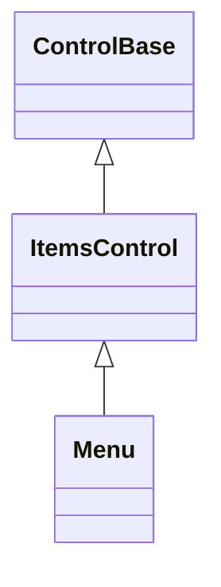
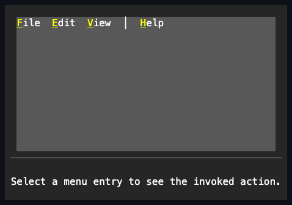
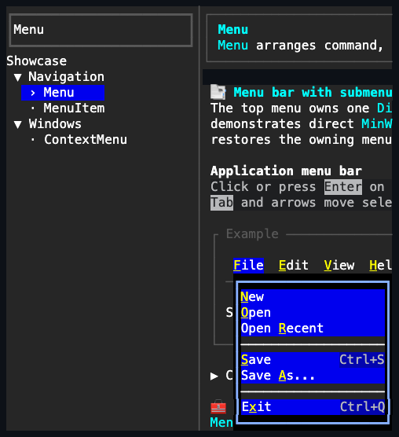

# Menu

## Overview

`Menu` holds a constrained mixture of
[`MenuItem` and `MenuSeparator`](menu-item.md#overview) controls and coordinates
their layout, selected visual state, keyboard navigation, check/radio
activation, and menu-level invocation notifications.

## Inheritance



## API

| Member          | Type                                     | Default            | Description                                                                  |
| --------------- | ---------------------------------------- | ------------------ | ---------------------------------------------------------------------------- |
| `Items`         | `MenuEntryCollection`                    | Empty              | Holds only `MenuItem` and `MenuSeparator` values.                            |
| `Orientation`   | `Orientation`                            | `Horizontal`       | Chooses menu-bar or vertical-flyout geometry and arrow behavior.             |
| `Spacing`       | `int`                                    | `0`                | Non-negative cells inserted between semantic entries.                        |
| `MinWidth`      | `Length`                                 | `Length.Cells(10)` | Inherited; this control's own default minimum Menu border-box width.         |
| `MaxWidth`      | `Length?`                                | `null`             | Inherited; unchanged unbounded maximum Menu border-box width.                |
| `SelectedIndex` | `int`                                    | `-1`               | Tracks the active non-separator navigation cursor.                           |
| `SelectedItem`  | `MenuItem?`                              | `null`             | Gets or selects the active non-separator item; derived from `SelectedIndex`. |
| `ItemInvoked`   | `EventHandler<MenuItemInvokedEventArgs>` | No subscribers     | Reports an item after its own `Invoked` subscribers complete.                |

## Keyboard

| Key                 | Behavior                                                                    |
| ------------------- | --------------------------------------------------------------------------- |
| Left / Right        | Moves through a horizontal menu, wrapping and skipping unavailable entries. |
| Up / Down           | Moves through a vertical menu, wrapping and skipping unavailable entries.   |
| Tab / Shift+Tab     | Moves to the next or previous menu item regardless of orientation.          |
| Home / End          | Selects the first or last available entry without wrapping.                 |
| Enter               | Activates the selected item.                                                |
| Space               | Activates the selected item on key release.                                 |
| Escape              | Closes the active menu chain.                                               |
| Alt+item access key | Selects and activates the matching item.                                    |

## Behavior

- `Items : MenuEntryCollection` can be inspected as an `IReadOnlyList<Control>`
  and offers typed `Add`/`Insert` overloads for `MenuItem` and `MenuSeparator`,
  along with `Remove` overloads, `RemoveAt`, `Move`, `IndexOf`, `Clear`, and a
  settable indexer. Arbitrary controls cannot enter through the semantic
  collection, and the indexer rejects a replacement that is neither type.
  Inserting, removing, replacing, or moving an entry keeps the identity of an
  already-selected entry: `SelectedIndex` shifts silently when the change does
  not affect it. `Move` is an in-place identity reorder and does not detach,
  reparent, blur, or reattach the entry.
- `Orientation` and `Spacing` control horizontal or vertical geometry. `Spacing`
  defaults to zero, so vertical flyout entries occupy adjacent rows; horizontal
  bars can opt into additional separation.
- The inherited `MinWidth` defaults to `Length.Cells(10)`, while `MaxWidth`
  keeps its unbounded null default. Both constrain the Menu border box through
  the ordinary [layout contract](../../concepts/layout.md#lengths). Set
  `MinWidth = Length.Cells(0)` if you want label-tight sizing. A retained
  submenu Popup adds its one-cell frame outside both horizontal Menu edges, so
  the default produces a 12-cell framed surface when space permits. A smaller
  root clamps the complete framed surface without drawing outside the viewport.
- `SelectedIndex` tracks the active `MenuItem` navigation cursor. Setting `-1`
  clears it, and a separator index is rejected. The cursor paints with selection
  colors only while focus remains within the menu or one of its retained
  submenus.
- `ItemInvoked` reports the item and the activation cause after the item's own
  `Invoked` subscribers complete.

## Interaction

Arrow keys follow `Orientation`, while Tab and Shift+Tab move forward and
backward regardless of orientation; Caps Lock and Num Lock are incidental, while
Shift and application-command-modified arrows and command-modified Tab remain
unhandled. All navigation keys repeat while held. Navigation wraps, skips
separators and unavailable items, updates `SelectedIndex`, and keeps focus on
the menu. Enter, or a Space press completed on the menu, activates the selected
private item with a keyboard cause, once per key hold and only with
activation-eligible modifiers. A primary pointer click invokes through the
shared [press-activation](../pressable.md#overview) contract.

An ampersand
[access key](../../concepts/access-keys.md#focus-and-semantic-actions) on an
item selects and focuses its owning menu, then uses the same activation path to
open a submenu or invoke a command. A top-level Alt mnemonic therefore arms the
same modal menu plane as Enter or pointer activation.

Moving the pointer over an available item selects it and changes the row
foreground without replacing the containing menu background. Physical hover
styling is independent of the focus-scoped selected appearance, so an unfocused,
inactive menu does not paint its retained navigation cursor. Hover does not open
a dormant menu. Once one sibling submenu is open, moving or keyboard-navigating
to another item closes the previous sibling and opens the new item's submenu.
Moving to an item without a submenu closes the previous submenu without invoking
the command.

Selection callbacks may synchronously mutate or detach the menu. A pending
submenu transition retains the selected item's identity and continues only if
that same item remains selected under the same attached menu session. Moving
that item is safe because the transition does not reuse its original numeric
index. Removing or replacing it, clearing the collection, selecting a different
item during reorder, or detaching from either selection notification cancels the
stale transition; it never indexes replacement state or opens another item.

Opening the first submenu arms one top-menu-rooted
[modal plane](../../concepts/modality.md#menu-planes) with
`OutsideInteraction.Dismiss`. Sibling switches, command rows, retained popup
surfaces, and arbitrarily deep submenus reuse that exact scope. Escape closes
the deepest branch before ending the root session; invoking a leaf item or
dismissing from outside closes the complete chain. A top menu inside a modal
Window becomes a temporary younger scope and restores the Window plane when it
closes.

A horizontal menu opens item submenus below the anchor. A vertical menu opens
nested submenus to the right. Popup edge fallback may flip those preferred
directions to keep the framed surface inside the terminal. Closing a submenu
restores focus to its owning menu before hiding the submenu content.

Vertical menu width comes from independent label and shortcut measurements: the
widest label plus a two-cell gutter plus the widest shortcut, clamped by the
inherited `MinWidth` and `MaxWidth`. Shortcut text is right-aligned to the
shared trailing edge, and label content cannot draw into the gutter. Changing
either width constraint while attached invalidates measure, and an open retained
submenu is remeasured and reframed on the next layout pass.

A vertical menu also negotiates one shared leading
[`StartAffix`](menu-item.md#affixes) column across every owned row: the widest
`StartAffix` reservation among owned items becomes every row's leading inset, so
a row without its own `StartAffix` still leaves its caption aligned with a
sibling that has one, instead of starting flush at its own empty column.
`EndAffix` is never negotiated this way and stays purely per-item, matching how
only the shortcut column, not a general trailing column, is shared. A horizontal
menu applies no shared column at all; each item reserves only its own local
affixes.

### Keyboard navigation

The menu sets
[`TabNavigation.None`](../../concepts/focus.md#hierarchical-tab-navigation) and
acts as one focus stop. Its private `MenuItem` faces never enter global
traversal; the menu handles Tab and Shift+Tab before the global focus default
and uses them to update selection. Separators and unavailable items are skipped.
Each retained row has an ownership-generation property lease: the menu imposes
one-cell height and, for items, excludes the row from focus and tab traversal.
Caller requests made while those values are imposed become the latest authored
values and are restored only after ordinary detachment. Disposal retires the
lease without writing back onto the disposing row.

```text
  Menu focus ──► MenuItem "File"       (selected private face)
                 MenuItem "Edit"
                 MenuSeparator         (skipped)
                 MenuItem "Help"
                       ▲
                       │ Tab/Shift+Tab: next/previous
                       │ Arrow keys: follow Orientation
```

Selecting a radio item stages every matching sibling's checked field before the
first property callback runs. Changed properties publish in item order. A
reentrant selection invalidates the older versions and suppresses their
remaining stale notifications; the first callback failure is rethrown only after
the current publication has been attempted. Disposal, removal, or group changes
during an earlier item callback likewise suppress publication through later
staged items that are no longer live members of this menu radio group.

## Example





```csharp
var menu = new Menu
{
    Orientation = Orientation.Vertical,
    MinWidth = Length.Cells(14),
    MaxWidth = Length.Percent(75),
};
menu.Items.Add(new MenuItem { Text = "Open" });
menu.Items.Add(new MenuSeparator());
menu.Items.Add(new MenuItem
{
    Text = "Auto save",
    Kind = MenuItemKind.Check,
});
```

## Expected behavior

| Scope               | Observable evidence                                                       |
| ------------------- | ------------------------------------------------------------------------- |
| Public API          | Validation, defaults, state changes, and deterministic output.            |
| Integrated behavior | Cross-component behavior through the real ownership and routing boundary. |

- The collection accepts only its constrained mixed entries, layout is compact
  at zero spacing, rows share one width, the default and configured minimum and
  maximum widths hold, width changes remeasure live, and a tiny root clamps the
  framed popup surface.
- A vertical menu's shared `StartAffix` column aligns every row's caption,
  including a row with no `StartAffix` of its own, and widens the menu when a
  narrow-labeled affixed row would otherwise force a longer unaffixed sibling's
  caption to clip.
- Separators span the full menu width, and submenus open below a horizontal menu
  and to the right of a vertical one.
- The menu keeps keyboard focus during navigation; Tab/Shift+Tab and arrow keys
  wrap, Enter, Space, and pointer clicks invoke items, and physical hover
  selects and styles rows as documented.
- Armed submenu switching, one-scope identity through sibling and nested
  transitions, outside consumption without replay, and focus restoration all
  behave as described in the interaction rules above.
- Check and radio publication is atomic, disabled items are skipped, and item
  events precede menu events.
- Tiny bounds, Unicode shortcuts, and final rendering all resolve
  deterministically down to the exact cells.
