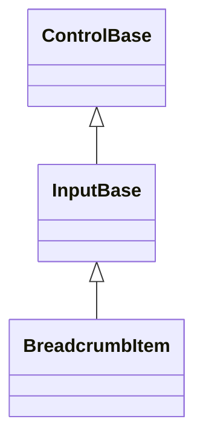
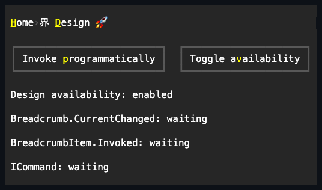

# BreadcrumbItem

## Overview

`BreadcrumbItem` is declared
`public sealed class BreadcrumbItem : InputBase, IStyled<BreadcrumbItemStyle>`.
It is one command-bearing retained location in a
[`Breadcrumb`](breadcrumb.md#overview) path. The item keeps its mnemonic-aware
caption, semantic current state, availability, complete local style, activation
event, and borrowed command binding while the owner may project it into an
overflow menu.

The caller creates the item and keeps its reference. Adding it transfers tree
ownership to the breadcrumb until removal; removal does not dispose it, while
disposing the owner disposes an item still retained there. Public mutation is
dispatcher-affine while attached. Null or control-bearing captions, invalid
lifetime access, and off-dispatcher mutation fail before observable state
changes; unavailable items do not activate.

## Inheritance



## API

| Member                       | Type                                | Default  | Description                                                          |
| ---------------------------- | ----------------------------------- | -------- | -------------------------------------------------------------------- |
| `Text`                       | `string`                            | `""`     | Non-null mnemonic-aware location caption without terminal controls.  |
| `IsCurrent`                  | `bool`                              | `false`  | Read-only; whether this item is the represented semantic location.   |
| `Style`                      | `BreadcrumbItemStyle?`              | `null`   | Optional complete local interactive-row presentation.                |
| `ActualStyle`                | `BreadcrumbItemStyle`               | Resolved | Read-only complete local, theme-owned, or code-owned presentation.   |
| Inherited `Command`          | `ICommand?`                         | `null`   | Borrowed command captured before an accepted activation starts.      |
| Inherited `CommandParameter` | `object?`                           | `null`   | Borrowed value supplied to command query and execution.              |
| `PerformInvoke()`            | `void`                              | —        | Requests programmatic activation through the same owner transaction. |
| `Invoked`                    | `EventHandler<ActivationEventArgs>` | —        | Reports activation after the owner commits this item as current.     |

`Text` rejects null with `ArgumentNullException` and terminal controls with
`ArgumentException`. `PerformInvoke()` requires the attached dispatcher and
throws `ObjectDisposedException` after disposal. An unavailable item does not
activate. A detached available item still raises `Invoked` and runs its command,
but has no owner current state to commit.

`BreadcrumbItemStyle` is a complete immutable `ControlStyle`. It resolves
through the theme's interactive-row states; clearing local `Style` resumes the
theme or code-owned fallback.

## Keyboard

| Key            | Behavior                                                                                      |
| -------------- | --------------------------------------------------------------------------------------------- |
| Enter / Space  | Activates this item when it is the owner's private active target.                             |
| Alt+access key | Focuses the owner and activates this item while primary, or while projected in open overflow. |

The item is not an independent focus or Tab stop while owned. The breadcrumb
owns directional movement and transfers activation to the current private
target. Pointer release and `PerformInvoke()` enter the same activation order.

## Ownership and activation

Owned items are normalized to `IsFocusable = false` and `IsTabStop = false` so
the breadcrumb remains the single focus stop. If callers author either property
while the item is owned, the live value stays normalized and the latest authored
value returns when the item detaches. Direct item disposal first removes it from
its owner.

Every owner-backed activation follows this observable order:

1. Capture `Command` and `CommandParameter`.
2. Commit the item as `Breadcrumb.CurrentItem` and update `IsCurrent`.
3. Publish the owner's current-state notifications.
4. Raise this item's `Invoked` event.
5. Execute the captured command only while the same item remains owned, current,
   available, and on the same transition generation.

An `Invoked` handler may navigate, detach, disable, or dispose the item without
allowing a stale command to execute. Overflow projection never reparents the
source item or copies its command state.

## Styling and Unicode

`BreadcrumbItemStyle` resolves complete normal, current, active, focused,
hovered, pressed, and disabled presentations from the interactive-row theme
role. Caption measurement, mnemonic collapse, clipping, and drawing use shared
[extended-grapheme geometry](../../concepts/unicode-cell-geometry.md#overview),
so combining sequences, wide characters, emoji, and zero-width constraints stay
cell-safe. An item omitted only because of finite width receives empty bounds
while its private menu projection owns presentation.

## Example



```csharp
var item = new BreadcrumbItem
{
    Text = "界 &Design 🚀",
    Command = navigateCommand,
    CommandParameter = "design-system"
};
item.Invoked += (_, eventArgs) => Log(eventArgs.Cause);

var path = new Breadcrumb();
path.Items.Add(new BreadcrumbItem { Text = "&Home" });
path.Items.Add(item);
```

## Expected behavior

| Scope                 | Observable evidence                                                                    |
| --------------------- | -------------------------------------------------------------------------------------- |
| Public API            | Caption validation, current state, availability, style resolution, and event payloads. |
| Integrated behavior   | Owner focus normalization, current commit order, overflow identity, and command order. |
| Complete runtime path | Whole-grapheme cells across primary, overflow, narrow, hidden, and disabled states.    |

- Current state commits before the item event, and the captured command executes
  only while that activation remains authoritative.
- Primary and overflow activation publish the same retained item identity.
- Unavailable items do not become current, active, invoked, or projected.
- Caption rendering never splits a combining sequence, wide glyph, or emoji
  cluster.
