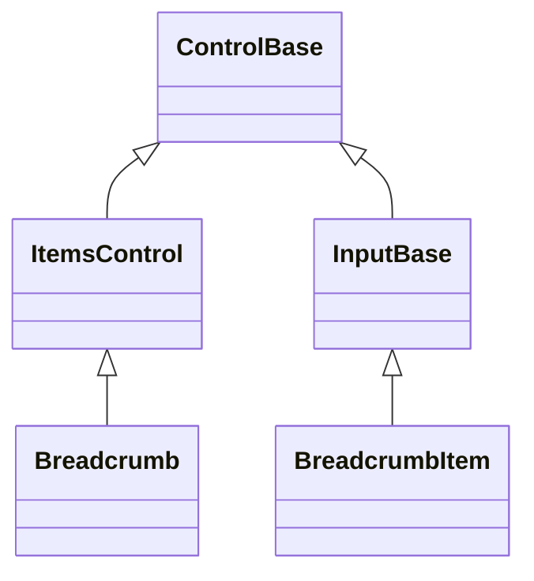
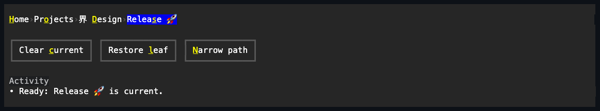
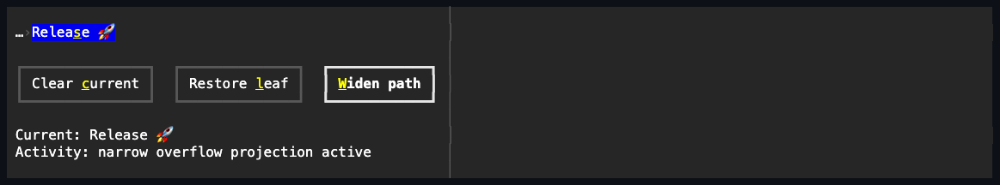

# Breadcrumb

## Overview

`Breadcrumb` is a sealed typed navigation control that presents a retained
root-to-location path on one terminal row. The caller creates and keeps
references to `BreadcrumbItem` controls; the breadcrumb owns their attachment
and lifetime until removal or owner disposal. Semantic `CurrentItem` state is
separate from the private roving keyboard target, so moving with arrow keys does
not claim that the application navigated.

The path automatically compresses at finite widths. Complete Unicode entries and
one-cell separators remain on the primary row while omitted available locations
are projected into one private overflow menu. Projection never reparents an
original item or copies its command state. Attached mutations are
dispatcher-affine, public values are validated before mutation, and unavailable
targets are rejected without changing current state.

## Inheritance



## API

| Member           | Type                                              | Default        | Description                                                                     |
| ---------------- | ------------------------------------------------- | -------------- | ------------------------------------------------------------------------------- |
| `Items`          | `BreadcrumbItemCollection`                        | Empty          | Owns the typed source-order path.                                               |
| `CurrentIndex`   | `int`                                             | `-1`           | Gets or sets the represented item index; `-1` explicitly clears current.        |
| `CurrentItem`    | `BreadcrumbItem?`                                 | `null`         | Gets or sets the represented owned item; null or a foreign item clears current. |
| `Style`          | `BreadcrumbStyle?`                                | `null`         | Gets or sets the complete local breadcrumb presentation.                        |
| `ActualStyle`    | `BreadcrumbStyle`                                 | Resolved       | Gets the complete local, theme-owned, or code-owned presentation.               |
| `CurrentChanged` | `EventHandler<BreadcrumbCurrentChangedEventArgs>` | —              | Reports a committed represented-location change.                                |

`CurrentIndex` accepts `-1` or the index of an owned, effectively visible and
enabled item. An index outside the collection throws
`ArgumentOutOfRangeException`; an owned hidden, collapsed, or effectively
disabled target throws `InvalidOperationException`. `CurrentItem` applies the
same availability validation to owned targets. Setting it to null or a foreign
item clears current. Attached setters require the owning dispatcher, and a
disposed owner throws `ObjectDisposedException`.

The path convention is root through final available location. Adding the first
available item establishes it as current, and every item or availability
mutation repairs a missing or unavailable current item to the final available
owned item. The caller may set an earlier owned item when navigating an
ancestor, and remains responsible for trimming any obsolete later entries. An
explicit `-1` or null state lasts until a later path or availability mutation
requires repair.

### BreadcrumbItem

| Member                       | Type                                | Default        | Description                                                             |
| ---------------------------- | ----------------------------------- | -------------- | ----------------------------------------------------------------------- |
| `Text`                       | `string`                            | `""`           | Gets or sets the non-null mnemonic-aware location caption.              |
| `IsCurrent`                  | `bool`                              | `false`        | Read-only; whether this item is the represented semantic location.      |
| `Style`                      | `BreadcrumbItemStyle?`              | `null`         | Gets or sets the complete local interactive-row presentation.           |
| `ActualStyle`                | `BreadcrumbItemStyle`               | Resolved       | Gets the complete local, theme-owned, or code-owned item presentation.  |
| Inherited `Command`          | `ICommand?`                         | `null`         | Runs after `Invoked` when the activation remains current and available. |
| Inherited `CommandParameter` | `object?`                           | `null`         | Supplies the borrowed parameter for command query and execution.        |
| `PerformInvoke()`            | `void`                              | —              | Requests programmatic activation through the same owner transaction.    |
| `Invoked`                    | `EventHandler<ActivationEventArgs>` | —              | Reports activation after its owning breadcrumb commits current state.   |

`Text` rejects null with `ArgumentNullException` and terminal controls with
`ArgumentException`. `PerformInvoke()` requires the attached dispatcher and
throws `ObjectDisposedException` after disposal. An unavailable item does not
activate. A detached available item still raises `Invoked` and runs its command,
but has no owner current state to commit.

Owned items are normalized to `IsFocusable = false` and `IsTabStop = false` so
the breadcrumb remains the single focus stop. If callers author either property
while the item is owned, the live value stays normalized and the latest authored
value is restored when the item detaches. Removal never disposes an item; direct
item disposal first removes it from its owner. Disposing the breadcrumb disposes
every item it still owns.

### BreadcrumbItemCollection

| Member                         | Result                                                          |
| ------------------------------ | --------------------------------------------------------------- |
| `this[int index]`              | Gets or replaces one item without changing its source position. |
| `Count`                        | Gets the number of retained semantic items.                     |
| `Add(item)` / `Insert(i,item)` | Attaches one detached item at the requested source position.    |
| `Remove(item)` / `RemoveAt(i)` | Detaches one item without disposing it.                         |
| `Move(oldIndex,newIndex)`      | Reorders an owned identity without detaching it.                |
| `IndexOf(item)`                | Returns the identity position, or `-1` for a foreign item.      |
| `Clear()`                      | Detaches every item without disposing any of them.              |

Collection calls reject null, duplicate, disposed, already attached, cyclic,
foreign, out-of-range, off-dispatcher, and active-transaction candidates before
observable mutation. Null input throws `ArgumentNullException`; invalid indexes
throw `ArgumentOutOfRangeException`; invalid ownership throws
`ArgumentException`; invalid dispatcher or transaction state throws
`InvalidOperationException`; and disposed participants throw
`ObjectDisposedException`.

### CurrentChanged

`BreadcrumbCurrentChangedEventArgs` exposes immutable `PreviousItem` and
`CurrentItem` references, either of which may be null. A current commit updates
the two items' `IsCurrent` state, then publishes
`PropertyChanged(CurrentIndex)`, `PropertyChanged(CurrentItem)`, and
`CurrentChanged`. At every callback boundary, a newer current, collection,
availability, attachment, or disposal transition supersedes the older
continuation.

Every activation route captures the command first, commits current, raises
`Invoked`, and then executes the captured command only while the same item is
still owned, current, available, and on the same transition generation. An
`Invoked` handler may therefore navigate, detach, disable, or dispose the item
without allowing a stale command to execute.

## Keyboard

| Key             | Behavior                                                                        |
| --------------- | ------------------------------------------------------------------------------- |
| Tab / Shift+Tab | Enters or leaves through the single breadcrumb owner stop.                      |
| Left / Up       | Moves the private active target to the previous primary-visible available item. |
| Right / Down    | Moves the private active target to the next primary-visible available item.     |
| Home / End      | Moves the active target to the first or last primary-visible available item.    |
| Enter / Space   | Activates the active item without transferring focus to that item.              |
| Alt+access key  | Focuses the owner and activates a matching primary-visible item.                |

Directional navigation accepts incidental lock modifiers and leaves Shift and
application-command-modified chords unhandled. It does not change `CurrentItem`;
Enter, Space, pointer release, access keys, and `PerformInvoke()` all use the
same activation ordering.

A width-overflowed available item's access key exists only while the overflow
menu is open. The menu invokes the original source item. Hidden, collapsed, and
disabled sources expose no primary or overflow access-key target.

## Layout and overflow

At normal width the breadcrumb arranges every participating item in source order
with one resolved separator between adjacent visible entries. Under a finite
constraint it chooses only whole entries and separators:

1. With a current item, it keeps that complete target and the nearest preceding
   entries that fit, producing a contiguous suffix in an ordinary path. Any
   later tail after an explicitly current ancestor remains omitted.
2. Omitted available entries are projected in source order into one overflow
   trigger before the kept suffix.
3. With explicit no-current state, it keeps the longest complete prefix, then a
   trailing overflow trigger when that complete affordance fits.
4. If neither an item nor trigger fits, the row renders no partial grapheme,
   separator, or pointer target.

An authored `Visibility.Hidden` item keeps its measured slot and adjacent
reserved gaps but neither paints nor interacts. A collapsed item releases its
slot. An effectively disabled item stays visible in the primary layout when it
fits, but cannot become current, active, invoked, or projected. An item omitted
only because of finite width receives empty bounds while the private projection
owns its presentation.

Overflow menu entries capture their source and ownership generations. Resize,
path mutation, availability changes, menu dismissal, or owner disposal makes a
stale projection inert. A resize that changes the visible window also cancels
any in-progress pointer press, so a physical cell cannot be reinterpreted as a
different item on release.

## Styling and Unicode

`BreadcrumbStyle` extends the ordinary complete `ControlStyle` with required
`SeparatorGlyph` and `SeparatorColor` values. `BreadcrumbStyle.Default` uses the
navigation current marker and control-border color. The color must be paintable,
and the `ControlGlyph` constructor rejects invalid preferred or fallback
scalars.

At measure and render time, the preferred separator is used only when it is one
terminal cell under the live cell-width policy. Otherwise its portable fallback
is used; if neither is one cell, both the separator and its reserved cell are
omitted. `BreadcrumbItemStyle` resolves through the theme's complete
interactive-row states, including current, active, focused, hovered, pressed,
and disabled presentation. Caption measurement, mnemonic collapse, clipping, and
drawing use shared extended-grapheme geometry, so combining sequences, wide
characters, emoji, and zero-width constraints remain cell-safe.

## Example





```csharp
var breadcrumb = new Breadcrumb();
breadcrumb.Items.Add(new BreadcrumbItem { Text = "&Home" });
breadcrumb.Items.Add(new BreadcrumbItem { Text = "Pr&ojects" });
breadcrumb.Items.Add(new BreadcrumbItem { Text = "界 &Design" });

breadcrumb.CurrentChanged += (_, change) =>
    Console.WriteLine(change.CurrentItem?.Text ?? "No current location");

// Navigate explicitly without replacing the retained path.
breadcrumb.CurrentIndex = 1;
```

`Breadcrumb` deliberately does not parse or navigate uniform resource
identifiers, fetch ancestors, bind an untyped value collection, wrap onto
multiple rows, expose a configurable overflow policy, or reveal its private
host, trigger, or menu. Application commands own navigation and path mutation.

## Expected behavior

| Scope                 | Observable evidence                                                         |
| --------------------- | --------------------------------------------------------------------------- |
| Public API            | Validation, defaults, state changes, and deterministic output.              |
| Integrated behavior   | Cross-component behavior through real ownership, routing, focus, and menus. |
| Complete runtime path | Final Unicode cells, pointer capture, and popup lifecycle cleanup.          |

- Typed ownership, retained focus-property restoration, identity-preserving
  moves, direct disposal, and final-location repair remain deterministic under
  callback reentry.
- Current and roving active identities stay independent across keyboard,
  pointer, access-key, programmatic, and overflow-menu activation.
- Wide, narrow, tiny, zero-width, hidden, collapsed, disabled, explicitly
  nonfinal-current, and no-current paths preserve whole-entry geometry and exact
  separator adjacency.
- Moves preserve current item identity while updating its numeric index.
- Adding any item deliberately selects the final available item when one
  exists, even when the added item is unavailable or the prior current item
  remains available.
- Removal, replacement, and availability mutations repair a missing or
  unavailable current item to the final available owned item when one exists.
