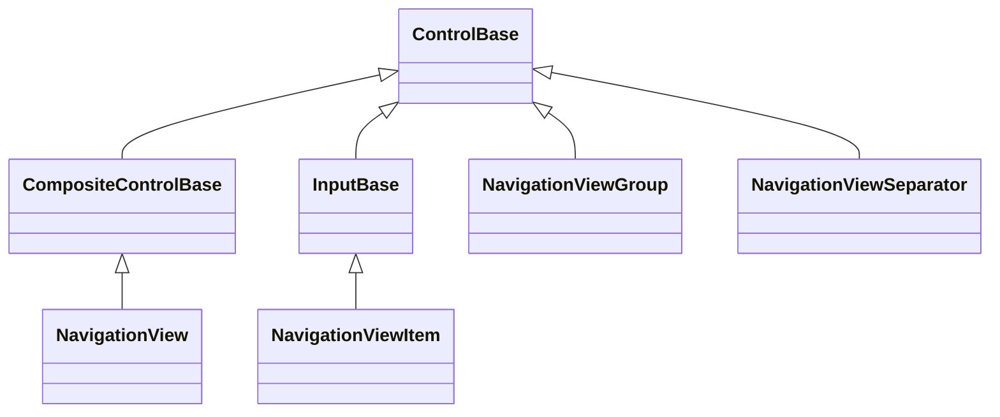
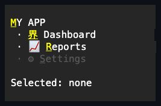

# NavigationView

## Overview

`NavigationView` is a sidebar navigation control with typed items, groups,
separators, an optional header, and a pinned footer section. It extends
[`CompositeControlBase`](../composite-control.md#overview) with an internal
`Dock` layout: the header docks to the top, the footer docks to the bottom, and
a scrollable items stack fills the remainder.

The view defaults to no border and resolves its continuous sidebar plane from
the active theme's generic `control.normal` role. It intentionally has no
NavigationView-specific theme section. The inherited chrome properties remain
open to caller overrides. Item rows preserve that continuous surface while their
foregrounds respond to pointer-over and selected states. Optional caller chrome
follows the shared [chrome contract](../../concepts/styling.md#shared-chrome).

Items, groups, and separators are managed through typed collections. Selection
is flat across all `NavigationViewItem` entries in both the main and footer
sections. Group headers participate in the current keyboard order but never
become `SelectedItem`, and separators are skipped entirely.

`NavigationViewItem`, `NavigationViewGroup`, and `NavigationViewSeparator` are
the three entry types this page also documents, since each exists only to
populate a `NavigationView`.

## Inheritance



## API

| Member                                                     | Type                                                    | Default        | Description                                                                   |
| ---------------------------------------------------------- | ------------------------------------------------------- | -------------- | ----------------------------------------------------------------------------- |
| `Header`                                                   | `string?`                                               | `null`         | Shows an optional bold title above the main section.                          |
| `Items`                                                    | `NavigationViewEntryCollection`                         | Empty          | Holds main items, groups, and separators in a scrollable section.             |
| `FooterItems`                                              | `NavigationViewEntryCollection`                         | Empty          | Holds equivalent entries pinned below the main section.                       |
| `SelectedItem`                                             | `NavigationViewItem?`                                   | `null`         | Read-only; the selected item across both sections.                            |
| `ScrollBarStyle`                                           | `ScrollBarStyle?`                                       | `null`         | Local style for the generated bar; `null` keeps theme resolution.             |
| `ActualScrollBarStyle`                                     | `ScrollBarStyle`                                        | Resolved       | Read-only; the style applied to the generated bar.                            |
| `Extent`                                                   | `Size`                                                  | Empty          | Read-only; the committed non-negative content extent of the scroll container. |
| `Viewport`                                                 | `Size`                                                  | Empty          | Read-only; the committed non-negative visible extent of the scroll container. |
| `HorizontalOffset`                                         | `int`                                                   | `0`            | The valid horizontal content offset of the generated scroll container.        |
| `VerticalOffset`                                           | `int`                                                   | `0`            | The valid vertical content offset of the generated scroll container.          |
| `LineSize`                                                 | `int`                                                   | `1`            | Non-negative wheel-scroll increment forwarded to the bar.                     |
| `PageOverlap`                                              | `int`                                                   | `0`            | Non-negative context retained by PageUp and PageDown.                         |
| `SelectItem(NavigationViewItem item)`                      | `void`                                                  | —              | Selects one item owned by this view without moving keyboard focus.            |
| `ScrollBy(int x, int y, ScrollCause cause = Programmatic)` | `bool`                                                  | —              | Scrolls the generated scroll container by signed cell deltas.                 |
| `BringItemIntoView(NavigationViewItem item)`               | `bool`                                                  | —              | Scrolls minimally to expose one owned entry.                                  |
| `SelectionChanged`                                         | `EventHandler<NavigationViewSelectionChangedEventArgs>` | No subscribers | Reports a committed selection change.                                         |
| `ScrollChanged`                                            | `EventHandler<ScrollChangedEventArgs>`                  | No subscribers | Raised by the view after the generated scroll container's offset commits.     |

## Keyboard

| Key                 | Behavior                                                 |
| ------------------- | -------------------------------------------------------- |
| Up / Down           | Moves to the previous or next available item or group.   |
| Home / End          | Moves to the first or last available entry.              |
| Page Up / Page Down | Moves by one visible page.                               |
| Enter / Space       | Invokes the current item or toggles the current group.   |
| Alt+access key      | Invokes the matching item or toggles the matching group. |

## Behavior

- `Header` is hidden when null or empty. Visible header text is always bold;
  mnemonic emphasis composes with that weight.
- `Items` and `FooterItems` accept `NavigationViewItem`, `NavigationViewGroup`,
  and `NavigationViewSeparator` through the same typed overloads. Their
  `ControlBase`-typed replacement indexer enforces that same set before changing
  ownership or the existing entry's forwarding and focus policy.
- Moving an entry within either collection reorders the existing identity
  without detaching, reparenting, blurring, or reattaching it.
- Every public collection mutation verifies the owning view or group on its
  dispatcher before null, index, membership, identity, or no-op checks. A
  rejected off-dispatcher call cannot inspect or partially change collection
  state.
- Entry insertion and replacement apply the view's focus policy transactionally.
  If a focus-property callback removes, clears, replaces, or disposes the
  incoming entry, that newer ownership snapshot wins and the interrupted
  mutation performs no further writes or event subscription.
- Removal and clear detach their complete entry snapshot and repair selection
  before restoring caller-authored focus properties. Restoration callbacks may
  safely begin another collection mutation against the committed state. Each
  entry is tracked by an ownership-generation lease, so reownership supersedes a
  pending restore and direct disposal retires authored metadata without writing
  onto the disposing control.
- While owned, every item, group, separator, and grouped item remains
  non-focusable and outside the tab order. Attempts to change either focus flag
  are retained as the latest authored policy, normalized immediately, and
  restored when the entry is detached.
- `SelectItem` rejects null, unavailable items, and items owned by another
  navigation view.
- `SelectionChanged` fires after a committed selection change. If an
  `IsSelected` or `SelectedItem` observer synchronously selects another item,
  the newer selection owns the visual markers, public property, and typed event;
  the superseded transition publishes nothing further.
- `Extent`, `Viewport`, `HorizontalOffset`, and `VerticalOffset` republish
  changes from the private scrolling host through the view's own
  `PropertyChanged` event. `ScrollChanged` likewise uses the view as sender;
  retained presentation controls never escape through public notifications.

The view is the single sidebar tab stop (`TabNavigation.None`); item and group
faces never receive keyboard focus themselves. Up and Down arrows move the
current entry across the available group headers and items while skipping
separators. PageUp and PageDown move by as many entries as fill the committed
viewport height minus `PageOverlap`, and they are handled even when the cursor
cannot move any further, so the key never escapes to page an enclosing
scrollable container. Home and End move to the first or last available entry.
The current entry scrolls into view automatically after keyboard navigation,
programmatic selection, invocation, access-key activation, structural changes,
group expansion, and viewport resize. The main and footer sections each use a
bounded private vertical viewport; an overflowing footer remains visually pinned
while its current descendant is revealed without exposing a second public scroll
surface. `BringItemIntoView` accepts direct or grouped items from either section
and returns whether an owning offset changed. Enter and Space toggle a current
group or invoke a current item without transferring focus, firing once per key
hold and only with activation-eligible modifiers, while the navigation keys
repeat while held. Navigation accepts incidental lock state but leaves Shift and
application-command-modified movement keys unhandled. When no entry is current,
activation first establishes the first available entry and then applies its
action.

An entry that becomes hidden cannot remain selected or current. An entry that
becomes disabled may retain its selected identity, but it immediately loses
keyboard-current eligibility; Enter and Space re-establish current on an
available entry instead of invoking the disabled one. These rules use effective
availability, including inherited ancestor state. Hidden-selection repair uses
the selected identity's current position in the complete main, grouped, and
footer item order, preferring its next available successor and then its previous
available predecessor. Earlier inserts, removals, moves, group expansion, or
availability transitions therefore cannot make repair jump to a stale index.

Direct item, group, separator, and owner disposal retire private authored-focus
leases with their ownership. A disposed view or retained disposed group does not
keep former entries alive through presentation metadata.

`LineSize` forwards the mouse wheel's cell step to the generated scroll
container from every point in the view, including its fixed header and footer.
Wheel scrolling preserves the current and selected identities but may move their
rows outside the viewport; only an explicit navigation, selection, structure,
expansion, or resize transition reveals the current entry again. A scroll-only
translation of arranged row bounds never triggers that reveal path. At a
main-section endpoint, an unconsumed wheel record remains available to an
enclosing scrollable container. Keyboard Up and Down always move by exactly one
entry regardless of this value.

Semantic text selection follows visible sidebar order: header, main entries and
expanded group descendants, then footer entries. Navigation markers, disclosure
glyphs, caller glyph prefixes, and affixes are presentation only and do not
enter copied text. Hidden entries and descendants of collapsed groups do not
contribute; clipping and scrolling retain complete-grapheme geometry only for
currently visible labels.

## NavigationViewItem

Extends [`InputBase`](../input-base.md#overview), opting into press activation
and a command but not the shared caption capability - it owns its label text
directly. The item renders as `› Text` when selected or hovered and as `· Text`
otherwise. Pointer or programmatic selection updates the owning
`NavigationView`; the item itself stays non-focusable and outside the tab order.

| Member                       | Type                                | Default        | Description                                                                                                |
| ---------------------------- | ----------------------------------- | -------------- | ---------------------------------------------------------------------------------------------------------- |
| Inherited `Text`             | `string`                            | `""`           | The label text.                                                                                            |
| `Glyph`                      | `string?`                           | `null`         | An optional printable Unicode prefix shown before the label; terminal controls are rejected.               |
| `IsSelected`                 | `bool`                              | `false`        | Read-only; whether this entry is the navigation view's selected item.                                      |
| `StartAffix`                 | `Affix?`                            | `null`         | Optional leading edge-pinned decoration, reserved after the marker and glyph prefix and outside the label. |
| `EndAffix`                   | `Affix?`                            | `null`         | Optional trailing edge-pinned decoration, reserved outside the label at the content box's far edge.        |
| `Style`                      | `NavigationViewItemStyle?`          | `null`         | Gets or sets the complete local presentation, including the idle and current markers.                      |
| `ActualStyle`                | `NavigationViewItemStyle`           | Resolved       | Read-only; the complete local, theme-owned, or code-owned presentation.                                    |
| Inherited `Command`          | `ICommand?`                         | `null`         | Runs after `Invoked`, when bound and `CanExecute` allows it.                                               |
| Inherited `CommandParameter` | `object?`                           | `null`         | The borrowed parameter passed to `Command` queries and execution.                                          |
| `PerformInvoke()`            | `void`                              | —              | Activates the item programmatically when it is enabled and visible.                                        |
| `Invoked`                    | `EventHandler<ActivationEventArgs>` | No subscribers | Raised after keyboard or pointer activation requests navigation.                                           |

Activation raises `Invoked`, then invokes the inherited `Command` with
`CommandParameter` when one is bound and `CanExecute` allows it. That command
binding is captured before `Invoked`, so a callback may rebind or dispose the
item without changing the activation already in progress. `PerformInvoke()`
first enters the shared `InputBase.TryActivate` mutation and
effective-availability gate; the item continues to own `Invoked` and captured
command ordering after admission.

`StartAffix` and `EndAffix` reserve fixed cell columns beside the label, the
same seam `Button` and `HyperlinkButton` expose (see
[styling.md](../../concepts/styling.md#instance-content-affix)). The marker and
any `Glyph` prefix always stay outboard of both affixes; the reserved layout
inside the remainder of the content box is `[start][gap] label [gap][end]`. The
gap comes from `NavigationViewItemStyle.AffixGap`, declared directly on that
style rather than forwarded from a shared input style, since
`NavigationViewItem` does not route its label through the caption capability
other `InputBase` controls share. When the content box is too narrow for
everything, the label shrinks first, then the end affix drops whole, then the
start affix - never a partial cluster.

## NavigationViewGroup

A collapsible labeled section owned by `NavigationView.Items` or `FooterItems`.
Sub-items are `NavigationViewItem` instances owned by the group's own `Items`
collection. Enter or Space on the current group toggles its expansion while the
owning `NavigationView` keeps focus. Collapsing a group whose descendant is
current moves the current state to the group header and repairs any now-hidden
selection.

Pointer toggling uses a paired primary press and release on the header row. The
group captures during the hold and cancels on drag-out, capture loss,
unavailability, detachment, or disposal; an unmatched release is inert.
Intrinsic border and padding deflate both the rendered header row and its press
target, and the retained child stack begins on the following content row.

| Member        | Type                           | Default  | Description                                                                                    |
| ------------- | ------------------------------ | -------- | ---------------------------------------------------------------------------------------------- |
| `Header`      | `string`                       | `""`     | The group label, rendered with the resolved expanded or collapsed disclosure glyph.            |
| `Items`       | `NavigationViewItemCollection` | Empty    | Holds this group's sub-items.                                                                  |
| `IsExpanded`  | `bool`                         | `true`   | Controls sub-item visibility.                                                                  |
| `Style`       | `NavigationViewGroupStyle?`    | `null`   | Gets or sets the complete local presentation, including the disclosure glyphs and item indent. |
| `ActualStyle` | `NavigationViewGroupStyle`     | Resolved | Read-only; the complete local, theme-owned, or code-owned presentation.                        |

## NavigationViewSeparator

A non-interactive horizontal divider line. It is not focusable and not
hit-testable. Its rule renders only through the deflated content box, preserving
intrinsic border and padding cells.

| Member        | Type                            | Default  | Description                                                             |
| ------------- | ------------------------------- | -------- | ----------------------------------------------------------------------- |
| `Style`       | `NavigationViewSeparatorStyle?` | `null`   | Gets or sets the complete local presentation, including the rule glyph. |
| `ActualStyle` | `NavigationViewSeparatorStyle`  | Resolved | Read-only; the complete local, theme-owned, or code-owned presentation. |

## Style-resolved glyphs

The idle and current item markers, the group's expanded and collapsed disclosure
glyphs, and the separator's own rule glyph resolve from each control's
`ActualStyle`, not from an individual property or `Reset*` method on the
control. `NavigationViewItemStyle` carries the immutable `IdleMarker` and
`CurrentMarker`; `NavigationViewGroupStyle` carries `CollapsedGlyph`,
`ExpandedGlyph`, and `ItemIndent`; `NavigationViewSeparatorStyle` carries
`Glyph`. When no local `Style` is assigned, `ActualStyle` completes from the
library's code-owned markers; the theme's `glyphs` family does not cover
navigation markers, so a local `Style` is the only way to move them.

> [!NOTE]
>
> To override a marker, assign a complete local `Style` — for example
> `item.Style = item.ActualStyle with { CurrentMarker = new Rune('▶') }` —
> rather than looking for a single-glyph property. Assigning `Style = null`
> returns the control to code-owned ownership; there is no separate reset method
> for an individual marker.

## Example



```csharp
var nav = new NavigationView { Header = "MY APP" };
nav.Items.Add(new NavigationViewItem { Text = "Dashboard", Glyph = "📊" });

var settings = new NavigationViewGroup { Header = "Settings" };
settings.Items.Add(new NavigationViewItem { Text = "General" });
settings.Items.Add(new NavigationViewItem { Text = "Advanced" });
nav.Items.Add(settings);

nav.Items.Add(new NavigationViewSeparator());
nav.FooterItems.Add(new NavigationViewItem { Text = "Quit", Glyph = "🚪" });
nav.SelectItem((NavigationViewItem)nav.Items[0]);

nav.SelectionChanged += (_, _) =>
    Console.WriteLine($"Selected: {nav.SelectedItem?.Text}");
```

Ampersands in item and group headers declare
[access keys](../../concepts/access-keys.md#focus-and-semantic-actions). An item
mnemonic focuses the view, makes that item current, and invokes and selects it.
A group mnemonic focuses the view, makes the group current, and toggles its
expansion. Both paths reveal an offscreen matched entry before the next settled
frame.

## Expected behavior

| Scope               | Observable evidence                                                       |
| ------------------- | ------------------------------------------------------------------------- |
| Public API          | Validation, defaults, state changes, and deterministic output.            |
| Integrated behavior | Cross-component behavior through the real ownership and routing boundary. |

- The typed collections accept their documented entry types, and programmatic
  selection accepts owned items while rejecting foreign ones.
- The view keeps keyboard focus while navigating across group headers and items,
  Enter and Space expand or collapse groups, and collapsing a group repairs a
  now-hidden current entry or selection.
- Separators are non-interactive, footer items stay separated from the main
  section, and the header renders as documented.
- Pointer selection works both directly and through grouped items, and
  forwarding handlers are cleaned up when grouped items are removed or the
  collection is cleared.
- Removing or directly disposing a selected top-level or grouped item repairs
  selection to the adjacent available item, or clears it when none remains.
- Clearing a group's descendants repairs a removed current child but preserves
  current on the still-owned group itself, including when the group was empty.
- Final rendering resolves deterministically to the exact cells.
