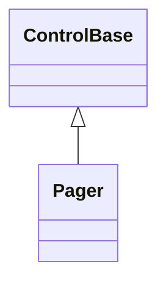
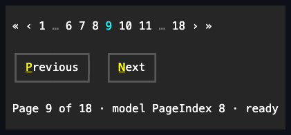

# Pager

## Overview

`Pager` is declared
`public sealed class Pager : ControlBase, IStyled<PagerStyle>`. It navigates one
zero-based page index inside a finite page count and renders a bounded sequence
of first, previous, numbered, next, and last targets.

The caller owns the page content, page size, loading, and the model that
supplies `PageCount`; Pager retains only scalar navigation state and its
immutable presentation. Its page invariant is exact: an empty range has
`PageIndex == -1`, and a nonempty range has `0 <= PageIndex < PageCount`.

Public mutations validate before changing state and follow the ordinary
dispatcher-affine control lifetime. Negative counts, indices outside the current
range, and a `MaximumVisiblePages` value below one are rejected rather than
coerced.

## Inheritance



## API

| Member                      | Type                                 | Default  | Description                                                                                   |
| --------------------------- | ------------------------------------ | -------- | --------------------------------------------------------------------------------------------- |
| `PageCount`                 | `int`                                | `0`      | The non-negative page count; changing it establishes or repairs `PageIndex` atomically.       |
| `PageIndex`                 | `int`                                | `-1`     | The zero-based current page, or `-1` only while `PageCount` is zero.                          |
| `MaximumVisiblePages`       | `int`                                | `5`      | The positive limit for centered, non-endpoint numbered candidates.                            |
| `Style`                     | `PagerStyle?`                        | `null`   | Optional complete developer-authored presentation.                                            |
| `ActualStyle`               | `PagerStyle`                         | Resolved | Read-only; the complete local, theme-owned, or code-owned presentation.                       |
| `CanTabStop`                | `bool`                               | `false`  | Read-only; requires the ordinary base eligibility and more than one page.                     |
| `ChangePage(int pageIndex)` | `bool`                               | —        | Makes one validated programmatic change and reports whether a different page committed.       |
| `PageChanged`               | `EventHandler<PageChangedEventArgs>` | —        | Raised after the matching property notifications while that transition remains authoritative. |

`PagerStyle : ControlStyle` is the complete immutable presentation. It adds
validated `FirstPageGlyph`, `PreviousPageGlyph`, `NextPageGlyph`,
`LastPageGlyph`, and `OmittedPagesGlyph` values plus a paintable
`CurrentPageColor` to the inherited `Face`, `Border`, and `Shadow`. The default
current-page foreground is `SemanticColor.Accent`. A `with` expression creates a
validated copy of `PagerStyle.Default`; assigning `null` to `Style` restores
theme and code-owned resolution.

`PageChangedEventArgs` carries `PreviousPageIndex`, `CurrentPageIndex`, and the
`ActivationCause`. Emitted `Pager` transitions reserve `-1` for an empty-range
sentinel. The public constructor has no page-count context: it accepts any two
distinct indices greater than or equal to `-1`, rejects an index below `-1`, and
rejects an unknown cause.

## Keyboard

| Key                      | Behavior                                                   |
| ------------------------ | ---------------------------------------------------------- |
| Left / Up / Page Up      | Changes to the previous page when one exists.              |
| Right / Down / Page Down | Changes to the next page when one exists.                  |
| Home                     | Changes to page index `0`.                                 |
| End                      | Changes to page index `PageCount - 1`.                     |
| Enter / Space            | Remains unhandled because the current page cannot reapply. |

Navigation accepts incidental lock modifiers. Shift- or application-command
modified chords remain available to routed ancestors, as do navigation keys at
an endpoint and every page-navigation key when the range has zero or one page.

## Page state and notifications

Setting `PageCount` stages the new count and any repaired index before an
observer runs. A transition then publishes, in order:

1. `PropertyChanged(PageCount)`.
2. `PropertyChanged(PageIndex)` when the index changed.
3. `PropertyChanged(CanTabStop)` when the count crossed the zero/one versus
   many-page boundary.
4. One programmatic `PageChanged` when the index changed.

Changing an empty count to a positive count establishes page index `0`.
Shrinking a range clamps an index beyond the new end to the final page, and
changing the count to zero establishes `-1`. A count change that leaves the
index valid raises no `PageChanged` event. Direct `PageIndex` assignment and
`ChangePage` publish `PropertyChanged(PageIndex)` before one programmatic
`PageChanged`; reapplying the current index is a no-op.

Callbacks run without a lock. If a property or typed-event observer changes page
state, availability, attachment, or lifetime, that newer transition suppresses
stale remaining notifications from the interrupted transition. Callback failures
do not roll back the committed state: Pager attempts still-current callbacks,
preserves the earliest failure, and rethrows it after required work.

## Layout and appearance

Unbounded measure uses the complete ideal sequence: first and previous
navigation glyphs, a centered numbered window, omission glyphs for remaining
gaps, then next and last navigation glyphs. `MaximumVisiblePages` limits only
centered non-endpoint candidates; the current, first, and final page numbers do
not consume that budget.

Finite width retains complete targets in this priority:

1. The current page number.
2. The first and final page numbers when distinct from current.
3. Nearby centered-window numbers, alternating left then right.
4. Omission glyphs whose numeric gaps remain.
5. Previous and next navigation glyphs.
6. First and last navigation glyphs.

Selected targets still render in their normal left-to-right order, separated by
one cell. A target enters the committed layout only when its complete text and
required separation fit. If even the current page number does not fit, Pager
draws no partial digits and exposes no pointer target. Page numbers use
invariant culture, so process culture cannot change geometry.


Each `ControlGlyph` resolves against the live terminal cell policy. Pager uses
the portable fallback when the preferred scalar is not exactly one cell and
omits the entire glyph target when neither scalar is one cell. Ordinary targets
use `SemanticColor.ControlText`, unavailable endpoint navigation uses
`SemanticColor.DisabledText`, omission uses `SemanticColor.Muted`, and the
current number uses `PagerStyle.CurrentPageColor`. These non-current roles are
code-owned rather than additional public style knobs.

Zero pages render no targets. One page renders only page number `1` when it
fits. The sealed control renderer owns intrinsic chrome; Pager renders only
targets to the cell canvas and never emits terminal protocol bytes.

## Focus, pointer, and capture

Pager keeps the ordinary explicit and pointer focus capability at every count,
but enters Tab traversal only when `PageCount > 1`. Leaving Tab eligibility does
not clear existing focus. `TabNavigation.None` makes the whole Pager one focus
stop rather than turning its derived targets into retained child controls.

A primary press on an enabled numbered or navigation target focuses Pager and
takes pointer capture. Release changes the page only when the same target kind,
page index, bounds, and layout generation remain current. Drag-away, focus loss,
hide, disable, detachment, disposal, modality change, or a newer layout cancels
the press. Disabled endpoint and omission targets remain unhandled after
cleanup. A resize or page-count change therefore cannot reinterpret a captured
cell as a different page.

Pager owns no access keys. Number text and style glyphs are not authored
captions.

## Binding and ownership

`BindingExtensions.Bind(pager, model, source => source.PageIndex)` binds the
integer model property two-way to `Pager.PageIndex`. Configure `PageCount`
before binding a nonempty source index. `-1` is the natural value for an empty
range; any other value outside the target's current range throws
`ArgumentOutOfRangeException` without clamping or writing a replacement back to
the model.

The target owns the binding lifetime. The returned `Binding` only needs to be
retained when synchronization must stop before Pager disposal. Source
notifications use the shared dispatcher coalescing, source-replacement, and
disposal rules from
[data binding](../../concepts/data-binding.md#dispatcher-and-responsiveness).
Pager intentionally has no page-count, page-size, item-source, or asynchronous
loading binding.

## Example



```csharp
var pager = new Pager
{
    PageCount = 42,
    PageIndex = 20,
    MaximumVisiblePages = 5,
    HorizontalAlignment = HorizontalAlignment.Stretch,
};

pager.PageChanged += (_, change) =>
    Console.WriteLine($"Page {change.CurrentPageIndex + 1} ({change.Cause})");
```

## Expected behavior

| Scope               | Observable evidence                                                       |
| ------------------- | ------------------------------------------------------------------------- |
| Public API          | Validation, defaults, state changes, and deterministic output.            |
| Integrated behavior | Cross-component behavior through the real ownership and routing boundary. |

- Every observer sees the exact page-count/page-index invariant, and reentry
  cannot publish stale typed events.
- Ideal and finite layouts retain whole targets deterministically, use invariant
  page text, and resolve glyph fallbacks against the live cell policy.
- Keyboard and pointer input converge on the same page transition, while capture
  cancellation prevents stale-cell activation.
- Zero- and one-page ranges stay outside Tab traversal and cannot activate a
  page, without revoking ordinary explicit focus.
- The two-way PageIndex binding preserves validation, dispatcher coalescing, and
  target-owned disposal.
