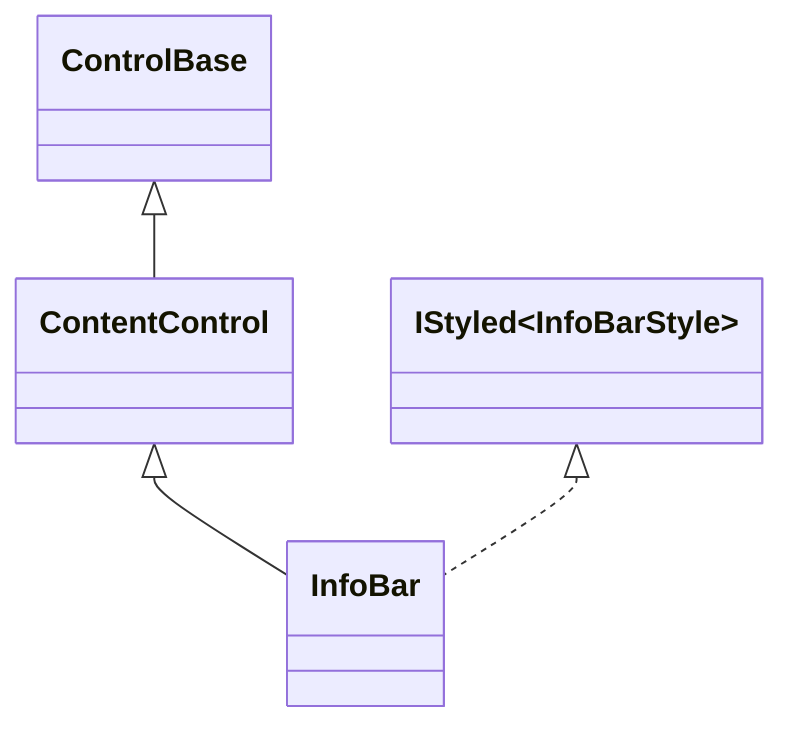
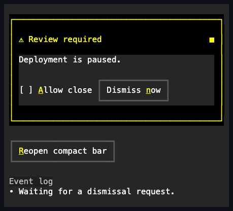

# InfoBar

## Overview

`InfoBar` is declared `public sealed class InfoBar : ContentControl` and
implements `IStyled<InfoBarStyle>`. It presents one persistent notification in
ordinary layout, with an optional title, adornment, retained body, and explicit
dismissal lifecycle. Unlike [`Toast`](toast.md#overview), it neither floats nor
creates a presentation plane.

The inherited `Content` remains a real caller-replaceable child. Closing the bar
temporarily removes its body and private dismiss affordance from layout and
input while preserving the latest caller-authored visibility for reopening. All
mutation is dispatcher-affine, and invalid title text or style values fail
before observable state changes.

## Inheritance



## API

| Member              | Type                                             | Default  | Description                                                                     |
| ------------------- | ------------------------------------------------ | -------- | ------------------------------------------------------------------------------- |
| Inherited `Content` | `ControlBase?`                                   | `null`   | Supplies the caller-replaceable retained notification body.                     |
| `Title`             | `string?`                                        | `null`   | Supplies optional single-line header text; terminal controls are rejected.      |
| `Adornment`         | `Affix?`                                         | `null`   | Supplies an optional grapheme-safe adornment before the title.                  |
| `IsOpen`            | `bool`                                           | `true`   | Controls whether the bar occupies layout, renders, and accepts input.           |
| `IsDismissible`     | `bool`                                           | `true`   | Enables the trailing focusable dismiss affordance.                              |
| `Style`             | `InfoBarStyle?`                                  | `null`   | Sets one complete local presentation or restores themed Control fallback.       |
| `ActualStyle`       | `InfoBarStyle`                                   | Resolved | Reports the complete resolved presentation.                                     |
| `Dismiss()`         | `void`                                           | —        | Requests cancellable dismissal; an already closed bar is unchanged.             |
| `DismissRequested`  | `EventHandler<InfoBarDismissRequestedEventArgs>` | —        | Allows cancellation while the bar is still open.                                |
| `Dismissed`         | `EventHandler`                                   | —        | Publishes after closed layout, focus, capture, and availability have committed. |

`InfoBarDismissRequestedEventArgs` derives from `CancelEventArgs`; setting its
inherited `Cancel` property keeps the bar open. `InfoBarStyle` extends
`ControlStyle` with `TitleFace`, `AdornmentColor`, `DismissGlyph`,
`DismissColor`, `Padding`, `ContentGap`, and `AdornmentGap`. Negative gaps,
transparent foreground paint, and dismiss glyphs without printable one-cell
preferred and fallback values are rejected. `Default` aliases `Info`; `Info`,
`Success`, `Warning`, and `Error` are complete semantic presets.

## Keyboard

| Key             | Behavior                                                                  |
| --------------- | ------------------------------------------------------------------------- |
| Tab / Shift+Tab | Traverses retained body controls and then the dismiss affordance.         |
| Enter / Space   | Dismisses when the private trailing affordance has focus.                 |
| Escape          | Is not handled; an owning surface or application keeps its cancel policy. |

The InfoBar itself is neither focusable nor a Tab stop. Its title and adornment
register no access keys; content controls retain their own access-key behavior.

## Dismissal and availability

For an open bar, `Dismiss()` publishes an ordered transition:

1. `DismissRequested` runs while `IsOpen` is still `true`.
2. Cancellation keeps layout, focus, input, and open state unchanged.
3. Otherwise, the bar commits `IsOpen = false`, removes its retained parts from
   layout and input, releases focus and pointer capture inside the bar, and
   publishes `PropertyChanged(nameof(IsOpen))`.
4. `Dismissed` runs after closed state and required cleanup have committed.

Every requested subscriber is attempted. When cancellation is absent, property
and completion publication continue after a callback failure unless a newer
callback-driven state transition supersedes them; the earliest failure is
re-thrown after required cleanup. Reopening restores current authored body
visibility and the same retained content and dismiss-part instances.

Opening never moves focus or enters modality. Hiding, detaching, disabling, or
disposing the bar cancels a pending dismiss press without synthesizing a
dismissal lifecycle.

## Layout and appearance

An open bar reserves intrinsic border chrome, style padding, one header row when
the header or dismiss affordance exists, and `ContentGap` only when visible body
content follows that header. The dismiss glyph owns the trailing header cell. At
narrow widths, title space shrinks and an adornment drops as one whole cluster
before the dismiss cell is sacrificed. A zero-sized slot draws no partial
grapheme or out-of-bounds cell.

Closing reports zero desired size and suppresses chrome, retained-child cells,
hit testing, focus candidates, and capture even if a parent assigns a nonempty
slot. Body wrapping and clipping remain the responsibility of the retained
content's own overflow policy. Preset styles use an opaque surface, flat
semantic accent border, matching title, adornment, and dismiss colors, and no
shadow.

## Example



```csharp
var retry = new Button { Text = "&Retry" };
var infoBar = new InfoBar
{
    Title = "Upload failed",
    Adornment = new Affix("!"),
    Style = InfoBarStyle.Error,
    Content = retry
};

retry.Click += (_, _) => infoBar.Dismiss();
infoBar.DismissRequested += (_, eventArgs) =>
{
    eventArgs.Cancel = uploadStillRunning;
};
```

## Expected behavior

| Scope                 | Observable evidence                                                  |
| --------------------- | -------------------------------------------------------------------- |
| Public API            | Validation, defaults, state changes, and deterministic output.       |
| Integrated behavior   | Retained ownership, focus, capture, visibility, and ordinary layout. |
| Complete runtime path | Final cells, semantic colors, Unicode geometry, and routed input.    |

- Closing reclaims layout and leaves no rendered or interactive descendant.
- Reopening restores the latest caller-authored body visibility on the same
  retained objects.
- Pointer, Enter, and Space dismissal share cancellable ordered publication;
  Escape remains unhandled.
- All four semantic presets render complete terminal cells, and deterministic
  narrow and randomized layouts remain bounded.
