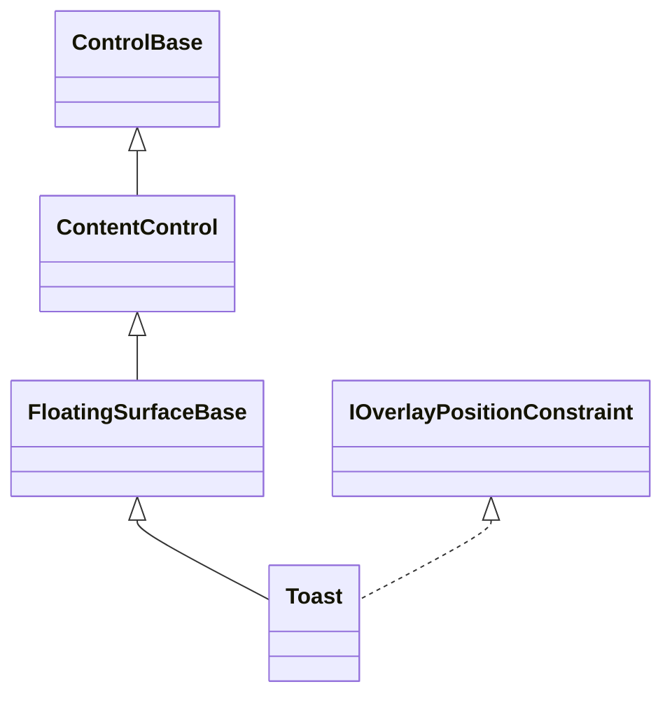

# Toast

## Overview

`Toast` is declared `public sealed class Toast : FloatingSurfaceBase` and
implements `IStyled<ToastStyle>` and the internal `IOverlayPositionConstraint`,
which keeps its edge slot inside the host's bounds. It presents one caller-owned
notification object in the attached owner’s Screen or Overlay presentation plane
without entering modality or moving focus. The Toast owns its replaceable
`Content`; callers retain and dispose the Toast itself.

Six edge positions partition independent stacks. New notifications occupy the
edge-nearest slot and older notifications move inward with one cell of spacing.
All mutation and lifecycle work is dispatcher-affine. Invalid positions,
animations, and durations throw before observable state changes.

## Inheritance



## API

| Member                      | Type                                           | Default    | Description                                                                    |
| --------------------------- | ---------------------------------------------- | ---------- | ------------------------------------------------------------------------------ |
| Inherited `Content`         | `ControlBase?`                                 | `null`     | Supplies arbitrary retained content owned by the Toast.                        |
| `Title`                     | `string?`                                      | `null`     | Supplies the optional single-line header title.                                |
| `Adornment`                 | `Affix?`                                       | `null`     | Supplies an optional grapheme before the title.                                |
| `Position`                  | `ToastPosition`                                | `TopRight` | Selects one of six screen-edge stacks.                                         |
| `Animation`                 | `ToastAnimation`                               | `Fade`     | Selects the deterministic entrance transition.                                 |
| `AnimationDuration`         | `TimeSpan`                                     | `200 ms`   | Sets the non-negative entrance duration; zero completes immediately.           |
| Inherited `FadeInDuration`  | `TimeSpan`                                     | Zero       | Adds a cell fade alongside Slide or Expand geometry.                           |
| Inherited `FadeOutDuration` | `TimeSpan`                                     | Zero       | Adds an optional dismissal fade and retained input barrier.                    |
| Inherited `FadeProgress`    | `double`                                       | `0`        | Reports shared terminal-cell visibility from zero through one.                 |
| `DisplayDuration`           | `TimeSpan`                                     | `5 s`      | Sets visible time after entrance; `Timeout.InfiniteTimeSpan` disables timeout. |
| `IsDismissible`             | `bool`                                         | `true`     | Enables the close affordance and keyboard or pointer dismissal.                |
| `CloseOnEscape`             | `bool`                                         | `true`     | Allows Escape dismissal independently from the other enabled close inputs.     |
| `Style`                     | `ToastStyle?`                                  | `null`     | Sets one complete local presentation or uses themed Popup fallback.            |
| `ActualStyle`               | `ToastStyle`                                   | Resolved   | Reports the complete resolved presentation.                                    |
| `IsOpen`                    | `bool`                                         | `false`    | Reports whether this Toast is currently presented.                             |
| `AnimationProgress`         | `double`                                       | `0`        | Reports normalized entrance progress from zero through one.                    |
| `Show(owner)`               | `void`                                         | —          | Mounts the same Toast in the owner’s presentation plane.                       |
| `Dismiss()`                 | `void`                                         | —          | Requests vetoable dismissal; a closed Toast is unchanged.                      |
| `CloseRequested`            | `EventHandler<SurfaceCloseRequestedEventArgs>` | —          | Allows cancellation before dismissal changes presentation.                     |
| `Closing`, `Closed`         | `EventHandler`                                 | —          | Publish ordered lifecycle around successful dismissal.                         |

`ToastPosition` defines `TopLeft`, `TopCenter`, `TopRight`, `BottomLeft`,
`BottomCenter`, and `BottomRight`. `ToastAnimation` defines `SlideTop`,
`SlideDown`, `SlideLeft`, `SlideRight`, `Expand`, and `Fade`.

## Keyboard

| Key           | Behavior                                                                       |
| ------------- | ------------------------------------------------------------------------------ |
| Escape        | Dismisses a focused Toast when `IsDismissible` and `CloseOnEscape` are `true`. |
| Enter / Space | Activates the focused close affordance when `IsDismissible` is `true`.         |

## Presentation and timing

`Show(owner)` resolves the attached owner’s stable presentation plane and mounts
the Toast object itself. It never creates a proxy, enters modality, or changes
focus. Showing an already open Toast or changing position, animation, or timing
while it is open throws. Resize recomputes the final edge slot against current
host bounds.

Animation progress derives from the dispatcher’s monotonic clock. `SlideLeft`
and `SlideRight` enter from the named side of the slot, `SlideDown` starts one
toast height above the slot and travels down, `SlideTop` starts at the host
content's top edge, `Expand` grows around its final center, and `Fade` reveals
stable cells in place. `ToastAnimation.Fade` uses `AnimationDuration` as its
effective shared fade-in and keeps `AnimationProgress` equal to `FadeProgress`;
it owns no second animation timer or previous-frame compositor. Slide and Expand
keep their geometry clock, and an inherited positive `FadeInDuration` composes
with it concurrently. The display timer starts only after both geometry and cell
visibility reach one, so neither entrance effect consumes visible lifetime.
Detach and disposal cancel every timer and release stack membership.

The shared dissolve includes content, title, adornment, close glyph, border, and
shadow over the current-frame underlay. It chooses complete grapheme owners by
stable absolute cell coordinates. Semantic images appear atomically only when
entrance completes and disappear as soon as exit is accepted.

## Appearance and dismissal

`ToastStyle` extends `PopupStyle` with title, adornment, close-glyph, padding,
and spacing fields. `Info`, `Error`, `Warning`, `Success`, and `Trace` are
complete presets, while `Default` aliases `Info`. Severity remains an appearance
choice rather than a closed behavior enum; applications may assign any complete
custom `ToastStyle`. Every preset paints an opaque semantic popup background;
custom styles control that fill through `Face.Background`. Caller content keeps
its own appearance, so layout-only wrappers that should visually belong to the
Toast use a transparent background and inherit the Toast surface beneath them.

A dismissible focused Toast handles Enter and Space and exposes the pointer
close glyph. Escape follows the independent `CloseOnEscape` policy, so an
application can leave the other input dismissal routes available without
reserving Escape. The close glyph uses capture-aware pointer press and release
semantics. Every route, including the display timeout, raises `CloseRequested`
first; cancellation leaves the Toast open and suppresses `Closing` and `Closed`.
A synchronous repeated `Dismiss()` from that request is absorbed by the shared
request guard, so one request produces at most one close lifecycle. A vetoed
display timeout leaves its timer active, so the Toast retries after another
`DisplayDuration` instead of becoming permanently manual-only. Before `Closed`
runs, the Toast has left its coordinator and presentation host and the shared
close guard has released. A handler may therefore show the same Toast again as a
distinct presentation; the completed dismissal does not remove that replacement.
Removing an ancestor subtree clears the mounted bounds through the shared
floating-surface detach path without publishing a requested-close lifecycle.

A positive `FadeOutDuration` changes only accepted dismissal timing. `IsOpen`,
the host edge, bounds, and coordinator remain committed while progress decreases
to zero. The Toast stays above the background as a consumed pointer and routed-
input barrier, but no Toast handler runs. Source animation and display timers
stop immediately. Final disappearance commits closed state, removes the Toast,
and publishes `Closed`; the default zero duration preserves immediate dismissal.

## Example


```csharp
var toast = new Toast
{
    Title = "Upload failed",
    Adornment = new Affix("!"),
    Position = ToastPosition.TopRight,
    Animation = ToastAnimation.SlideLeft,
    FadeInDuration = TimeSpan.FromMilliseconds(120),
    FadeOutDuration = TimeSpan.FromMilliseconds(160),
    CloseOnEscape = false,
    Style = ToastStyle.Error,
    Content = new Text("The server rejected the archive.")
};

toast.Show(uploadButton);
```

## Expected behavior

| Scope                 | Observable evidence                                                       |
| --------------------- | ------------------------------------------------------------------------- |
| Public API            | Validation, defaults, state changes, and deterministic output.            |
| Integrated behavior   | Cross-component behavior through the real ownership and routing boundary. |
| Complete runtime path | Final cells, lifecycle ordering, timer cleanup, and mounted input routes. |

- All six positions clamp to the live host and stack independently with newest
  nearest the selected edge.
- Every animation reaches the exact stable final slot from elapsed dispatcher
  time; Fade uses shared progress, and automatic dismissal begins only after all
  entrance effects complete.
- Optional title, adornment, close affordance, arbitrary content, border, and
  semantic preset colors render as complete terminal cells.
- Input dismissal can be disabled as a whole or Escape can be reserved
  independently while pointer, Enter, and Space dismissal remain available.
- Showing preserves existing focus and modality; successful dismissal removes
  the identical Toast object and publishes `Closing` before `Closed`.
- A failing `Opened` observer rolls back the stack registration, public open
  state, animation state, and common presentation so the Toast can be shown
  again.
- Detach, hide, and disposal release timers, pointer state, and coordinator
  references without leaving a stale stack reservation.
- Optional dismissal fade prevents click-through and delays removal and `Closed`
  exactly until shared progress reaches zero.
