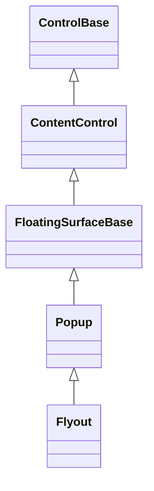
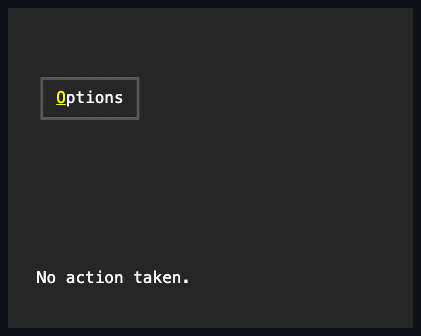

# Flyout

## Overview

`Flyout` is declared `public sealed class Flyout : Popup`. It is a direct
[`Popup`](popup.md#overview) specialization for interactive, anchored,
light-dismiss content. The Flyout object is the popup surface itself; it does
not forward state to a private Popup.

## Inheritance



## API

| Member                          | Type             | Default | Description                                                             |
| ------------------------------- | ---------------- | ------- | ----------------------------------------------------------------------- |
| Inherited `Content`             | `ControlBase?`   | `null`  | The flyout body; the flyout owns it.                                    |
| Inherited `Anchor`              | `ControlBase?`   | `null`  | Identifies the sibling used for placement.                              |
| Inherited `Placement`           | `PopupPlacement` | `Below` | Selects the preferred anchor-relative placement.                        |
| Inherited `IsOpen`              | `bool`           | `false` | Controls the direct inherited popup presentation.                       |
| Inherited `CloseOnEscape`       | `bool`           | `true`  | Lets a bubbling Escape close the surface.                               |
| Inherited `FocusOnOpen`         | `bool`           | `true`  | Transfers focus to the first eligible descendant.                       |
| Inherited `ShowAnchorIndicator` | `bool`           | `false` | Draws an arrow toward the anchor when enabled.                          |
| `ShowAt(ControlBase anchor)`    | `void`           | —       | Validates, assigns the anchor, and opens the same Flyout instance.      |
| Inherited `Closing`             | `EventHandler`   | —       | Raised when closure is requested or after closing state commits.        |
| Inherited `Closed`              | `EventHandler`   | —       | Raised only after the surface becomes unavailable and its bounds clear. |

## Light dismiss

`ShowAt(anchor)` validates the anchor, assigns it, and opens the same Flyout
instance. Opening installs light-dismiss observation, closes any other open
Flyout beneath the same logical root, and keeps normal routed ancestry. A
primary press outside the Flyout and its anchor closes it without replaying the
press to the background. Moving or resizing the anchor closes the open Flyout,
so a stale placement is never kept on screen.

Automatic `IsOpen` presentation uses light dismissal without creating a modal
scope. The inherited `OpenModal` API remains available when a caller explicitly
needs application modality. Placement, flipping, root clamping, elevation,
frame, shadow, content ownership, lifecycle, and disposal follow
[`Popup`](popup.md#overview) and the
[floating-surface](../../concepts/floating-surfaces.md#overview) contracts.

## Example



```csharp
var flyout = new Flyout
{
    Content = new Stack { Children = { confirmButton, cancelButton } },
};

owner.Children.Add(flyout);
flyout.ShowAt(triggerButton);
```

## Expected behavior

| Scope               | Observable evidence                                                       |
| ------------------- | ------------------------------------------------------------------------- |
| Public API          | Validation, defaults, state changes, and deterministic output.            |
| Integrated behavior | Cross-component behavior through the real ownership and routing boundary. |

- The Flyout is a direct Popup with no nested presentation Popup, and `ShowAt`
  validates its argument and uses exactly that anchor.
- Placement, rendering, and `SurfaceBounds` behave as inherited from Popup.
- A press outside dismisses the flyout without replaying the press, Escape
  closes it, and opening transfers focus to the first eligible descendant.
- Opening one flyout closes a sibling under the same logical root, and moving or
  resizing the anchor closes the open flyout.
- The lifecycle events fire in their documented order, and detaching or
  disposing the flyout cleans it up.
- Final rendering resolves to the expected semantic cells.
