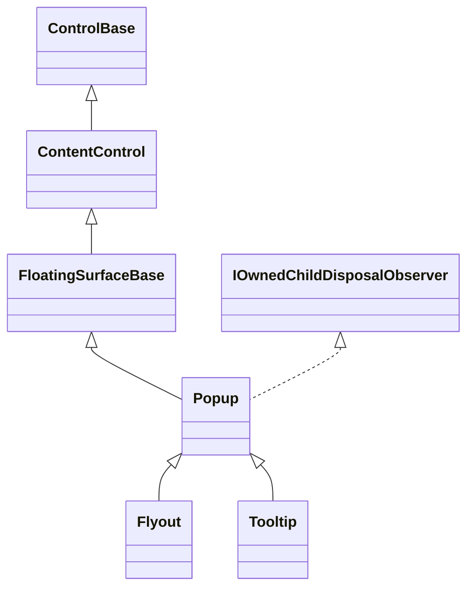
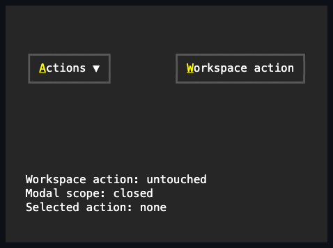

# Popup

## Overview

`Popup` is declared `public class Popup : FloatingSurfaceBase` and implements
the internal `IOwnedChildDisposalObserver`, so a directly disposed `Content`
notifies the owning Popup before its disposal publishes. It displays one owned
content control on an opaque, framed, anchor-relative modal surface. Its
constructor calls the inherited `EnableChromeAuthoring()`, widening
[`FloatingSurfaceBase`](../../concepts/floating-surfaces.md#overview)'s
capability-gated `Border`/`Shadow` authoring to actually usable for `Popup` and
[`Window`](../windows/window.md#overview) alike, each enabling it from its own
constructor. The Popup object renders and hit-tests that surface directly; it
does not own a second presentation Popup. Setting `IsOpen` to true while the
popup is attached to an application tree automatically enters a dismissing
[application modal scope](../../concepts/modality.md#popup-and-window-presentations).
`OpenModal` remains available when a caller needs a different outside policy or
an explicit initial-focus target. Elevation is automatic, so a caller does not
need to assign a higher ordinary z-order. The surface always clears before its
content renders, which means a drop-down can never visually blend with the
content behind it.

An open popup is promoted into the shared popup layer after ordinary sibling
rendering and before final pointer targeting. It stays visually and
interactively above later layout siblings — FIGlet output or document text, for
example — without being reparented and without changing its routed ancestry.
Promotion omits the surface from the ordinary pass and renders it exactly once
in the popup pass. Dedicated popup ownership slots remain the preferred way to
declare this relationship, but ordinary ownership edges get the same behavior
through intrinsic promotion.

## Inheritance



## API

| Member                                                                                         | Type                                           | Default                         | Description                                                                                                   |
| ---------------------------------------------------------------------------------------------- | ---------------------------------------------- | ------------------------------- | ------------------------------------------------------------------------------------------------------------- |
| Inherited `Content`                                                                            | `ControlBase?`                                 | `null`                          | Holds one owned surface child and collapses it while closed.                                                  |
| `Anchor`                                                                                       | `ControlBase?`                                 | `null`                          | The optional attached sibling or ancestor used to place the open surface.                                     |
| `Placement`                                                                                    | `PopupPlacement`                               | `Below`                         | The preferred anchor-relative placement; flips to the opposite side when it does not fit.                     |
| `IsOpen`                                                                                       | `bool`                                         | `false`                         | Controls the visible surface and the configured automatic modal lifetime.                                     |
| `ModalBehavior`                                                                                | `PopupModalBehavior`                           | `Auto`                          | Selects automatic Dismiss modality or owner-managed modality.                                                 |
| `FocusOnOpen`                                                                                  | `bool`                                         | `true`                          | Transfers focus to the first eligible descendant across every ownership slot on open.                         |
| `CloseOnEscape`                                                                                | `bool`                                         | `true`                          | Closes the popup when Escape bubbles up from its content.                                                     |
| `ConnectsToAnchor`                                                                             | `bool`                                         | `false`                         | Initialization-only; omits the frame edge adjoining the resolved anchor side.                                 |
| `SuppressCloseOtherPopups`                                                                     | `bool`                                         | `false`                         | Initialization-only; keeps other open Popup descendants of the same logical root open.                        |
| `ShowAnchorIndicator`                                                                          | `bool`                                         | `false`                         | Draws one directional frame arrow toward the anchor.                                                          |
| `Style`                                                                                        | `PopupChrome`                                  | Composed from `Border`/`Shadow` | Sets `Border` and `Shadow` together; a component left null in it keeps Theme ownership.                       |
| Inherited `Border`                                                                             | `Border`                                       | `Popup` theme profile           | Public complete local frame authoring, enabled by `EnableChromeAuthoring()`.                                  |
| Inherited `ResetBorder()`                                                                      | `void`                                         | —                               | Returns the local border to Theme ownership.                                                                  |
| Inherited `Shadow`                                                                             | `Shadow`                                       | `Popup` theme profile           | Public complete local shadow authoring, enabled by `EnableChromeAuthoring()`.                                 |
| Inherited `ResetShadow()`                                                                      | `void`                                         | —                               | Returns the local shadow to Theme ownership.                                                                  |
| Inherited `ActualFace`                                                                         | `Face`                                         | Resolved                        | Read-only; the current theme-, state-, and caller-composed face.                                              |
| Inherited `ActualBorder`                                                                       | `Border`                                       | Resolved                        | Read-only; the current theme-, state-, and caller-composed border.                                            |
| Inherited `ActualShadow`                                                                       | `Shadow`                                       | Resolved                        | Read-only; the current theme-, state-, and caller-composed shadow.                                            |
| Inherited `SurfaceBounds`                                                                      | `Rect`                                         | Empty                           | Read-only; the committed framed rectangle while open.                                                         |
| `OpenModal(OutsideInteraction outsideInteraction = Dismiss, ControlBase? initialFocus = null)` | `ModalScope`                                   | —                               | Opens a closed surface and enters an application-owned modal scope, for a non-default policy or focus target. |
| Inherited `Opened`                                                                             | `EventHandler`                                 | —                               | Raised only after the surface becomes presented and its bounds commit.                                        |
| Inherited `CloseRequested`                                                                     | `EventHandler<SurfaceCloseRequestedEventArgs>` | —                               | Raised before anything commits; a handler can veto by setting `Cancel`.                                       |
| Inherited `Closing`                                                                            | `EventHandler`                                 | —                               | Raised when closure is requested or after family-specific closing state commits.                              |
| Inherited `Closed`                                                                             | `EventHandler`                                 | —                               | Raised only after the presented surface becomes unavailable and its bounds clear.                             |

> [!NOTE]
>
> Two of the defaults above hold only for a directly constructed `Popup`. Both
> shipped subclasses flip `SuppressCloseOtherPopups` to `true` in their
> constructors (`Tooltip`, `Flyout`), so showing either leaves an open drop-down
> or menu untouched; and the popups `InputBase.EnablePopup` builds default
> `FocusOnOpen` to `false`, with `Tooltip` setting it false again.

## Content ownership

The inherited `Content` uses managed capacity-one ownership and is collapsed
while `IsOpen` is false, so closed content cannot receive focus, pointer input,
or rendering. Directly disposing the assigned content notifies the owning Popup
before the disposal publishes, so the popup repairs its semantic state first.
Replacing content detaches the previous child without disposing it and preserves
the last `Visibility` the Popup forced on it; newly committed content is forced
visible while open, or collapsed while closed.

## Placement

`Anchor` and `Placement` define the position. `Below`, `Above`, `Right`, and
`Left` use the anchored edge, and when the preferred side does not fit, the
popup flips to the natural opposite side before clamping. An open popup follows
its `Anchor` when a foreign sibling's own layout moves it — a preceding sibling
growing, a container resizing it, and so on — not just when the popup's own root
resizes. The base response re-resolves placement, the same flip-and-clamp logic
a root resize already runs; [`Tooltip`](tooltip.md#overview) uses that default,
while [`Flyout`](flyout.md#overview) overrides it to dismiss instead of chasing
the anchor's new position, matching light dismiss's assumption that its captured
bounds stay valid only for a stationary anchor.

Detached construction may stage any `Anchor`. Presentation validates it
transactionally: the anchor must be live, attached to the popup's dispatcher,
and in the same retained tree. A sibling or ancestor is valid; the popup itself
and its descendants are rejected. Invalid opening leaves `IsOpen`, content
visibility, and `SurfaceBounds` closed, while an invalid replacement on an open
popup leaves the existing anchor and presentation untouched.

Placement constrains the framed surface to the popup host. The content occupies
only the deflated interior. A root resize runs normal layout again, so an open
popup repositions before the next frame. Closed layout still enters the base
collapsed-content measure and arrange transactions, clearing stale desired size
and bounds without invoking content overrides. The surface frame overlays
retained content, so child shadows cannot replace its final frame cells.

## Modal behavior

`ModalBehavior` accepts only `Auto` or `None`. During opening, or during a later
attachment and availability reconciliation, `Auto` enters the default dismissing
scope and `None` leaves modality to the logical owner. Changing the value while
the surface is already presented does not enter or exit its current scope; the
new policy applies on the next opening or reconciliation. Undefined values throw
before any mutation. Either policy still permits an explicit `OpenModal` call
while the Popup is closed.

`IsOpen` controls surface and content arranging, rendering, hit testing, and the
configured automatic modal lifetime. Opening a detached popup is staged and
reconciled when the Popup later attaches. Opening an attached Popup under
`ModalBehavior.Auto` enters `OutsideInteraction.Dismiss`; an outside press or an
unhandled in-plane wheel closes the popup without replaying that input.
`OpenModal(outsideInteraction, initialFocus)` opens a closed surface and returns
its disposable `ModalScope`, for callers that need a non-default policy or focus
target. One popup cannot own two live modal presentations.

An ordinary close raises `Closing` while its modal scope and content are still
available, then exits the scope before content becomes unavailable. Disposing
the returned or application-visible scope closes the Popup, so an attached
transient surface never falls back to accidental modeless interaction. A failed
modal entry closes only a popup exposed by that call and rethrows the initiating
failure after rollback. The shared
[presentation contract](../../concepts/modality.md#popup-and-window-presentations)
defines validation, focus selection, and lifetime ownership.

## Chrome and code-owned glyphs

`ConnectsToAnchor` and `SuppressCloseOtherPopups` are initialization-only
policy. The former removes the frame edge adjoining the resolved anchor side.
The latter prevents opening from closing other Popup descendants of the same
logical root. `ShowAnchorIndicator` adds one arrow to the frame edge facing the
anchor.

`Face`, `Border`, and `Shadow` resolve from the active theme's `Popup` profile
unless a caller assigns a complete local composite. `ResetFace()`,
`ResetBorder()`, and `ResetShadow()` return those values to theme ownership.
`Style` sets `Border` and `Shadow` together as one `PopupChrome` value; a
component left null in it keeps that part on theme ownership. Every control that
owns a retained Popup (`ComboBox`, `DateInput`, `DateTimeInput`, `MenuItem`,
`ContextMenu`) forwards this same `PopupChrome` fragment through its own
`PopupChrome`/`SubmenuChrome` property, instead of leaking the private Popup.
The resolved `ActualShadow` applies to `SurfaceBounds`, not to the Popup's
root-sized layout slot; it stays outside popup hit testing and obeys the root
frame clip. `SurfaceBounds` reports the committed rectangle, including its
one-cell frame.

The theme-selected `Border.GlyphStyle` supplies the popup chrome. Terminal-safe
glyph repair remains code-owned.

## Interaction

A closed popup neither draws its surface nor participates in hit testing. An
open popup routes pointer and keyboard input to its content through normal
routing, and its frame itself is also a hit-testable surface. `CloseOnEscape`
defaults to true and closes an open popup when Escape bubbles up from its
content with activation-eligible modifiers. Shift and lock state remain
eligible; application-command modifiers bubble without closing the popup. The
FIGlet showcase picker demonstrates the composition as
`ComboBox → Popup → ListView`.

Popup owns generic elevation, placement fallback, the default Dismiss modality,
and the open-chain lifetime. It delegates isolation and consume-without-replay
behavior to the application modality manager. Framework consumers may coordinate
a larger logical plane internally: for example,
[`Menu`](../menus/menu.md#interaction) decides when hover switches an armed
sibling submenu, while each `MenuItem` configures that retained popup's
preferred direction and menu-specific surface appearance. A press inside any
open descendant popup surface stays inside the ancestor chain; light dismissal
never collapses an ancestor before the descendant input route completes.

## Lifecycle

`Closing` is raised before content is collapsed, which gives a composite owner
the chance to restore focus. `IsOpen` is already false at that point, so the
surface no longer renders or hit-tests, even though the previous `SurfaceBounds`
remains committed and readable during the event. `Closed` follows after content
becomes unavailable and `SurfaceBounds` has cleared.

An `IsOpen` change commits, invalidates, and publishes `PropertyChanged` before
any dependent work. Opening then exposes the current content and requests focus.
Closing begins with `IsOpen == false`: it raises `Closing` while the current
content retains its pre-close availability and the previous bounds remain
readable, but the surface is already ineligible for rendering and hit testing.
It then collapses the current content and releases its focus and capture, clears
`SurfaceBounds`, and raises `Closed`, in that order. Every stage still runs
after a callback failure, and the earliest failure is rethrown once the complete
transition finishes. A callback cannot reenter `IsOpen`; attempting to do so
throws `InvalidOperationException` without reversing the outer transition.

Disposing a Popup performs the common surface cleanup before disposing its
currently assigned content. Content removal still publishes the inherited
committed `Content == null` transition; callback failures cannot interrupt
disposal, and the earliest failure remains the one rethrown. Previously replaced
content stays detached and caller-owned.

## Example



```csharp
var popup = new Popup
{
    Content = details,
    Anchor = helpButton,
    Placement = PopupPlacement.Below,
    Face = new Face(
        SemanticColor.ControlText,
        Color.Rgb(68, 68, 68),
        SemanticDecoration.NormalText,
        Underline.None,
        Color.Default),
    Border = new Border(
        BorderSide.All,
        BorderGlyphStyle.Rounded,
        Color.Rgb(0, 215, 255),
        Color.Transparent,
        SemanticDecoration.Border),
};

popup.IsOpen = true;
```

## Expected behavior

| Scope               | Observable evidence                                                       |
| ------------------- | ------------------------------------------------------------------------- |
| Public API          | Validation, defaults, state changes, and deterministic output.            |
| Integrated behavior | Cross-component behavior through the real ownership and routing boundary. |

- Opening while detached is staged and reconciled on attachment, a closed popup
  neither renders nor hit-tests, and the open surface paints opaque framed
  cells.
- The surface is promoted above later siblings and rendered exactly once,
  whether it comes from an ordinary or a popup ownership slot, and an ineligible
  intermediate owner suppresses promotion.
- Placement uses the preferred side and falls back by flipping and clamping.
- Escape from content closes the popup, and light dismiss preserves descendant
  surfaces until their input routes complete.
- `ModalBehavior` validates its values, anchor chrome renders connected and
  indicated variants, and `SuppressCloseOtherPopups` keeps sibling popups open.
- Focus discovery crosses private slots on open, and closing restores focus.
- Callback failures never abort the transition, the first failure is the one
  rethrown, and reentering `IsOpen` from a callback is rejected.
- Ownership rules hold, a root resize repositions the open surface, and closed
  layout clears stale geometry; final rendering is deterministic down to the
  exact cells.

For the modal path, callers can additionally rely on automatic default Dismiss
behavior, rejection of a duplicate presentation, initial-focus validation,
consumption of outside presses and unhandled in-plane wheel input, retention of
scroll children, scope exit on Escape and on ordinary close, focus restoration,
external scope disposal closing the visual surface, rollback on failed entry,
owner-managed composite planes, and completion through reentrant callback
failures.
