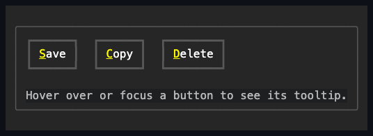

# Tooltip

## Overview

`Tooltip` is a direct [`Popup`](popup.md#overview) specialization for passive,
delayed information. The Tooltip object is itself the owned popup-layer surface
associated with its anchor; it does not create a private Popup.

## API

| Member                         | Default          | Purpose                                                    |
| ------------------------------ | ---------------- | ---------------------------------------------------------- |
| `Content`, `Text`              | `null`, `null`   | Supply rich content, or text as a shorthand.               |
| `Anchor`, `Placement`          | `null`, `Below`  | Identify the trigger and position relative to it.          |
| `ShowDelay`, `HideDelay`       | 500 ms, 100 ms   | Configure deterministic hover/focus presentation timing.   |
| `IsOpen`                       | `false`          | Reports, or directly controls, the inherited presentation. |
| `FocusOnOpen`, `CloseOnEscape` | `false`, `false` | Keep the passive surface out of focus and Escape handling. |
| `HitTestVisible`               | `false`          | Keeps the tooltip from becoming a pointer target.          |

`SetText` and `SetContent` create or update the one Tooltip associated with a
non-null anchor. Overloads also set the placement and show delay. `GetTooltip`
returns that exact surface, and `ClearTooltip` closes and detaches it; a later
Set call may reuse the anchor's registered framework-part slot with a new
Tooltip.

An attached Tooltip listens to its anchor's pointer entry and exit, focus gain
and loss, and pointer presses. Hover or focus starts one show timer, and exit
starts one hide timer; focus loss or a press hides the tooltip immediately.
Overlapping hover and focus transitions restart a single timer subscription
rather than stacking callbacks. The timers run on the owning dispatcher, stop on
detach, and are disposed together with the Tooltip.

Tooltip defaults to a passive surface policy: no automatic modal scope, no focus
transfer, no keyboard navigation, no Escape handling, and no hit testing. These
are constructor defaults on the underlying Popup surface, not enforced
invariants — the corresponding properties remain settable. Once available, the
Tooltip measures and arranges itself against the anchor's root, so the first
open frame already has committed content geometry. Because the Tooltip lives in
its anchor's owned popup-layer slot rather than as a normal tree child, it is
not swept up in the anchor's own layout passes; instead it re-resolves its own
placement directly whenever the anchor's text or content changes, the anchor
reflows, or the surface it is presented on resizes while still open. Placement,
edge flipping, root clamping, elevation, lifecycle, and ownership otherwise
follow Popup and the
[floating-surface contract](../../concepts/floating-surfaces.md#overview).

Appearance does not follow Popup. Tooltip resolves the dedicated `TooltipStyle`
(`styles.tooltip`) instead of inheriting `PopupStyle` directly, so a hint stays
visually distinct from an interactive drop-down or menu even though both are
framed. Both share the `window`/`windowText`
[floating-tier colors](../../concepts/themes.md#style-types) and an all-side
border, but `TooltipStyle` draws that border with the plain square glyph style
rather than Popup's rounded one, and carries no shadow. The frame keeps a
tooltip legible when it floats over occupied content instead of blending into
whatever text or controls sit underneath it. Like every style-conforming
control, this is theme-authorable — a theme's `styles.tooltip` entry overrides
the default.

## Example



```csharp
Tooltip.SetText(
    saveButton,
    "Save your work",
    PopupPlacement.Above,
    TimeSpan.FromMilliseconds(500));
```

## Expected behavior

- The Tooltip is a direct Popup with no nested presentation Popup, and it owns
  its text or rich content.
- The attached Set/Get/Clear/Set cycle reuses the anchor slot as documented, and
  arguments and timing intervals are validated.
- Pointer and focus triggers honor the configured delays, overlapping triggers
  restart the single timer, and a press or focus loss dismisses the tooltip
  immediately.
- The passive policy holds: the tooltip takes no focus, handles no keyboard
  input, enters no modal scope, and is never a pointer target.
- The default appearance resolves `TooltipStyle` — a plain square all-side
  border with no shadow, on the `window`/`windowText` colors — visually distinct
  from Popup's rounded frame, and a theme's `styles.tooltip` entry can still
  override it.
- The first open frame has committed geometry and renders its text, the
  lifecycle cleans up as documented, and disposal leaves no retained anchor or
  timer subscriptions.
