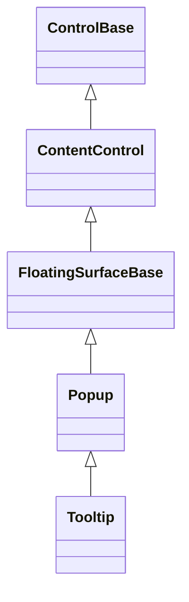

# Tooltip

## Overview

`Tooltip` is declared `public sealed class Tooltip : Popup`. It is a direct
[`Popup`](popup.md#overview) specialization for passive, delayed information.
The Tooltip object is itself the owned popup-layer surface associated with its
anchor; it does not create a private Popup.

## Inheritance



## API

| Member                                                                                   | Type             | Default  | Description                                                          |
| ---------------------------------------------------------------------------------------- | ---------------- | -------- | -------------------------------------------------------------------- |
| Inherited `Content`                                                                      | `ControlBase?`   | `null`   | Supplies rich content; the tooltip owns it.                          |
| `Text`                                                                                   | `string?`        | `null`   | Text shorthand; reads or mutates an owned `Text` `Content` in place. |
| Inherited `Anchor`                                                                       | `ControlBase?`   | `null`   | Identifies the trigger control.                                      |
| Inherited `Placement`                                                                    | `PopupPlacement` | `Below`  | Selects the preferred anchor-relative placement.                     |
| `ShowDelay`                                                                              | `TimeSpan`       | `500 ms` | Non-negative delay before showing on hover or focus.                 |
| `HideDelay`                                                                              | `TimeSpan`       | `100 ms` | Non-negative delay before hiding on pointer exit.                    |
| Inherited `IsOpen`                                                                       | `bool`           | `false`  | Reports, or directly controls, the inherited presentation.           |
| Inherited `FocusOnOpen`                                                                  | `bool`           | `false`  | Keeps the passive surface out of focus transfer.                     |
| Inherited `CloseOnEscape`                                                                | `bool`           | `false`  | Keeps the passive surface out of Escape handling.                    |
| Inherited `IsHitTestVisible`                                                             | `bool`           | `false`  | Keeps the tooltip from becoming a pointer target.                    |
| `SetText(ControlBase anchor, string text)`                                               | `void`           | —        | Creates or updates the text tooltip on `anchor`.                     |
| `SetText(ControlBase anchor, string text, PopupPlacement placement)`                     | `void`           | —        | Overload that also sets the preferred placement.                     |
| `SetText(ControlBase anchor, string text, PopupPlacement placement, TimeSpan showDelay)` | `void`           | —        | Overload that also sets the placement and show delay.                |
| `SetContent(ControlBase anchor, ControlBase content)`                                    | `void`           | —        | Creates or updates the rich-content tooltip on `anchor`.             |
| `SetContent(ControlBase anchor, ControlBase content, PopupPlacement placement)`          | `void`           | —        | Overload that also sets the preferred placement.                     |
| `GetTooltip(ControlBase anchor)`                                                         | `Tooltip?`       | —        | Returns the tooltip associated with `anchor`, or null.               |
| `ClearTooltip(ControlBase anchor)`                                                       | `void`           | —        | Closes and detaches the tooltip associated with `anchor`.            |

`SetText` and `SetContent` create or update the one Tooltip associated with a
non-null anchor. Overloads also set the placement and show delay. `GetTooltip`
returns that exact surface, and `ClearTooltip` closes and detaches it; a later
`Set` call may reuse the anchor's registered framework-part slot with a new
Tooltip.

Every multi-argument overload validates all arguments before creating,
reattaching, or mutating a Tooltip. A rejected placement or delay therefore
preserves the existing anchor, content, placement, timing, and visibility.

## Keyboard

| Key | Behavior                                                |
| --- | ------------------------------------------------------- |
| —   | This control has no control-specific keyboard commands. |

## Triggers and timing

An attached Tooltip listens to its anchor's pointer entry and exit, focus gain
and loss, and pointer presses. Hover or focus starts one show timer, and exit
starts one hide timer; focus loss or a press hides the tooltip immediately.
Overlapping hover and focus transitions restart a single timer subscription
rather than stacking callbacks. The timers run on the owning dispatcher and are
released on detach, so reattachment creates timers from the new dispatcher's
clock and queue instead of retaining the previous owner. They are also released
when the Tooltip is disposed, or when `Visibility` becomes `Hidden` while the
Tooltip is still attached.

Tooltip defaults to a passive surface policy: no automatic modal scope, no focus
transfer, no keyboard navigation, no Escape handling, and no hit testing. These
are constructor defaults on the underlying Popup surface, not enforced
invariants — the corresponding properties remain settable. Once available, the
Tooltip measures and arranges itself against the anchor's root, so the first
open frame already has committed content geometry. Because the Tooltip lives in
its anchor's owned popup-layer slot rather than as a normal tree child, it is
not swept up in the anchor's own layout passes; instead it re-resolves its own
placement directly whenever the anchor's text or content changes, the anchor
reflows, or the surface it is presented on resizes while still open. Placement,
edge flipping, root clamping, elevation, lifecycle, and ownership otherwise
follow [`Popup`](popup.md#overview) and the
[floating-surface contract](../../concepts/floating-surfaces.md#overview).

## Appearance

Appearance does not follow Popup. Tooltip resolves the dedicated `TooltipStyle`
(`styles.tooltip`) instead of inheriting `PopupStyle` directly, so a hint stays
visually distinct from an interactive drop-down or menu even though both are
framed. Both share the `window`/`windowText`
[floating-tier colors](../../concepts/themes.md#style-types) and an all-side
border, but `TooltipStyle` draws that border with the light glyph style rather
than Popup's rounded one, and carries no shadow. The frame keeps a tooltip
legible when it floats over occupied content instead of blending into whatever
text or controls sit underneath it. Like every style-conforming control, this is
theme-authorable — a theme's `styles.tooltip` entry overrides the default.

## Example


```csharp
Tooltip.SetText(
    saveButton,
    "Save your work",
    PopupPlacement.Above,
    TimeSpan.FromMilliseconds(500));
```

## Expected behavior

| Scope               | Observable evidence                                                       |
| ------------------- | ------------------------------------------------------------------------- |
| Public API          | Validation, defaults, state changes, and deterministic output.            |
| Integrated behavior | Cross-component behavior through the real ownership and routing boundary. |

- The Tooltip is a direct Popup with no nested presentation Popup, and it owns
  its text or rich content.
- The attached Set/Get/Clear/Set cycle reuses the anchor slot as documented, and
  arguments and timing intervals are validated.
- Pointer and focus triggers honor the configured delays, overlapping triggers
  restart the single timer, and a press or focus loss dismisses the tooltip
  immediately.
- The passive policy holds: the tooltip takes no focus, handles no keyboard
  input, enters no modal scope, and is never a pointer target.
- The default appearance resolves `TooltipStyle` — a light all-side border with
  no shadow, on the `window`/`windowText` colors — visually distinct from
  Popup's rounded frame, and a theme's `styles.tooltip` entry can still override
  it.
- The first open frame has committed geometry and renders its text, the
  lifecycle cleans up as documented, and clear, disposal, or hiding an attached
  Tooltip releases association, ownership, anchor, relayout, and timer
  subscriptions even when a close observer fails; the earliest failure is
  rethrown after cleanup.
