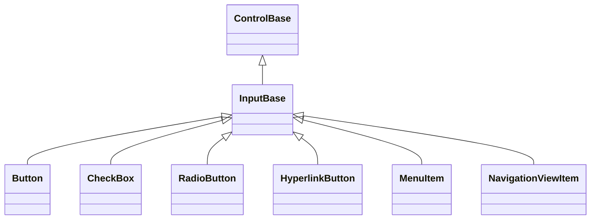

# Pressable caption and command capabilities

## Overview

[`InputBase`](input-base.md#overview) exposes a single-text-caption authoring
role and an optional command as two independent opt-in capabilities -
[`EnableCaption`](input-base.md#api) and [`EnableCommand`](input-base.md#api) -
rather than imposing them on every descendant. `EnableCaption` gives a control
no `Content` and no `Children` collection, with the only caption surface being
the string `Text` property, backed by a lazily materialized owned caption child
that never allocates until a control's text is first assigned. Reading `Text`
before `EnableCaption` runs is always safe and returns `""`; assigning it before
`EnableCaption` runs throws `InvalidOperationException`, the same precedent
[`IsOpen`](input-base.md#api) sets for the popup capability. `EnableCommand`
gives a control `Command`/`CommandParameter`, gated the same way. A control that
needs arbitrary owned content instead of a plain caption does not call
`EnableCaption` - it derives from [`InputBase`](input-base.md#overview) directly
and calls whichever capabilities it actually needs, the way
[`ComboBox`](input/combo-box.md#overview), `DateInput`, and `DateTimeInput` do
for their popup-backed fields, pairing `EnablePopup` with
`EnablePressActivation` and skipping the caption capability. `ListItem` composes
the same shared press behavior directly (not through `InputBase`) while keeping
[`ContentControl`](content-control.md#overview)'s replaceable `Content` edge for
realized template output, since it already derives from `ContentControl` for
that reason.

Concrete controls implement `Activate(ActivationCause)`. `Button`, `CheckBox`,
`RadioButton`, `HyperlinkButton`, and `MenuItem` call `EnablePressActivation`,
`EnableCaption`, and `EnableCommand`, and each declares `IStyled<TStyle>` for
its own typed style; the internal `TabHeader` calls only
`EnablePressActivation`, with its own field-backed `Text` override that never
materializes a caption child; `NavigationViewItem` calls `EnablePressActivation`
and `EnableCommand` but not `EnableCaption`, for the same field-backed-`Text`
reason. A control whose face is derived from data rather than a caption, such as
[`ComboBox`](input/combo-box.md#overview), calls only `EnablePressActivation`
and never touches the caption or command capabilities at all.

## Inheritance



## API

| Member                  | Type            | Default | Description                                                                                                                                                                                                                                                |
| ----------------------- | --------------- | ------- | ---------------------------------------------------------------------------------------------------------------------------------------------------------------------------------------------------------------------------------------------------------- |
| `EnableCaption()`       | `void`          | —       | Protected; opts into the single-text-caption authoring role. Throws if called twice.                                                                                                                                                                       |
| `EnableCommand()`       | `void`          | —       | Protected; opts into the optional command. Throws if called twice.                                                                                                                                                                                         |
| `Text`                  | `string`        | `""`    | The non-null caption string; virtual, so `NavigationViewItem` and `TabHeader` back it with their own field instead of calling `EnableCaption`. The getter never throws; the setter throws `InvalidOperationException` if `EnableCaption` was never called. |
| `TextControl`           | `Display.Text?` | `null`  | Protected, read-only; the lazily materialized owned caption child, or null before `Text` is first assigned.                                                                                                                                                |
| `Command`               | `ICommand?`     | `null`  | Optional command a concrete control invokes on activation. Both accessors throw `InvalidOperationException` if `EnableCommand` was never called.                                                                                                           |
| `CommandParameter`      | `object?`       | `null`  | Borrowed parameter passed to `Command` queries and execution. Gated the same way as `Command`.                                                                                                                                                             |
| `ExecuteCommandIfAny()` | `void`          | —       | Protected; invokes `Command` with `CommandParameter` when a command is bound and allows execution.                                                                                                                                                         |

`EnableCommand` supplies `Command`/`CommandParameter` lifetime - including
`CanExecuteChanged` subscription and dispatcher-marshaled invalidation - on top
of the [`InputBase`](input-base.md#api) press-activation capability a control
enables separately. Concrete classes still publish their own events and their
own programmatic activation method (`Button.Click`/`PerformClick`,
`MenuItem.Invoked`/`PerformInvoke`, and so on); only the command lifetime itself
is shared. A concrete `Activate` override decides whether and how `Command`
factors into its own semantics - `Button` and `HyperlinkButton` check
`CanExecute` and call `Execute` after their `Click` event; toggles and menu
items that have not called `EnableCommand` simply never expose the property at
all.

## Interaction

The owner's `UseMnemonic` value controls both marker rendering and automatic
[access-key activation](../concepts/access-keys.md#focus-and-semantic-actions)
against `Text`. An accepted access key focuses the semantic owner and calls
`Activate` with `ActivationCause.Keyboard`.

Space commits the pressed state on its first key press and ignores key repeats.
The matching release activates the control when it is still focused, or when it
is detached and therefore has no focus owner at all. Enter activates immediately
on press. Both keys require no modifier beyond Shift (plus the lock keys, where
the platform reports them) to be handled at all; a stroke carrying Control, Alt,
Super, Hyper, or Meta is left unhandled instead, so it bubbles to whatever
shortcut or ambient handler expects it. That gate is evaluated per stroke, not
per gesture: once a Space press has armed the held state, its paired release
always consumes the stroke the way the press did, but activates only if the
release itself carries no disqualifying modifier - an incidental Control, Alt,
Super, Hyper, or Meta that arrives between press and release cancels the pending
activation instead of committing it. A primary pointer press inside the arranged
box requests focus and capture for the caption-enabled control itself, even when
the owned caption child was the original hit target. Pointer motion updates the
pressed state by containment: releasing inside the bounds activates once, and
releasing outside cancels.

The rectangle used for that containment test is
[`InteractionBounds`](input-base.md#api), a `protected virtual` seam that
defaults to `Bounds`. A derived control that paints its pressed face translated
away from `Bounds` - such as `Button`'s whole-cell shadow translation while
`IsPressed` is true - overrides `InteractionBounds` to return the same rectangle
it actually paints, so press, drag, and release always agree with the committed
painted geometry instead of the untranslated layout footprint (see
[`docs/controls/input/button.md`](input/button.md#interaction)). `HitTest` stays
on `Bounds` regardless: it is the stable layout footprint used before a press
begins, and capture governs hit testing once a press is under way.

Focus loss, disable, hide, collapse, detach, disposal, terminal-focus loss, and
capture cancellation all clear any held state without activating. The protected
capture-cancellation hook runs after manager ownership and pressed state are
already clear. Completion revalidates lifetime, attachment, visibility, and
enabled state after pressed-state, focus, and capture-loss callbacks; an
invalidated owner is never cleared or activated through a stale continuation.
The protected pressed-state hook still runs when a property observer throws, so
derived geometry and rendering cannot disagree with committed `IsPressed`.
Keyboard and pointer completions carry the `Keyboard` and `Pointer`
`ActivationCause` values; a concrete programmatic API uses `Programmatic`.

The press-activation state machine is one internal composed behavior, enabled
once through [`InputBase.EnablePressActivation`](input-base.md#api) and used by
every control described on this page as well as `ComboBox`, `DateInput`, and
`DateTimeInput`, each of which enables it directly. `Expander`, `ListItem`, and
`Window` compose the same behavior directly instead of through `InputBase`,
since each already derives from a different public base
(`HeaderedContentControl`, `ContentControl`, and `FloatingSurfaceBase`
respectively) for its own content role. In every case the behavior owns no
control-tree state and operates only through the protected focus and capture
boundaries, keeping the public inheritance role about replaceable content,
rather than using inheritance merely to reuse event handling.

## Visual state and extension

A control that calls `EnableCaption` inherits `IsFocusable` and `IsTabStop`
default-true behavior from `InputBase`, so `CanFocus` is effectively true, and
supplies the normal, hovered, focused, pressed, and disabled states from
`ControlBase`. A derived semantic toggle adds checked, indeterminate, or
selected flags through its visual-state override. Its CLR setter uses
`SetVisualStateProperty`, which validates dispatcher and lifetime access before
checking equivalence, commits the field, clears resolved style caches, requests
the strongest phase declared by the active state styles, and then publishes one
property notification.

```csharp
public sealed class ToggleChip : InputBase
{
    private bool _isChecked;

    public ToggleChip()
    {
        EnablePressActivation();
        EnableCaption();
    }

    public bool IsChecked => _isChecked;

    protected override void Activate(ActivationCause cause) =>
        _ = SetVisualStateProperty(ref _isChecked, !_isChecked, nameof(IsChecked));

    protected override bool IsCheckedState => IsChecked;

    protected override void OnEvent(RoutedEventArgs eventArgs)
    {
        base.OnEvent(eventArgs);
        HandlePressActivation(eventArgs);
    }
}
```

## Example

```csharp
public sealed class ActionChip : InputBase
{
    public ActionChip()
    {
        EnablePressActivation();
        EnableCaption();
    }

    public event EventHandler<ActivationEventArgs>? Activated;

    protected override void Activate(ActivationCause cause) =>
        Activated?.Invoke(this, new ActivationEventArgs(cause));

    protected override void OnEvent(RoutedEventArgs eventArgs)
    {
        base.OnEvent(eventArgs);
        HandlePressActivation(eventArgs);
    }
}
```

## Expected behavior

| Scope               | Observable evidence                                                       |
| ------------------- | ------------------------------------------------------------------------- |
| Public API          | Validation, defaults, state changes, and deterministic output.            |
| Integrated behavior | Cross-component behavior through the real ownership and routing boundary. |

- A control that calls `EnableCaption` derives from
  [`InputBase`](input-base.md#overview), not `ContentControl`, and exposes no
  `Content` or `Children`; `Text` is the sole caption surface, and assigning it
  notifies exactly once and is silent on same-value assignment.
- Space and Enter follow the transitions above, pointer presses that originate
  on the owned caption child still route focus and capture to the owner, and an
  inside release activates exactly once while an outside release cancels.
- Every availability change cancels a held press without activating,
  visual-state changes request their combined impact, callbacks arrive in the
  documented order, and Unicode captions and tiny bounds render safely.
