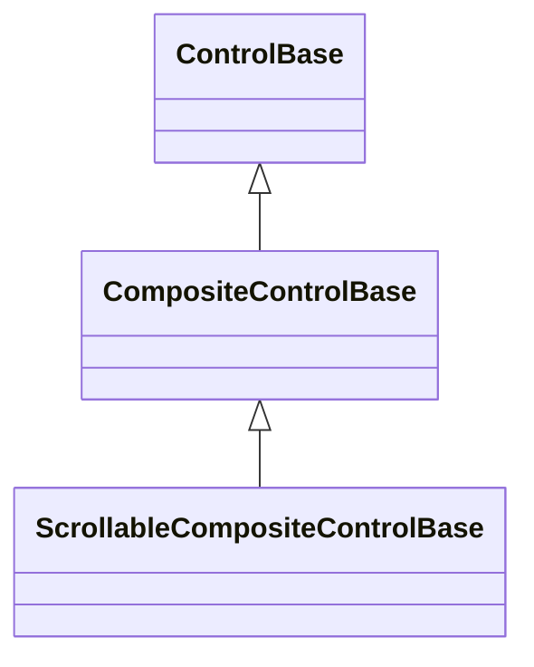

# ScrollableCompositeControl base API

## Overview

`ScrollableCompositeControlBase : CompositeControlBase` is the abstract base for
a composite whose retained private implementation tree includes one scrolling
presentation host. It keeps that mutable host private while republishing extent,
viewport, offsets, scroll policy, generated-scrollbar styling, and
`ScrollChanged` on the semantic component itself. The event sender is always the
component; the private host never escapes through the public contract.

Use `ScrollableCompositeControlBase` when a composite's private implementation
tree - not a caller-replaceable content value or a typed item collection -
includes exactly one container that scrolls.
[`ItemsControl`](items-control.md#overview) derivations with the same need use
[`ScrollableItemsControl`](items-control.md#scrollableitemscontrol) instead;
that role serves a semantic item owner, not a general composite.
[`TreeView`](collections/tree-view.md#overview),
[`JsonView`](collections/json-view.md#overview),
[`NavigationView`](navigation/navigation-view.md#overview), `CodeView`, and
`Document` all derive from this base.

## Inheritance



## API

| Member                                                                    | Type                                   | Default          | Description                                                                                                    |
| ------------------------------------------------------------------------- | -------------------------------------- | ---------------- | -------------------------------------------------------------------------------------------------------------- |
| `ScrollBars`                                                              | `ScrollBars`                           | Host-defined     | Virtual; axes enabled by the private scrolling host.                                                           |
| `ShowScrollBars`                                                          | `ShowScrollBars`                       | Host-defined     | Reservation policy for generated scrollbars.                                                                   |
| `ScrollBarStyle`                                                          | `ScrollBarStyle?`                      | `null`           | Complete local generated-scrollbar style.                                                                      |
| `ActualScrollBarStyle`                                                    | `ScrollBarStyle`                       | Resolved         | Resolved generated-scrollbar style.                                                                            |
| `Extent`                                                                  | `Size`                                 | Layout-dependent | Virtual; committed content extent.                                                                             |
| `Viewport`                                                                | `Size`                                 | Layout-dependent | Virtual; committed visible extent.                                                                             |
| `HorizontalOffset`                                                        | `int`                                  | `0`              | Virtual; valid horizontal content offset.                                                                      |
| `VerticalOffset`                                                          | `int`                                  | `0`              | Valid vertical content offset.                                                                                 |
| `LineSize`                                                                | `int`                                  | `1`              | Non-negative keyboard and wheel increment in cells.                                                            |
| `PageOverlap`                                                             | `int`                                  | `0`              | Non-negative context retained between page commands.                                                           |
| `ScrollBy(int x, int y, ScrollCause cause)`                               | `bool`                                 | —                | Virtual; adds signed deltas with saturation and endpoint clamping.                                             |
| `ScrollChanged`                                                           | `EventHandler<ScrollChangedEventArgs>` | No subscribers   | Reports offsets with the component as sender.                                                                  |
| `InitializeScrollableContent(Container, bool)`                            | `void`                                 | —                | Protected; installs the scrolling contract over an already-owned host, exactly once.                           |
| `InitializeScrollableContent(Container, ProjectionSurface, bool)`         | `void`                                 | —                | Protected; installs the scrolling contract together with the shared projection surface, exactly once.          |
| `InitializeWidthDependentProjection(Func<bool>, Func<int?>, Action<int>)` | `void`                                 | —                | Protected; installs reconciliation between a width-dependent projection and the host's settled viewport width. |
| `AddScrollChangedHandler(EventHandler<...>?)`                             | `void`                                 | —                | Protected virtual; adds one `ScrollChanged` subscriber.                                                        |
| `RemoveScrollChangedHandler(EventHandler<...>?)`                          | `void`                                 | —                | Protected virtual; removes one `ScrollChanged` subscriber.                                                     |
| `RaiseScrollChanged(ScrollChangedEventArgs)`                              | `void`                                 | —                | Protected; publishes one transition directly, independent of host forwarding.                                  |
| `HandleScrollKey(KeyEventArgs, bool)`                                     | `bool`                                 | —                | Protected; maps and applies one keyboard navigation stroke through the host.                                   |
| `HandleScrollWheel(PointerEventArgs)`                                     | `bool`                                 | —                | Protected; maps and applies one wheel record through the host.                                                 |
| `OnScrollHostScrollChanged(ScrollChangedEventArgs)`                       | `void`                                 | No-op            | Protected virtual; runs after the bridge refreshes cached properties.                                          |
| `TextSelectionPageDistance()`                                             | `int`                                  | Host-derived     | Protected override; the host's `Viewport.Height - PageOverlap` once installed.                                 |

`Extent`, `Viewport`, `HorizontalOffset`, `ScrollBars`, and `ScrollBy` are
`virtual` so a derived component can widen, restrict, or fully replace one axis
without losing the shared forwarding contract for the others - `Document` widens
`Extent` by its own layout-dependent maximum line width, restricts `ScrollBars`
to vertical, and replaces `HorizontalOffset` and the two-axis `ScrollBy`
overload entirely because its horizontal position is derived from its
selectable-text viewport rather than a generated horizontal scrollbar.

`AddScrollChangedHandler`/`RemoveScrollChangedHandler` back the public
`ScrollChanged` event by default, routing to the coordinator installed by
`InitializeWidthDependentProjection` instead once one is installed, so a
subscriber observes one settled transition per reconciled layout pass rather
than every intermediate reconciliation attempt while it settles a wrapped layout
against the viewport. `JsonView` and `CodeView` both call
`InitializeWidthDependentProjection`, paired with `forwardsScrollEvent: false`
at `InitializeScrollableContent`, so the default host-forwarding path never
double-publishes alongside the coordinator's own settled republication. A
component that republishes a transformed or settled transition through some
other mechanism of its own still overrides both methods directly instead.

### Projection surface

`ProjectionSurface : ControlBase` is the shared private measured and clipped
render surface a projection-style component installs into its private scrolling
host: a component that lays its own content out and paints it through one child
surface, rather than hosting arbitrary caller content. `JsonView`, `CodeView`,
and `Document` each install one through
`InitializeScrollableContent(Container, ProjectionSurface, bool)`.

A consumer constructs `new ProjectionSurface(owner, measure, render)` with the
owning component and two callbacks: `measure` receives the measure-time width
constraint (or null when unconstrained) and returns the projection's visual
extent; `render` receives the clipped canvas and the surface's own content
bounds. The surface owns no projection state and makes no layout or painting
decisions of its own - both callbacks delegate straight back to the owner.

| Member                                               | Type                 | Default  | Description                                                                   |
| ---------------------------------------------------- | -------------------- | -------- | ----------------------------------------------------------------------------- |
| `GetThemeChangeImpact(Theme?, Theme?, Face?, Face?)` | `InvalidationImpact` | Composed | Protected override; the maximum of this surface's own impact and the owner's. |
| `MeasureOverride(Constraint)`                        | `Size`               | —        | Protected override; returns `measure(constraint.Width)`.                      |
| `OnRenderContent(TerminalCanvas)`                    | `void`               | —        | Protected override; calls `render(canvas, ContentBounds)`.                    |

The surface owns no style slot of its own, so nothing about a Theme swap alone
would otherwise ever invalidate it: `GetThemeChangeImpact` composes its own
generic-default impact with the owner's real impact through the internal
`ScrollableCompositeControlBase.ResolveProjectionThemeChangeImpact` seam, which
simply forwards to the owner's own `GetThemeChangeImpact`. The base additionally
invalidates the installed surface for Render from its own `OnPropertyChanged`
override whenever a property change named `"ActualStyle"` commits, covering a
local style assignment and a Theme swap identically.

## Keyboard

This base still defines no control-specific keyboard commands of its own. A
derived component whose scrolling host is itself the focus target never sees
that host's own `AutoScroll` arrow, page, and wheel handling: routed input walks
the ancestry between the terminal focus and the root, and a private scrolling
host nested inside a focus-owning composite - `Document`, `CodeView`, and
`NavigationView` all keep focus on the outer component, not on their private
host - sits on the descendant side of that walk, not the ancestor side, so it
never receives the routed key or pointer event at all. Such a derivative
forwards the navigation key or wheel record it does own into `HandleScrollKey`
or `HandleScrollWheel`, which replay the identical mapping and endpoint policy
the host's own `AutoScroll` handling would have applied had the host been
reachable directly.

| Key                                            | Behavior                                                                |
| ---------------------------------------------- | ----------------------------------------------------------------------- |
| Up, Down, Left, Right, Page Up/Down, Home, End | Only when forwarded by a derived component through `HandleScrollKey`.   |
| Wheel                                          | Only when forwarded by a derived component through `HandleScrollWheel`. |

## Construction and ownership

A concrete constructor creates its complete retained subtree, commits the root
through `InitializeContent` exactly as `CompositeControlBase` requires, then
installs the scrolling contract through
`InitializeScrollableContent(host, forwardsScrollEvent)`. The scrolling host
passed to `InitializeScrollableContent` is either that same committed root
(`JsonView`, `CodeView`, `Document`) or a retained descendant of it
(`TreeView`'s and `NavigationView`'s items host sits inside a `Dock` alongside
other private children) - either way it must already be an owned retained
descendant of the component by the time `InitializeScrollableContent` runs.

`InitializeScrollableContent` rejects:

- null with `ArgumentNullException`;
- a host that is not yet an owned retained descendant, or off-dispatcher access,
  with `InvalidOperationException`;
- a disposed component with `ObjectDisposedException`; and
- a repeated call with `InvalidOperationException` - exactly one scrolling host
  may ever be installed.

A projection-style component - one whose private scrolling host paints through
one [projection surface](#projection-surface) rather than caller content - calls
`InitializeScrollableContent(host, surface, forwardsScrollEvent: false)`
instead, then `InitializeWidthDependentProjection` when its projection also
depends on the settled viewport width. `InitializeWidthDependentProjection`
rejects a host installed with `forwardsScrollEvent: true` and a call before the
projection-surface overload ran, both with `InvalidOperationException`; its
installed coordinator subscribes to the host's own `ScrollChanged` after the
retained scrolling bridge already did, so the bridge's own refresh of this
component's cached `Extent`, `Viewport`, and offsets always runs before a
subscriber reached through the coordinator observes the transition.

Internally, `InitializeScrollableContent` obtains a `RetainedScrollPart` through
the protected `ControlBase.RegisterRetainedScrollPart` seam - the same seam
`RegisterRetainedPartProperty<T>` uses for a single forwarded property. Both are
protected authoring primitives a derived control can use directly to build a
custom retained-part bridge beyond scrolling; `RetainedScrollPart` and
`RetainedPartProperty<T>` are obtained only through these registration methods
and are never constructed directly. Either bridge's lifetime follows the
registering component: it disposes automatically once the component disposes, or
earlier if any control on the ownership path between the bridged source and the
component changes parent.

## Layout and traversal

Layout and traversal are unchanged from `CompositeControlBase`: the base
measures and arranges the retained root exactly as documented there. Scrolling
geometry - extent, viewport, and offsets - is the private host's own
[box-model and scrolling](../concepts/scrolling.md#overview) behavior, reached
only through the members this base republishes.

## Lifetime

Disposing the component disposes its retained root exactly once, following
`CompositeControlBase`'s rules. The scrolling bridge (`RetainedScrollPart` and
its forwarded properties) is registered with the same lifecycle bookkeeping
every retained-part bridge uses, so it is disposed alongside the component
without a derived type needing to release it explicitly.

## Example

```csharp
public sealed class LogPanel: ScrollableCompositeControlBase
{
    private readonly Stack _log;

    public LogPanel()
    {
        _log = new Stack { AutoScroll = true, Orientation = Orientation.Vertical };
        InitializeContent(_log);
        InitializeScrollableContent(_log);
    }

    public void Append(string line) => _log.Children.Add(new Text(line));
}
```

An application interacts with `LogPanel.ScrollBy`, `VerticalOffset`, and
`ScrollChanged` without ever seeing the private `Stack`.

## Expected behavior

| Scope               | Observable evidence                                                       |
| ------------------- | ------------------------------------------------------------------------- |
| Public API          | Validation, defaults, state changes, and deterministic output.            |
| Integrated behavior | Cross-component behavior through the real ownership and routing boundary. |

- The public surface matches the documented reflection shape.
- `InitializeScrollableContent` succeeds once, over an already-owned host, and
  rejects a second attempt.
- `ScrollChanged` reports the component - never the private host - as sender.
- `Extent`, `Viewport`, and the offsets stay synchronized with the private
  host's own committed values after every layout pass.
- A component that overrides `Extent`, `HorizontalOffset`, `ScrollBars`, or
  `ScrollBy` preserves the override's documented restriction under every
  inherited entry point, not only the one it overrides directly.
