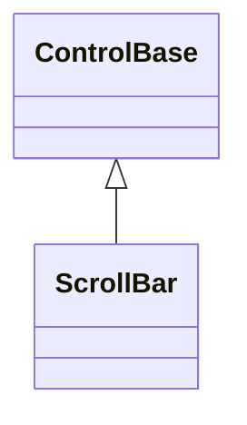

# ScrollBar

## Overview

`ScrollBar` is declared
`public sealed class ScrollBar : ControlBase, IStyled<ScrollBarStyle>`. It is a
focusable range control over an inclusive integer range, with buttons, a track,
and a draggable thumb. Use it on its own, or let an overflowing `Container`,
`TextInput`, `ListView`, or `ComboBox` generate one for you.

## Inheritance



## API

| Member                                                  | Type                            | Default    | Description                                                                                                     |
| ------------------------------------------------------- | ------------------------------- | ---------- | --------------------------------------------------------------------------------------------------------------- |
| `Minimum`                                               | `int`                           | `0`        | Non-negative inclusive lower endpoint.                                                                          |
| `Maximum`                                               | `int`                           | `100`      | Non-negative inclusive upper endpoint.                                                                          |
| `Value`                                                 | `int`                           | `0`        | The current value, always inside the inclusive `Minimum`–`Maximum` range.                                       |
| `ViewportSize`                                          | `int`                           | `0`        | Non-negative visible extent represented by the thumb.                                                           |
| `SmallChange`                                           | `int`                           | `1`        | Non-negative button, key, or wheel increment.                                                                   |
| `LargeChange`                                           | `int`                           | `10`       | Non-negative page or track-click increment.                                                                     |
| `Orientation`                                           | `Orientation`                   | `Vertical` | Vertical or horizontal geometry.                                                                                |
| `Style`                                                 | `ScrollBarStyle?`               | `null`     | Optional complete developer-authored presentation.                                                              |
| `ActualStyle`                                           | `ScrollBarStyle`                | Resolved   | Read-only; the complete local, theme-owned, or code-owned presentation.                                         |
| `ScrollBy(int delta, ScrollCause cause = Programmatic)` | `bool`                          | —          | Adds a signed command delta with saturation and endpoint clamping.                                              |
| `ValueChanged`                                          | `EventHandler<ScrollEventArgs>` | —          | Raised after a changed value commits while that commit is still newest; a reentrant newer commit supersedes it. |

A `ScrollBarStyle` bundles `Chrome`, `Fill`, a complete `ScrollBarGlyphs` set,
`ControlColor`s for the track, thumb, and buttons, and the inherited
`Face`/`Border`/`Shadow`. The presets are `FullBlock`, `FullLine`, `ThinBlock`,
and `ThinLine`. A `with` expression creates a validated member-wise copy of any
preset; assigning `null` to `Style` restores the Theme-owned presentation.
ScrollBar declares no `styles.*` theme key of its own: its code-owned
`Chrome`/`Fill`/glyph family come from the active theme's root-level `glyphs`
field whenever no local `Style` is assigned (see
[themes.md](../../concepts/themes.md#glyph-families)); per-part colors remain
code-owned. A style change that alters `Chrome` invalidates measure, because the
reserved extent moves; any other difference is render-only.

Hosts that generate their own bars expose a nullable `ScrollBarStyle` property
and a read-only `ActualScrollBarStyle`. A host forwards a local complete style
to both of its generated bars; when the property is null, the current Theme
supplies the style. The raw per-part colors, glyphs, `ScrollBarChrome`, and
`ScrollBarFill` are not exposed as independent control properties.

`TreeView` and `NavigationView` keep their scrolling stack private, so these
proxy properties are the only way to reach the bar they generate. Neither
control pins a style onto that bar, for a deliberate reason: a local complete
style permanently outranks the Theme, and since the private child cannot be
reached to reset it, pinning would leave the bar both unreachable and
unthemeable. A null proxy therefore leaves the bar to the Theme and the library
default, exactly like every other host.

## Keyboard

| Key                 | Behavior                                                        |
| ------------------- | --------------------------------------------------------------- |
| Left / Right        | Decreases or increases a horizontal scrollbar by `SmallChange`. |
| Up / Down           | Decreases or increases a vertical scrollbar by `SmallChange`.   |
| Page Up / Page Down | Decreases or increases the value by `LargeChange`.              |
| Home / End          | Moves to `Minimum` or `Maximum`.                                |

## Behavior

Range setters validate before mutating. `Minimum` and `Maximum` throw when the
new endpoint would exclude the current `Value` (or invert the other endpoint),
before any range state changes; `Value` itself is unaffected by a rejected
endpoint change. This is deliberately unlike [`Slider`](../input/slider.md#api),
whose endpoint setters instead commit and auto-clamp `Value` to the new
endpoint. `ScrollBy` saturates and clamps. A vertical bar intrinsically measures
`1×3` and a horizontal bar `3×1`; thin styles omit the directional buttons. The
thumb length represents `viewport / (range + viewport)`, with a one-cell minimum
whenever scrolling is possible. Tiny tracks degrade deterministically and never
draw outside their bounds.

## Input

Wheel events are handled only when they actually change the value. Arrow keys
and the directional buttons move by `SmallChange`; the Page keys and clicks on
the track move by `LargeChange`; Home and End jump to the endpoints. Keyboard
movement accepts lock state but no Shift or application-command modifier;
unsupported chords remain unhandled. Dragging the thumb captures the pointer,
and both cell and pixel pointer reports map through the same geometry. Keys
outside the scrollbar command set remain available to inherited routed input.

## Example


```csharp
var position = new ScrollBar
{
    Minimum = 0,
    Maximum = 240,
    ViewportSize = 24,
    Value = 80,
    Style = ScrollBarStyle.ThinLine
};
```

## Expected behavior

| Scope               | Observable evidence                                                       |
| ------------------- | ------------------------------------------------------------------------- |
| Public API          | Validation, defaults, state changes, and deterministic output.            |
| Integrated behavior | Cross-component behavior through the real ownership and routing boundary. |

- Range values are validated as documented, and thumb geometry follows the
  viewport formula.
- Local styles take precedence over the Theme and Theme replacement takes effect
  immediately, across all presets; glyphs are validated with width-policy
  fallback.
- Keyboard, pointer, and wheel input move the value as described, with
  unconsumed endpoint wheel events bubbling to ancestors and drags cancelling
  cleanly. Release cleanup is idempotent when a value or property callback
  detaches, hides, disposes, or explicitly releases capture: it clears live
  pressed state once and never mutates a disposed bar.
- Tiny tracks degrade safely, generated hosts forward styles to their bars as
  documented, and the rendered output matches exact cells.
