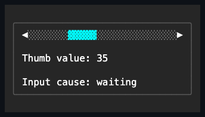

# ScrollBar

## Overview

`ScrollBar` is a focusable range control over an inclusive integer range. Use it
on its own, or let an overflowing `Container`, `TextInput`, `ListView`, or
`ComboBox` generate one for you.

## API

| Member                        | Default         | Description                                            |
| ----------------------------- | --------------- | ------------------------------------------------------ |
| `Minimum`, `Maximum`, `Value` | `0`, `100`, `0` | Non-negative inclusive range and current value.        |
| `ViewportSize`                | `0`             | Visible extent used for thumb geometry.                |
| `SmallChange`, `LargeChange`  | `1`, `10`       | Button/key and page/track increments.                  |
| `Orientation`                 | `Vertical`      | Vertical or horizontal geometry.                       |
| `Style`                       | `null`          | Optional complete developer-authored `ScrollBarStyle`. |
| `ActualStyle`                 | Theme scrollbar | The resolved style; always present.                    |
| `ValueChanged`                | No subscribers  | Reports each committed value and its cause.            |

A `ScrollBarStyle` bundles `Chrome`, `Fill`, a complete `ScrollBarGlyphs` set,
`ControlColor`s for the track, thumb, and buttons, and the inherited
`Face`/`Border`/`Shadow`. The presets are `FullBlock`, `FullLine`, `ThinBlock`,
and `ThinLine`. A `with` expression creates a validated member-wise copy of any
preset. A theme document may additionally author a `styles.scrollBar` section
with `chrome` (`"thin"` or `"full"`) and `fill` (`"line"` or `"block"`) string
members; an active theme's section supplies `Chrome`/`Fill` ahead of the
code-owned defaults whenever no local `Style` is assigned (see
[themes.md](../../concepts/themes.md#style-types)). The glyph family and
per-part colors remain code-owned.

Hosts that generate their own bars expose a nullable `ScrollBarStyle` property
and a read-only `ActualScrollBarStyle`. A host forwards a local complete style
to both of its generated bars; when the property is null, the current Theme
supplies the style. The raw per-part colors, glyphs, `ScrollBarChrome`, and
`ScrollBarFill` are not exposed as independent control properties.

`TreeView` and `NavigationView` keep their scrolling stack private, so these
proxy properties are the only way to reach the bar they generate. Neither
control pins a style onto that bar, for a deliberate reason: a local complete
style permanently outranks the Theme, and since the private child cannot be
reached to reset it, pinning would leave the bar both unreachable and
unthemeable. A null proxy therefore leaves the bar to the Theme and the library
default, exactly like every other host. A style change that alters `Chrome`
invalidates measure, because the reserved extent moves; any other difference is
render-only.

## Behavior

Range setters validate before mutating. `ScrollBy` saturates and clamps. A
vertical bar intrinsically measures `1×3` and a horizontal bar `3×1`; thin
styles omit the directional buttons. The thumb length represents
`viewport / (range + viewport)`, with a one-cell minimum whenever scrolling is
possible. Tiny tracks degrade deterministically and never draw outside their
bounds.

Wheel events are handled only when they actually change the value. Arrow keys
and the directional buttons move by `SmallChange`; the Page keys and clicks on
the track move by `LargeChange`; Home and End jump to the endpoints. Dragging
the thumb captures the pointer, and both cell and pixel pointer reports map
through the same geometry. Keys outside the scrollbar command set remain
available to inherited routed input.

## Example



```csharp
var position = new ScrollBar
{
    Minimum = 0,
    Maximum = 240,
    ViewportSize = 24,
    Value = 80,
    Style = ScrollBarStyle.ThinLine
};
```

## Expected behavior

Callers can rely on the following: range values are validated as documented;
thumb geometry follows the viewport formula; local styles take precedence over
the Theme and Theme replacement takes effect immediately, across all presets;
glyphs are validated with width-policy fallback; keyboard, pointer, and wheel
input move the value as described, with unconsumed endpoint wheel events
bubbling to ancestors and drags cancelling cleanly; tiny tracks degrade safely;
generated hosts forward styles to their bars as documented; and the rendered
output matches exact cells.
