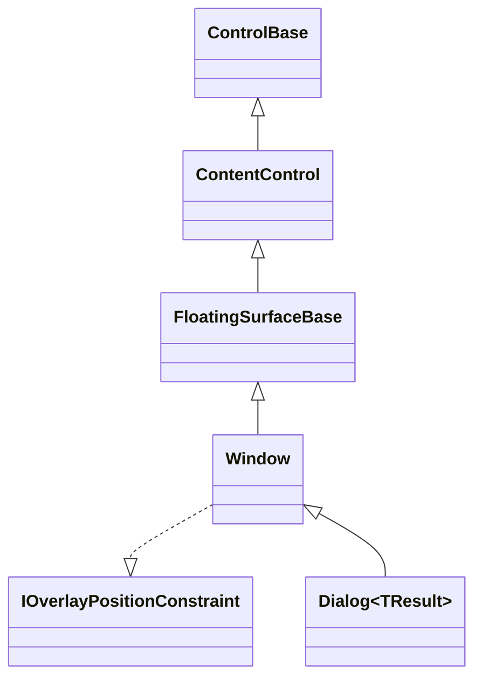
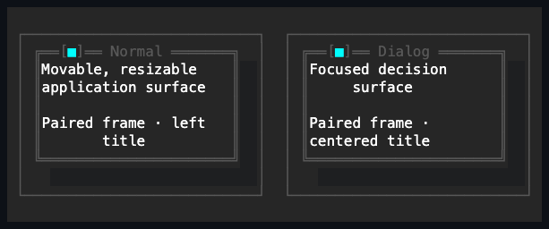
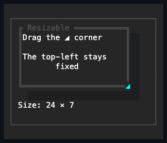
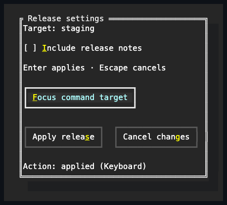

# Window

## Overview

`Window` is declared
`public partial class Window : FloatingSurfaceBase, IOverlayPositionConstraint`.
It frames its inherited `Content` as a titled terminal surface. Its constructor
calls the inherited `EnableChromeAuthoring()`, widening
[`FloatingSurfaceBase`](../../concepts/floating-surfaces.md#overview)'s
capability-gated `Border`/`Shadow` authoring to actually usable for `Window` and
[`Popup`](../popups/popup.md#overview) alike, each enabling it from its own
constructor. The Window object itself is the retained, rendered, hit-tested, and
optionally modal identity — there is no separate presentation wrapper to manage.
Window also implements the internal `IOverlayPositionConstraint` interface,
which lets an owning [`Overlay`](../layout/overlay.md#overview) center and clamp
it without rewriting authored offsets.

## Inheritance



## API

| Member                                                                                        | Type                                           | Default                            | Description                                                                                                                                  |
| --------------------------------------------------------------------------------------------- | ---------------------------------------------- | ---------------------------------- | -------------------------------------------------------------------------------------------------------------------------------------------- |
| Inherited `Content`                                                                           | `ControlBase?`                                 | `null`                             | Owns one child inside the titled frame.                                                                                                      |
| `Header`                                                                                      | `string`                                       | Empty                              | Non-null header text written into the top edge; rejects terminal control characters.                                                         |
| `HeaderPlacement`                                                                             | `WindowTitlePlacement`                         | `Left`                             | Aligns the header left or right within the lane left over after close chrome, or centers it on the whole frame and clamps it into that lane. |
| `CanMove`                                                                                     | `bool`                                         | `true`                             | Whether the window can be dragged by its title bar.                                                                                          |
| `CanResize`                                                                                   | `bool`                                         | `false`                            | Whether the window shows a `◢` grip and can be resized by dragging its bottom-right corner.                                                  |
| `CanClose`                                                                                    | `bool`                                         | `true`                             | Whether the window renders a framed close affordance in the title edge.                                                                      |
| `CloseOnEscape`                                                                               | `bool`                                         | `false`                            | Whether Escape requests closure when no cancel button handles it.                                                                            |
| `ClosePlacement`                                                                              | `WindowClosePlacement`                         | `Left`                             | Places close chrome after the left corner or before the right corner.                                                                        |
| `IsActive`                                                                                    | `bool`                                         | `false`                            | Read-only; whether this is the owning Application's active Window.                                                                           |
| Inherited `Border`                                                                            | `Border`                                       | `Window` theme profile             | Public complete local frame authoring, enabled by `EnableChromeAuthoring()`.                                                                 |
| Inherited `ResetBorder()`                                                                     | `void`                                         | —                                  | Returns the local border to Theme ownership.                                                                                                 |
| Inherited `Shadow`                                                                            | `Shadow`                                       | `Window` theme profile (composite) | Public complete local shadow authoring, enabled by `EnableChromeAuthoring()`.                                                                |
| Inherited `ResetShadow()`                                                                     | `void`                                         | —                                  | Returns the local shadow to Theme ownership.                                                                                                 |
| Inherited `ActualFace`                                                                        | `Face`                                         | Resolved                           | Read-only; the current theme-, state-, and caller-composed face.                                                                             |
| Inherited `ActualBorder`                                                                      | `Border`                                       | Resolved                           | Read-only; the current theme-, state-, and caller-composed border.                                                                           |
| Inherited `ActualShadow`                                                                      | `Shadow`                                       | Resolved                           | Read-only; the current theme-, state-, and caller-composed shadow.                                                                           |
| Inherited `SurfaceBounds`                                                                     | `Rect`                                         | Empty                              | Read-only; the committed window rectangle while presented.                                                                                   |
| Inherited `FadeInDuration`                                                                    | `TimeSpan`                                     | Zero                               | Sets an optional complete-surface entrance dissolve.                                                                                         |
| Inherited `FadeOutDuration`                                                                   | `TimeSpan`                                     | Zero                               | Sets an optional close dissolve that retains visibility and modality until invisible.                                                        |
| Inherited `FadeProgress`                                                                      | `double`                                       | `0`                                | Reports shared cell visibility from zero through one.                                                                                        |
| `Close()`                                                                                     | `void`                                         | —                                  | Requests closure, the same veto-and-collapse sequence as the affordance, Escape, and modal dismissal.                                        |
| `ShowModal(OutsideInteraction outsideInteraction = Ignore, ControlBase? initialFocus = null)` | `ModalScope`                                   | —                                  | Makes the Window visible and enters one application-owned modal presentation rooted at it.                                                   |
| `Shown`                                                                                       | `EventHandler`                                 | —                                  | Raised after this Window becomes visible.                                                                                                    |
| Inherited `CloseRequested`                                                                    | `EventHandler<SurfaceCloseRequestedEventArgs>` | —                                  | Raised before anything commits; a handler can veto by setting `Cancel`.                                                                      |
| Inherited `Closing`                                                                           | `EventHandler`                                 | —                                  | Raised when closure is requested or after family-specific closing state commits.                                                             |
| Inherited `Closed`                                                                            | `EventHandler`                                 | —                                  | Raised only after the presented surface becomes unavailable and its bounds clear.                                                            |

## Keyboard

| Key                          | Behavior                                                                              |
| ---------------------------- | ------------------------------------------------------------------------------------- |
| Enter                        | Activates the first available descendant Button whose `IsDefault` property is `true`. |
| Escape                       | Activates the first available descendant Button whose `IsCancel` property is `true`.  |
| Escape with no cancel button | Closes the Window when `CloseOnEscape` and `CanClose` are both `true`.                |
| Tab / Shift+Tab              | Moves focus within the Window; a modal Window confines traversal to its own surface.  |

## Layout and positioning

The inherited `Content` slot uses managed capacity-one ownership, and the child
is arranged inside the one-cell physical frame. Replacing content detaches the
old control without disposing it; disposing the Window disposes only whatever
content is still assigned at that point. Automatic measurement includes the
child, margins, frame, header, and the complete close chrome.

A Window is normally a direct child of an
[`Overlay`](../layout/overlay.md#overview). A Window that fits and has no
explicit position centers on each centered axis. The attached `Left`, `Top`,
`Right`, and `Bottom` offsets select explicit placement. On every arrangement,
the Overlay keeps the complete border box inside its latest content bounds
without changing the offsets you authored. An oversized Window starts at the
leading edge and clips normally.

When `CanMove` is true, a drag whose button mask includes Primary on unoccupied
title-bar chrome captures the pointer and writes Overlay `Left` and `Top`
offsets from the absolute pointer movement, clearing any existing
`Right`/`Bottom` offsets in the same move. Before changing those anchors, an
`Auto`/`Star` dimension is fixed to its currently resolved cell extent, so a
position gesture never changes the border-box size. The border box stays inside
the parent content bounds. Setting `CanMove` to false during a gesture ends it;
release, pointer leave, capture loss, disable, hide, detach, or disposal do the
same.

When `CanResize` is true, a drag whose button mask includes Primary from the
single visible `◢` bottom-right corner grip captures the pointer and writes
`Width` and `Height` from the absolute pointer movement. The top-left corner
stays fixed because the gesture also writes Overlay `Left` and `Top` offsets
from the corner's starting position — so, just as a title drag does, a resize
converts the window to an explicitly positioned one, regardless of whatever
alignment or `Right`/`Bottom` anchoring placed it beforehand. The result is
clamped to `MinWidth`/`MaxWidth`, `MinHeight`/`MaxHeight`, and the parent
content bounds. Cell and percentage limits share the ordinary layout contract;
each pointer move resolves percentage limits from the current parent content
extent, so a resized parent immediately changes the interactive floor or
ceiling. The corner hit is checked before the title-bar hit, so a minimum-height
window resizes rather than drags when the two targets coincide. Only the
bottom-right corner is an interactive target; the other three corners and the
four edges are not resize handles. Setting `CanResize` to false during a gesture
ends it; release, pointer leave, capture loss, disable, hide, detach, or
disposal do the same. Width, height, and origin commits revalidate permission,
active capture, parent, dimensions, and four overlay anchors after each
observable setter. A callback that ends the gesture or makes a newer sizing or
anchoring decision therefore stops the remaining stale resize writes. Resize
arithmetic widens accepted pointer coordinates before addition, so an extreme
outward cell clamps to the authored and parent maximum instead of wrapping
inward.

## Chrome and interaction

The close chrome — the `■` mark and the `[` and `]` that bracket it — and the
bottom-right `◢` resize grip live on `WindowStyle`, so a theme authors them
through its `styles.window.normal` section. The close glyphs are `CloseGlyph`,
`CloseLeftBracket`, and `CloseRightBracket`; the resize glyph is
`ResizeGripGlyph`. That is what a theme targeting a terminal without dependable
box-drawing coverage needs in order to render coherent ASCII window chrome. The
close mark's foreground for each interaction state is themeable through
`WindowStyle`'s `CloseMarkColor`, `CloseMarkActiveColor`,
`CloseMarkPressedColor`, and `CloseMarkDisabledColor`. The grip has the parallel
`ResizeGripColor`, `ResizeGripActiveColor`, `ResizeGripPressedColor`, and
`ResizeGripDisabledColor` members.

Once interaction chrome is resolved, Window registers that complete immutable
value as a render dependency. Theme replacement compares its resolved glyphs and
colors directly, so equivalent output stays clean and Window needs no separate
whole-pipeline Theme comparison override.

`Header` is non-null text, clipped before either corner. `HeaderPlacement`
aligns it left or right within the lane left over after close chrome. `Center`
centers the header on the whole frame, so the title sits under the frame's
midpoint, and then clamps the run into that lane: beside right-placed chrome a
centered header that would overhang the chrome is pushed back so it ends at the
lane's far end. A header wider than a lane of at least four cells is ellipsized
inside the lane; a narrower lane clips it. Automatic width reserves the
Unicode-measured header and close cells. Ampersands in the header are literal;
they do not declare Window access keys.

When `CanClose` is true, one close affordance renders in the selected title
edge. At full width, nine cells or more, the chrome is `[■]` with two frame
glyphs on each side; from eight down to four cells it degrades to a single close
glyph, and a frame narrower than four cells omits it entirely so at least one
non-chrome interior cell remains. The pointer target supports hover, capture,
press, leave, reentry, release, and unavailable cleanup. Activating it requests
closure through the shared
[`CloseRequested`/`Closing`/`Closed` sequence](../../concepts/floating-surfaces.md#overview):
a `CloseRequested` handler can veto the request outright by setting
`SurfaceCloseRequestedEventArgs.Cancel`, otherwise the Window raises `Closing`
and, by default, accepts collapse. With a positive `FadeOutDuration`,
visibility, `IsOpen`, bounds, focus, and modality remain committed until
`FadeProgress` reaches zero; the exiting Window consumes input without invoking
its subtree. The final transition collapses it and raises `Closed`. A `Closing`
handler that itself changes `Visibility` — hiding it to a different state,
restoring it, or disposing the Window — takes responsibility for the outcome
instead of the default collapse. `Close()` runs the identical sequence
programmatically, regardless of `CanClose`, matching Escape and modal
outside-dismissal. A failing `CloseRequested` observer propagates its exception
without poisoning the reentrancy guard, so a later close request can retry
normally. The shared floating-surface close engine owns that guard, the
logical-open state used by never-attached Windows, callback failure aggregation,
retention, common cleanup, and final `Closed` publication; Window supplies only
its visibility-specific post-`Closing` commit.

Pointer ancestry does not restyle the Window face, frame, or shadow. The close
mark and resize grip can still react independently while their targets are
hovered or pressed. Their local hover bits are reconciled from the committed
framework pointer-over path, so ancestor availability, removal, reparenting,
retargeting, and modal exclusion clear them even when no raw `Leave` reaches
Window. The grip replaces the ordinary bottom-right border cell only while
`CanResize` is true, making the actual one-cell hit target discoverable.

Unhandled Enter and Escape search the owned descendants in deterministic
ownership order for the first enabled, visible `Button` marked `IsDefault` or
`IsCancel`, but only under the shared
[keyboard activation modifier policy](../../concepts/input-routing.md#keyboard-modifier-policy).
A fallback button receives `ActivationCause.Keyboard`, preserving the input
identity observed by its `Click` event and command. A command-modified Enter or
Escape bypasses button fallback and remains available to the route. When no
cancel button exists, Escape requests closure — raising `CloseRequested` and
then `Closing` — only when both `CloseOnEscape` and `CanClose` are true; that
dismissal policy remains independent of fallback button activation.

## Application activation

The owning Application publishes at most one active Window through
`Application.ActiveWindow`, and the matching Window reports `IsActive`. A
modal-eligible primary press on Window chrome, content, or any descendant
activates the nearest Window before routed pointer handlers run. Generic pointer
focus is bounded by that Window, so clicking non-focusable chrome or background
does not move keyboard focus out into the application shell. A committed
programmatic, pointer, keyboard, or modal focus transition into a Window also
activates its nearest Window ancestor. A qualifying press or a committed focus
move outside all Windows clears activation.

Entering modality activates the Window even when neither it nor its content can
accept keyboard focus. In that case focus becomes null, while
`Application.ActiveWindow` and `Window.IsActive` still identify the passive
modal Window that owns the interaction plane.

Activating another Window atomically deactivates the previous one and raises it
above its sibling Windows in the owning `Overlay`'s z-order, reusing
[`Overlay.SetZIndex`](../layout/overlay.md#api); non-Window overlay children and
popups are never touched by this reordering (see
[Floating surfaces](../../concepts/floating-surfaces.md)). Hiding, collapsing,
disabling, detaching, disposing, or shutting down the active Window activates
the most recently active remaining available Window instead of clearing
activation, walking a small recency history the activation manager keeps for
this purpose. Visibility and enabled state include inherited ancestor state, so
hiding or disabling an ordinary container around the active Window triggers the
same immediate fallback. That bounded history is an ordering hint: if every
retained entry is unavailable, the manager searches the owned tree for an older
Window marked by the same activation lifetime. Only when no previously active
Window remains available does activation clear. The default Window profile maps
`IsActive` onto its existing `FocusWithin` appearance contribution, changing
only the frame foreground to `SemanticColor.ActiveBorder`. `ContainsFocus` and
`IsFocused` keep their independent keyboard-focus meanings.

Activation notifications are serialized: reentrant activation supersedes the
older request, and a throwing observer is rethrown only after manager identity,
subscriptions, active flags, and z-order are coherent. When Window z-order
reaches `int.MaxValue`, sibling Windows are renormalized in their existing
visual order before the target is raised; non-Window notification layers keep
their reserved z-index.

## Presentation and modality

An attached, visible Window is a presented surface. Changing `Visibility` to
visible opens it, updates `SurfaceBounds`, raises `Shown`, and modelessly
focuses the first eligible descendant, or the Window itself. Changing visibility
away from visible exits any active surface scope and performs the common focus,
capture, bounds, and lifecycle cleanup. The fallback uses the shared
descendant-first initial-focus resolver, including retained framework parts,
active-plane membership, and focusable controls that are not tab stops.

Removing an ancestor releases this Window's mounted bounds and modal scope even
though the Window itself did not receive the root unavailable notification.
Reattaching that still-visible subtree presents the Window again and raises
`Shown`, without publishing `Closing` or `Closed` for structural detachment.

An `Opened` observer that hides, detaches, or disposes the Window invalidates
that presentation and suppresses its later `Shown` and focus work. When `Opened`
or `Shown` throws without invalidating the same presentation, required later
stages still complete and the earliest callback failure is rethrown.

Initial focus posted during attachment belongs to that exact attachment
generation and dispatcher. If the Window detaches or migrates before the queue
drains, the older callback is ignored; only work posted by the current owner may
use its focus manager.

`ShowModal(outsideInteraction, initialFocus)` makes the Window visible and
returns its application-owned `ModalScope`. The default
`OutsideInteraction.Ignore` consumes outside input without requesting closure.
`Dismiss` requests closure the same way — `CloseRequested` then `Closing` — and,
unless vetoed, closes the Window afterward. A configured dismissal fade retains
the modal plane and its current focus until disappearance, then collapses the
Window and restores focus. A `Closing` handler that hides, restores, or disposes
the Window performs immediate direct-visibility cleanup and starts no fade. One
Window cannot own two live modal presentations. Disposing the returned scope
from outside ends modality without changing visibility, so the same surface can
continue modelessly. The shared
[modality contract](../../concepts/modality.md#popup-and-window-presentations)
owns validation, confinement, nesting, and focus restoration.

Dialogs do not select a Window role through an enum. Instead,
[`Dialog<TResult>`](../../dialogs/index.md#dialog-catalog) derives from Window
and sets a base-class default policy for placement, centered header, close,
Escape, typed completion, and modal lifecycle. These are defaults a concrete
dialog is expected to override where its own chrome differs: the base class's
fixed placement is one example, kept only by the plain `Dialog<TResult>` itself
and overridden to movable by MessageBox and the file dialogs, while the centered
header and Escape policy are kept by every shipped dialog.

## Example







```csharp
var window = new Window
{
    Header = "Workspace",
    CanClose = true,
    CanResize = true,
    CloseOnEscape = true,
    Content = root,
};

overlay.Children.Add(window);
Overlay.SetLeft(window, Length.Cells(4));
Overlay.SetTop(window, Length.Cells(2));

var scope = window.ShowModal(
    OutsideInteraction.Ignore,
    initialFocus: firstField);
```

## Expected behavior

| Scope                 | Observable evidence                                                       |
| --------------------- | ------------------------------------------------------------------------- |
| Public API            | Validation, defaults, state changes, and deterministic output.            |
| Integrated behavior   | Cross-component behavior through the real ownership and routing boundary. |
| Complete runtime path | Final cells, activation identity, and modal lifecycle ordering.           |

- Inheritance holds without a role enum, and the caller's defaults and overrides
  apply.
- Application and Window activation identity behave as documented, including
  primary presses on chrome, background, content, and descendants, programmatic
  and keyboard focus activation, switching between Windows, clearing on outside
  presses, passive modal activation, modal rejection, focus independence,
  unavailable cleanup, shutdown, and active-border rendering.
- Header clipping, placement, and Unicode measurement are correct; close chrome
  and the visible resize grip render their exact normal, hover, pressed, and
  disabled states, including zero and tiny bounds; content and collapsed
  geometry, the opaque surface and shadows, and ownership all hold.
- Default/cancel/Escape discovery searches private slots in ownership order and
  reports keyboard activation identity.
- Overlay centering, offsets, title drag, clamping, resize, and the oversized
  fallback behave as documented.
- The presentation lifecycle and its rollback, Ignore and Dismiss modality,
  rejection of duplicate presentations, initial-focus validation, Tab
  confinement, focus restoration, visibility-driven exit, and external scope
  disposal all hold, along with cleanup after callback failures.
- The final semantic cells are exact.
