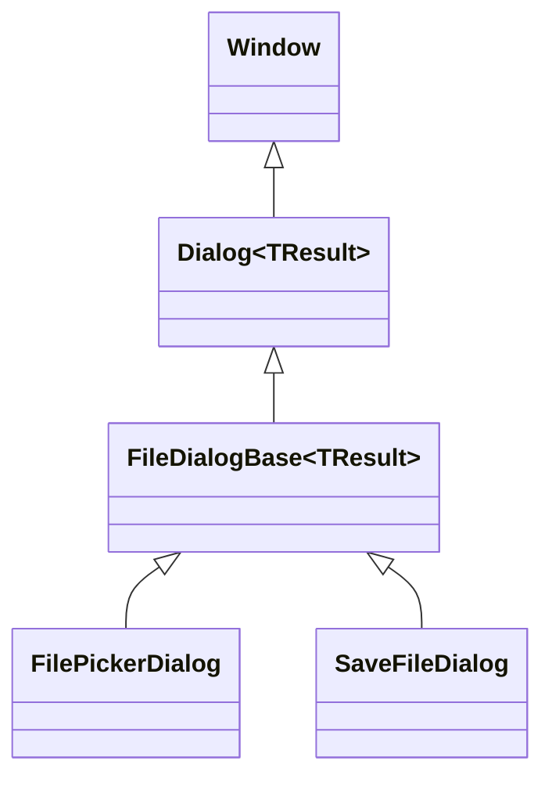

# FileDialogBase authoring API

## Overview

`FileDialogBase<TResult> : Dialog<TResult>` is the abstract base for a modal
dialog that browses one directory at a time and completes with a dialog-specific
typed result. [`FilePickerDialog`](file-picker-dialog.md#overview) and
[`SaveFileDialog`](save-file-dialog.md#overview) both derive from it today.

`FileDialogBase` owns the complete directory-browsing lifecycle: the location
bar and typed-path navigation, the bordered file `ListView` and its filter and
hidden-entry controls, the guarded asynchronous directory-load pipeline (one
outstanding request at a time, stale completions discarded, synchronous and
asynchronous filesystem failures both degraded to a recoverable status line),
and the shared Cancel action. A concrete derivative supplies only the handful of
seams that genuinely differ between file dialogs: what its own root layout looks
like, what its own frame and structural presentation resolves to, how it reacts
to a selected or invoked file entry, how it reacts to a fresh directory load,
and which control receives focus at each stage. Everything else lives here
exactly once, so a new file dialog - a folder picker, a multi-file importer -
reuses the same guarded-load lifecycle `FilePickerDialog` and `SaveFileDialog`
already prove instead of re-deriving it.

## Inheritance



## API

`FilePickerDialog` and `SaveFileDialog` document the complete public contract
they inherit from this base - `CurrentDirectory`, `ShowHidden`, `FilterIndex`,
`IsLoading`, `Status`, the caption and placeholder text properties, and the
Cancel action's own style - alongside their own additions; see
[FilePickerDialog](file-picker-dialog.md#api) and
[SaveFileDialog](save-file-dialog.md#api). This page documents only the
protected authoring seam a third-party derivative implements or calls.

### Authoring seam

| Member                                                            | Type                    | Default | Description                                                                                                                                                                                                                               |
| ----------------------------------------------------------------- | ----------------------- | ------- | ----------------------------------------------------------------------------------------------------------------------------------------------------------------------------------------------------------------------------------------- |
| `FileDialogBase(...)`                                             | constructor             | —       | Allocates every shared control and state property; a derivative calls it first, builds its own controls, then calls `Initialize`.                                                                                                         |
| `FileSystem`                                                      | `IFilePickerFileSystem` | —       | The canonical path and enumeration source every navigation and load runs through; a derivative reaches the same source instead of calling `System.IO` directly.                                                                           |
| `FileList`                                                        | `ListView`              | —       | The shared file/directory list; `ItemTemplate` and `ItemInvocation` are already configured.                                                                                                                                               |
| `FileListSurface`                                                 | `Dock`                  | —       | The library-owned bordered surface around `FileList`.                                                                                                                                                                                     |
| `StatusText`                                                      | `Text`                  | —       | The shared status display bound to `Status` through `SetStatus`.                                                                                                                                                                          |
| `HiddenToggle`                                                    | `CheckBox`              | —       | The shared hidden-entry toggle; must appear somewhere in a derivative's own content, since `Initialize` binds its style to it.                                                                                                            |
| `PathInput`                                                       | `TextInput`             | —       | The shared directory-path input.                                                                                                                                                                                                          |
| `SnapshotStatus`                                                  | `string`                | —       | The status text last committed by a successful load, restored after a transient selection-only status clears.                                                                                                                             |
| `Initialize()`                                                    | `void`                  | —       | Retains the tree returned by `CreateContent`, resolves and applies `ResolveDialogStyle`, binds part styles, and wires shared interaction. Called exactly once, after a derivative's own constructor creates its dialog-specific controls. |
| `CreateContent()`                                                 | `Grid`                  | —       | Protected abstract; builds the complete root layout `Initialize` retains as `Content`.                                                                                                                                                    |
| `ResolveDialogStyle()`                                            | `FileDialogStyle`       | —       | Protected abstract; resolves the derivative's own complete aggregate style. Called from `Initialize` and every measure pass, so it must be cheap and side-effect free.                                                                    |
| `CreateLocationBar()`                                             | `Grid`                  | —       | Builds the up-button-and-path-input row shared by every file dialog.                                                                                                                                                                      |
| `CreateMetadata()`                                                | `Grid`                  | —       | Builds the filter picker and trailing status row; already composed by `CreateFileListArea`.                                                                                                                                               |
| `CreateFileListArea()`                                            | `Grid`                  | —       | Builds the bordered `FileListSurface` followed by `CreateMetadata`'s row; a derivative's `CreateContent` typically calls this once.                                                                                                       |
| `CreateFooter(Button acceptButton)`                               | `Grid`                  | —       | Builds the delimiter and trailing action row containing `acceptButton` and the shared Cancel Button, through the same `Dialog<TResult>.CreateActionBar` every built-in dialog uses.                                                       |
| `WireAcceptInteraction()`                                         | `void`                  | —       | Protected abstract; wires the derivative's own accept-action handlers (a Button click, a submitted input, or both).                                                                                                                       |
| `GetModalFocusTarget()`                                           | `ControlBase`           | —       | Protected abstract; the control focused when the dialog becomes modal.                                                                                                                                                                    |
| `GetInitialLoadFocusTarget()`                                     | `ControlBase`           | —       | Protected abstract; the control focused once the first directory load commits, if focus is still on `PathInput` at that point.                                                                                                            |
| `OnListSelectionChanged()`                                        | `void`                  | —       | Protected abstract; called after `FileList`'s selection changes.                                                                                                                                                                          |
| `OnFileItemInvoked(FilePickerEntry entry, ActivationCause cause)` | `void`                  | —       | Protected abstract; called when a file (never a directory) entry is invoked by keyboard or pointer. A directory entry always navigates instead.                                                                                           |
| `TryAcceptTypedDirectory(string canonicalDirectory)`              | `bool`                  | `false` | Protected virtual; lets a derivative accept a submitted path that names an existing directory as a final selection instead of navigating into it.                                                                                         |
| `OnLoadCommitted(FilePickerEntry[] entries)`                      | `void`                  | —       | Protected abstract; called after a load replaces `FileList.Items` and `CurrentDirectory`, before the base publishes its own folder/file-count status text over whatever this hook set.                                                    |
| `SetStatus(string value)`                                         | `void`                  | —       | Publishes `Status` and repaints `StatusText`.                                                                                                                                                                                             |

`CreateContent`, `ResolveDialogStyle`, `WireAcceptInteraction`,
`GetModalFocusTarget`, `GetInitialLoadFocusTarget`, `OnListSelectionChanged`,
`OnFileItemInvoked`, and `OnLoadCommitted` are the seams every derivative must
implement. `TryAcceptTypedDirectory` defaults to declining every typed directory
(so `Navigate` always runs); `FilePickerDialog` overrides it to accept a
directory in `Directories`/`FilesAndDirectories` selection mode, and
`SaveFileDialog` leaves the default in place because it has no
directory-selection concept.

### FilePickerEntry

`FilePickerEntry` is the immutable immediate-child record `OnLoadCommitted` and
`OnFileItemInvoked` receive: `Name` (basename), `FullPath` (fully qualified),
`IsDirectory`, and `IsHidden`. Two entries are equal only when `FullPath`
matches under ordinal comparison. Only an `IFilePickerFileSystem` implementation
constructs one; a derivative consumes the type but never builds an instance
itself.

### IFilePickerFileSystem

`IFilePickerFileSystem` is the filesystem abstraction behind `FileSystem`:
`GetFullPath`, `GetParent`, `FileExists`, `DirectoryExists`, and the
asynchronous `GetEntriesAsync(directory, filter, showHidden, cancellationToken)`
returning a directories-first `FilePickerEntry` snapshot. A test substitutes a
deterministic fake through the constructor's `fileSystem` parameter instead of
touching the real filesystem; `FilePickerDialog` and `SaveFileDialog` both
expose an `internal` constructor overload for exactly this purpose, and a
third-party derivative can offer the same seam on its own public constructor.

## Deriving

A third-party file dialog calls the base constructor, builds its own
dialog-specific controls, calls `Initialize()`, and implements the eight
required seams:

```csharp
public sealed class FolderPickerDialog: FileDialogBase<string>
{
    private readonly Button _selectButton;

    public FolderPickerDialog(IFilePickerFileSystem fileSystem, string initialDirectory)
        : base(
            fileSystem,
            title: "Select Folder",
            initialDirectory,
            showHidden: false,
            filterIndex: 0,
            maxVisibleRows: 12,
            nonListWindowRows: 16,
            filters: [FilePickerFilter.AllFiles],
            selectionMode: ListSelectionMode.Single,
            cancelledResult: string.Empty)
    {
        _selectButton = new Button { Text = "&Select", IsDefault = true };
        Initialize();
    }

    protected override Grid CreateContent()
    {
        var root = new Grid { RowSpacing = 1 };
        root.Rows.Add(Track.Auto());
        root.Rows.Add(Track.Star(1));
        root.Rows.Add(Track.Auto());
        Grid.SetRow(CreateFileListArea(), 1);
        Grid.SetRow(CreateFooter(_selectButton), 2);
        root.Children.Add(CreateLocationBar());
        root.Children.Add(CreateFileListArea());
        root.Children.Add(CreateFooter(_selectButton));
        return root;
    }

    protected override FileDialogStyle ResolveDialogStyle() => FilePickerDialogStyle.Default;

    protected override void WireAcceptInteraction() =>
        _selectButton.Click += (_, _) => Complete(CurrentDirectory);

    protected override ControlBase GetModalFocusTarget() => FileList;

    protected override ControlBase GetInitialLoadFocusTarget() => FileList;

    protected override void OnListSelectionChanged()
    {
    }

    protected override void OnFileItemInvoked(FilePickerEntry entry, ActivationCause cause)
    {
    }

    protected override void OnLoadCommitted(FilePickerEntry[] entries)
    {
    }
}
```

A caller instantiates `FolderPickerDialog` and presents it exactly as it would
`FilePickerDialog` or `SaveFileDialog` - through its own `ShowAsync` factory
built on `Dialog<TResult>.PresentAsync` (see
[Dialogs](index.md#dialog-catalog)) - while `FileDialogBase` owns the complete
navigation, filtering, hidden-entry, and guarded-load lifecycle underneath it.

## Expected behavior

| Scope               | Observable evidence                                                                                                                                                                               |
| ------------------- | ------------------------------------------------------------------------------------------------------------------------------------------------------------------------------------------------- |
| Public API          | Every protected seam is reachable from outside this assembly, and a derivative that implements only the required seams gets the complete guarded-load, navigation, and status lifecycle for free. |
| Integrated behavior | `FilePickerDialog` and `SaveFileDialog` share this exact contract; their own pages document only the seams and asymmetries specific to each.                                                      |
