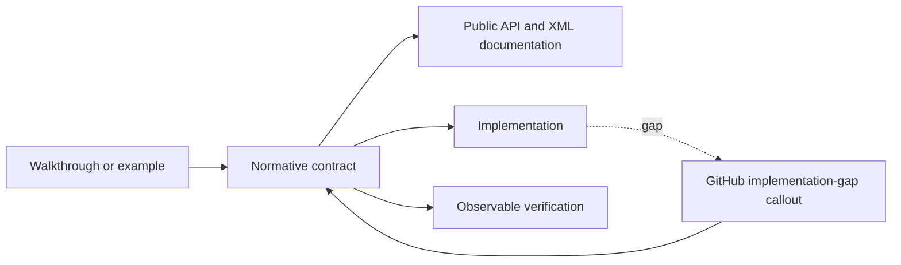

# Documentation structure

## Documentation contract

SharpVision documentation is a versioned product surface. It serves readers,
application authors, and contributors from the same Markdown source. A behavior
is documented only when its normative owner, public API names, validation,
fallback, and verification evidence are explicit.

Normative pages describe the intended SharpVision contract. When the current
implementation differs, the page keeps the intended behavior and identifies the
implementation gap beside the affected rule. The
[coverage matrix](protocols/coverage-matrix.md#coverage) remains a factual view
of behavior that is implemented and verified today.

Every normative page has one H1 title and a stable H2 spine. Additional H2 and
H3 sections may explain domain-specific behavior, but they do not replace the
required sections below.

## Document kinds

| Kind         | Location               | Required H2 sections, in order                                                                            | Owns                                                        |
| ------------ | ---------------------- | --------------------------------------------------------------------------------------------------------- | ----------------------------------------------------------- |
| Control      | `docs/controls/**`     | `<Type> contract`, `API`, `Example`, `Expected behavior`                                                  | One public control or authoring role.                       |
| Dialog       | `docs/dialogs/**`      | `<Type> contract`, `API`, `Interaction`, `Example`, `Expected behavior`                                   | One modal task and its typed result.                        |
| Concept      | `docs/concepts/**`     | `<Topic> contract`, topic sections, `Expected behavior`                                                   | Behavior shared by multiple public types.                   |
| Architecture | `docs/architecture/**` | `<Topic> contract`, ownership/flow sections, `Expected behavior`                                          | Cross-layer ownership and ordering.                         |
| Protocol     | `docs/protocols/**`    | `<Protocol> contract`, `Sources`, protocol-specific grammar/detection/typed sections, `Expected behavior` | One wire protocol or terminal-description family.           |
| Testing      | `docs/testing/**`      | `<Topic> contract`, `Required evidence`                                                                   | What constitutes acceptable verification.                   |
| Walkthrough  | `docs/walkthroughs/**` | Task-oriented imperative sections                                                                         | One complete public workflow; never new normative behavior. |

Category index pages are catalogs and are exempt from the per-page spine. They
must link directly to each page's contract anchor.

The contract is the single owner of intended behavior. Examples teach it, public
APIs expose it, and observable verification demonstrates it. A current
implementation gap is visible without weakening the intended contract.

## Contract sections

A contract section answers, in this order:

1. What value, component, protocol, or workflow owns the behavior.
2. What a caller may rely on.
3. What the caller owns and what SharpVision retains or copies.
4. Which units, bounds, ordering, threading, and lifetime rules apply.
5. How invalid, unsupported, malformed, or unavailable input behaves.

Use RFC 2119-style uppercase words only when quoting or defining protocol
requirements that need that convention. Ordinary descriptive prose uses “must”
sparingly and never disguises an aspiration as current support.

## API sections

Public properties, methods, constructors, events, and typed values use inline
code and their exact C# spelling. A public surface is summarized with a table:

| Member    | Type   | Default | Contract                                                 |
| --------- | ------ | ------- | -------------------------------------------------------- |
| `Example` | `bool` | `false` | Describes the observable behavior, units, and ownership. |

Follow the table with numbered algorithms, validation bullets, or lifecycle
rules when a table cell would become a paragraph. Code examples illustrate an
already stated contract; they never define an otherwise undocumented default.

Before changing an API table:

1. Inspect the current declaration and XML documentation.
2. Confirm defaults from initializers and constructors.
3. Confirm validation and exception types from the public mutation boundary.
4. Confirm state, layout, rendering, or protocol effects from observable tests.
5. Link shared behavior to its single normative concept or architecture owner.

## Expected behavior

The final section of every normative page summarizes the behavior readers can
rely on and the evidence that keeps the contract stable. It describes observable
outcomes, not private calls or contributor workflow. Use a table when several
evidence layers apply:

| Scope                 | Observable evidence                                                          |
| --------------------- | ---------------------------------------------------------------------------- |
| Public API            | Validation, defaults, state changes, and deterministic output.               |
| Integrated behavior   | Cross-component behavior through the real ownership and routing boundary.    |
| Complete runtime path | Final cells, bytes, lifecycle ordering, cleanup, or pseudoterminal behavior. |

After the table, bullets list feature-specific guarantees and a numbered list
describes any important multi-step scenario. Exact-byte, fragmentation,
randomized, Unicode, and allocation evidence remains in the dedicated
[testing specifications](testing/index.md#test-map).

## Implementation gaps

When code does not satisfy the intended contract, keep the intended rule and
place this GitHub callout immediately after it:

> [!IMPORTANT] **Implementation gap:** State the missing or conflicting behavior
> in user terms. Explain the current observable behavior and identify the
> affected public type or subsystem. Do not promise a release date or hide the
> gap in a testing-only section.

Use `NOTE` for compatibility details that do not violate the contract and
`WARNING` when current behavior can lose data, leak resources, weaken safety, or
leave the terminal in an invalid state. Each gap remains local to the rule it
affects so readers cannot mistake intended behavior for verified support.

## Links and ownership

- One page owns each normative rule; other pages link to its exact section.
- Relative links include the section anchor when the target is a contract.
- The [coverage matrix](protocols/coverage-matrix.md#coverage) is the only
  summary of currently verified terminal support.
- Protocol pages cite primary standards or terminal-author documentation and
  record an edition, version, or access date.
- Paths, commands, type names, and member names match the current repository.
- Normative pages contain no placeholder markers, delivery plans, internal
  milestone names, vague edge-case promises, or speculative support claims.
- Multi-step lifetimes and ordered behavior use sequence or state diagrams.
  Ownership, inheritance, and graph relationships use class or flow diagrams.
- Shared behavior such as invalidation, layout, rendering, input routing, and
  lifecycle has one dedicated owner; API pages link to it instead of copying the
  algorithm.

## Validation

Documentation changes run, in increasing scope:

1. `npm run format:check`
2. `npm run lint:markdown`
3. `npm run lint:links`
4. `npm run test:docs`
5. `make lint`

The repository gate also compiles XML documentation, examples, and the showcase,
so prose-only success is not evidence that a public surface is coherent.
