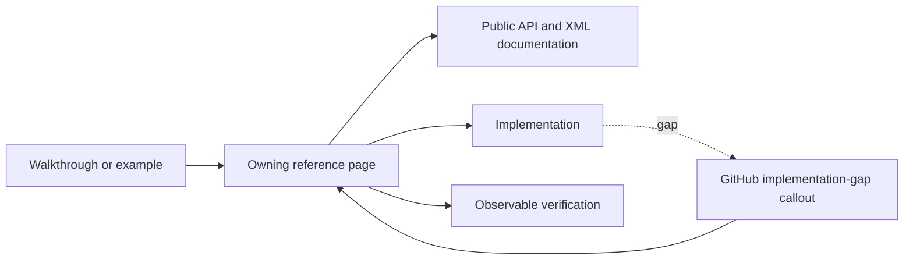

# Documentation guide

## Overview

SharpVision documentation is part of the product. The same Markdown pages serve
application authors and contributors, and they are versioned and validated with
the code. A behavior counts as documented once the page that owns it names the
public API, explains validation and fallback, and points at the evidence that
keeps it true.

Pages describe how SharpVision is meant to behave, in plain technical prose.
Write for an engineer who is reading the page to get something done, not for a
lawyer: say what the component does, what the caller can count on, and what
happens when input is wrong. Avoid contract-style boilerplate; precision comes
from naming the API, the units, and the observable outcome, not from formal
language.

When the implementation does not do what the page says yet, keep the intended
behavior and mark the difference with an
[implementation-gap callout](#implementation-gaps) right beside the affected
rule. Never rewrite a page to bless an implementation shortcut: if the current
behavior is a workaround, document the behavior users should get and flag the
gap. Track the implementation work outside the public documentation. The
[coverage matrix](protocols/coverage-matrix.md#coverage) stays a factual list of
what is implemented and verified today.

Every page has one H1 title and the standard H2 sections for its kind, in order.
Pages may add further H2 and H3 sections for domain-specific material, but never
in place of the standard ones.

## Page types

| Kind         | Location               | Required H2 sections, in order                                                                 | Covers                                                       |
| ------------ | ---------------------- | ---------------------------------------------------------------------------------------------- | ------------------------------------------------------------ |
| Control      | `docs/controls/**`     | `Overview`, `API`, `Example`, `Expected behavior`                                              | One public control or authoring role.                        |
| Dialog       | `docs/dialogs/**`      | `Overview`, `API`, `Interaction`, `Example`, `Expected behavior`                               | One modal task and its typed result.                         |
| Concept      | `docs/concepts/**`     | `Overview`, topic sections, `Expected behavior`                                                | Behavior shared by multiple public types.                    |
| Architecture | `docs/architecture/**` | `Overview`, ownership/flow sections, `Expected behavior`                                       | Cross-layer ownership and ordering.                          |
| Protocol     | `docs/protocols/**`    | `Overview`, `Sources`, protocol-specific grammar/detection/typed sections, `Expected behavior` | One wire protocol or terminal-description family.            |
| Testing      | `docs/testing/**`      | `Overview`, `Required evidence`                                                                | What counts as acceptable verification.                      |
| Walkthrough  | `docs/walkthroughs/**` | Task-oriented imperative sections                                                              | One complete public workflow; it never introduces new rules. |

Category index pages are catalogs and are exempt from the per-page section
spine. They link directly to each page's overview anchor.

Each rule has exactly one owning page. Examples teach it, public APIs expose it,
and observable verification demonstrates it. A current implementation gap is
visible without weakening the intended behavior.

## Overview sections

The opening section tells readers what the thing is and what they can count on.
Cover, in this order:

1. What value, component, protocol, or workflow the page describes.
2. What callers can rely on.
3. Who owns what: what the caller keeps, and what SharpVision retains or copies.
4. The units, bounds, ordering, threading, and lifetime rules that apply.
5. What happens on invalid, unsupported, malformed, or unavailable input.

Use RFC 2119-style uppercase words only when quoting or defining protocol
requirements that need that convention. Ordinary prose uses "must" sparingly and
never presents planned behavior as if it worked today.

Assume the reader knows C# but does not know SharpVision internals or terminal
protocol vocabulary. Introduce each specialized term before using its acronym.
For example, explain that a terminal description is a database entry containing
commands and key sequences before discussing terminfo, and explain that evidence
is a fact from a named source before discussing evidence precedence.

Choose structure by the question the reader is trying to answer:

| Reader question                         | Preferred structure                        |
| --------------------------------------- | ------------------------------------------ |
| What values or variants exist?          | Table with one row per value or variant.   |
| What happens in a fixed order?          | Numbered list or sequence diagram.         |
| Which branch or fallback is selected?   | Flowchart or decision table.               |
| Which states can a value move between?  | State diagram.                             |
| Who owns data or performs an operation? | Ownership table or responsibility diagram. |
| What can go wrong?                      | Failure table with observable outcomes.    |

Paragraphs explain why a rule exists. They do not hide a procedure, state
machine, precedence order, or catalog that is clearer in one of these forms.

## API sections

Public properties, methods, constructors, events, and typed values use inline
code and their exact C# spelling. A public surface is summarized with a table:

| Member    | Type   | Default | Description                                              |
| --------- | ------ | ------- | -------------------------------------------------------- |
| `Example` | `bool` | `false` | Describes the observable behavior, units, and ownership. |

Follow the table with numbered algorithms, validation bullets, or lifecycle
rules when a table cell would become a paragraph. Code examples illustrate an
already stated rule; they never define an otherwise undocumented default.

Before changing an API table:

1. Inspect the current declaration and XML documentation.
2. Confirm defaults from initializers and constructors.
3. Confirm validation and exception types from the public mutation boundary.
4. Confirm state, layout, rendering, or protocol effects from observable tests.
5. Link shared behavior to the single concept or architecture page that owns it.

## Expected behavior

The final section of every reference page summarizes the behavior readers can
rely on and the evidence that keeps it stable. Write it as statements about
observable outcomes, not as a test-plan checklist, private call list, or
contributor workflow. Use a table when several evidence layers apply:

| Scope                 | Observable evidence                                                          |
| --------------------- | ---------------------------------------------------------------------------- |
| Public API            | Validation, defaults, state changes, and deterministic output.               |
| Integrated behavior   | Cross-component behavior through the real ownership and routing boundary.    |
| Complete runtime path | Final cells, bytes, lifecycle ordering, cleanup, or pseudoterminal behavior. |

After the table, bullets list feature-specific guarantees and a numbered list
describes any important multi-step scenario. Exact-byte, fragmentation,
randomized, Unicode, and allocation evidence remains in the dedicated
[testing specifications](testing/index.md#test-map).

## Implementation gaps

When code does not do what the page says it should, keep the intended rule and
place this GitHub callout immediately after it:

> [!IMPORTANT]
>
> **Implementation gap:** State the missing or conflicting behavior in user
> terms. Explain the current observable behavior and identify the affected
> public type or subsystem. Do not promise a release date or hide the gap in a
> testing-only section.

Each gap should have corresponding work tracked outside the public docs. Never
include a GitHub issue identifier such as a hash followed by digits, an issue
URL, or issue-tracker status in documentation. Those references go stale and
tell readers nothing about the behavior they can rely on. Use `NOTE` for
compatibility details that do not conflict with the documented behavior and
`WARNING` when current behavior can lose data, leak resources, weaken safety, or
leave the terminal in an invalid state. Each gap stays local to the rule it
affects so readers cannot mistake intended behavior for verified support.

## Links and ownership

- One page owns each rule; other pages link to its exact section.
- Relative links include the section anchor when the target is a specific rule.
- The [coverage matrix](protocols/coverage-matrix.md#coverage) is the only
  summary of currently verified terminal support.
- Protocol pages cite primary standards or terminal-author documentation and
  record an edition, version, or access date.
- Paths, commands, type names, and member names match the current repository.
- Reference pages contain no placeholder markers, delivery plans, internal
  milestone names, issue identifiers, vague edge-case promises, or speculative
  support claims.
- Multi-step lifetimes and ordered behavior use sequence or state diagrams.
  Ownership, inheritance, and graph relationships use class or flow diagrams.
- Shared behavior such as invalidation, layout, rendering, input routing, and
  lifecycle has one dedicated owner; API pages link to it instead of copying the
  algorithm.

## Validation

Documentation changes run, in increasing scope:

1. `npm run format:check`
2. `npm run lint:markdown`
3. `npm run lint:links`
4. `npm run test:docs`
5. `make lint`

The repository gate also compiles XML documentation, examples, and the showcase,
so prose-only success is not evidence that a public surface is coherent.
