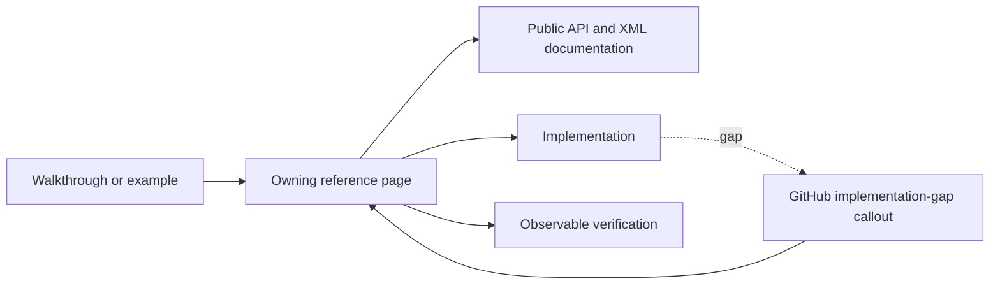
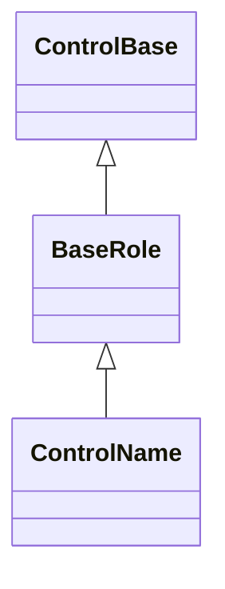

# Documentation guide

## Overview

SharpVision documentation is part of the product. The same Markdown pages serve
application authors and contributors, and they are versioned and validated with
the code. A behavior counts as documented once the page that owns it names the
public API, explains validation and fallback, and points at the evidence that
keeps it true.

Pages describe how SharpVision is meant to behave, in plain technical prose.
Write for an engineer who is reading the page to get something done, not for a
lawyer: say what the component does, what the caller can count on, and what
happens when input is wrong. Avoid contract-style boilerplate; precision comes
from naming the API, the units, and the observable outcome, not from formal
language.

When the implementation does not do what the page says yet, keep the intended
behavior and mark the difference with an
[implementation-gap callout](#implementation-gaps) right beside the affected
rule. Never rewrite a page to bless an implementation shortcut: if the current
behavior is a workaround, document the behavior users should get and flag the
gap. Track the implementation work outside the public documentation. The
[coverage matrix](protocols/coverage-matrix.md#coverage) stays a factual list of
what is implemented and verified today.

Every page has one H1 title and the standard H2 sections for its kind, in order.
Pages may add further H2 and H3 sections for domain-specific material, but never
in place of the standard ones.

## Page types

| Kind         | Location               | Required H2 sections, in order                                                                 | Covers                                                       |
| ------------ | ---------------------- | ---------------------------------------------------------------------------------------------- | ------------------------------------------------------------ |
| Control      | `docs/controls/**`     | `Overview`, `Inheritance`, `API`, `Example`, `Expected behavior`                               | One public control or authoring role.                        |
| Dialog       | `docs/dialogs/**`      | `Overview`, `API`, `Interaction`, `Example`, `Expected behavior`                               | One modal task and its typed result.                         |
| Concept      | `docs/concepts/**`     | `Overview`, topic sections, `Expected behavior`                                                | Behavior shared by multiple public types.                    |
| Architecture | `docs/architecture/**` | `Overview`, ownership/flow sections, `Expected behavior`                                       | Cross-layer ownership and ordering.                          |
| Protocol     | `docs/protocols/**`    | `Overview`, `Sources`, protocol-specific grammar/detection/typed sections, `Expected behavior` | One wire protocol or terminal-description family.            |
| Testing      | `docs/testing/**`      | `Overview`, `Required evidence`                                                                | What counts as acceptable verification.                      |
| Walkthrough  | `docs/walkthroughs/**` | Task-oriented imperative sections                                                              | One complete public workflow; it never introduces new rules. |

Category index pages are catalogs and are exempt from the per-page section
spine. They link directly to each page's overview anchor.



Each rule has exactly one owning page. Examples teach it, public APIs expose it,
and observable verification demonstrates it. A current implementation gap is
visible without weakening the intended behavior.

Every control and authoring-role page follows the exact section contract,
inheritance-diagram convention, and API-table shape the
[control-page contract](#control-page-contract) defines, using the
[control-page template](#control-page-template) as its literal skeleton.

## Control-page contract

Every page under `docs/controls/**` other than a category index documents one
control or one authoring role, and every one of them follows this same contract,
so a reader compares any two pages without relearning their shape.

### Section order

| Order | Section             | Required            | Notes                                                           |
| ----- | ------------------- | ------------------- | --------------------------------------------------------------- |
| 1     | `Overview`          | Always              | The type, its role, and what a caller can rely on.              |
| 2     | `Inheritance`       | Always              | One page-local Mermaid `classDiagram`.                          |
| 3     | `API`               | Always              | Opens with the canonical member table.                          |
| 4     | Topic sections      | Optional, any count | Only between `API` and `Example`.                               |
| 5     | `Example`           | Always              | Compilable C#, plus the generated image for a concrete control. |
| 6     | `Expected behavior` | Always              | `Scope`/`Observable evidence` table plus feature bullets.       |

A topic section never replaces `Inheritance`, `API`, `Example`, or
`Expected behavior`, and it never appears before `API` or after `Example`. An
abstract authoring-role page follows the identical six-slot spine; only its
`Example` section's image requirement differs, described below.

### Inheritance

Add one page-local Mermaid `classDiagram` under `## Inheritance` that shows the
documented type's complete, accurate base chain up to and including
`ControlBase`, plus any derived or owned role the page actually discusses.
Follow the exact conventions the
[control catalog diagram](controls/index.md#control-catalog) already uses:
`Base <|-- Derived` edges, and generic arity written `~T~` (`Owner~TValue~`, not
`Owner<TValue>`), for any type the chain still declares generically. Accuracy
always wins over compactness: never elide an intermediate role class that is the
real parent — write `ControlBase <|-- InputBase <|-- Button`, never a shortcut
straight from `ControlBase` to `Button`. Eliding a role is allowed only when
that role does not exist in the real chain, never to save a line.

### API

Every page — including the five chart pages — carries its own local API summary.
A chart page may add a link to the
[shared chart API](controls/charts/index.md#api) beside its own table, never in
place of it. `## API` opens with a table using this exact header:

| Member    | Type   | Default | Description                                              |
| --------- | ------ | ------- | -------------------------------------------------------- |
| `Example` | `bool` | `false` | Describes the observable behavior, units, and ownership. |

`—` marks a field that genuinely does not apply to that row, such as an event's
`Default`. It never means "see below" or "see the table beneath this one" — a
cell that needs more room gets prose or a numbered list right after the table
instead.

One member documents one row by default. Two narrow exceptions group rows:

- Members that share an identical `Type`, `Default`, and `Description`,
  verbatim, such as `Width` and `Height` sized the same way.
- A tightly coupled read/reset pair, such as `Face` and `ResetFace()`.

A grouped row lists every member in `Member`, backtick-quoted and
comma-separated, for example `` `Width`, `Height` ``. Nothing else groups — two
members that merely feel related still get their own rows the moment `Type`,
`Default`, or `Description` differs between them.

Document members in this order:

1. Constructors, only when at least one carries validated parameters; listed
   first.
2. Properties, the bulk of the table.
3. Methods, after properties. `Member` is `Name(params)`, `Type` is the return
   type, and `Default` is `—` for a `void` method.
4. Events, after methods. `Type` is the handler delegate type, and `Default` is
   always `—`.
5. Attached properties, in their own `### Attached properties` sub-table with
   the same four-column header, `Member` written `Owner.Property`.
6. Style types, documented in prose after the main table, never as API rows. A
   named preset style value never appears as an API-table row either.
7. Related public types the page does not own, linked to that type's owning page
   and its `#api` anchor; never re-tabulate a member the owning page already
   documents.

Glyph, state, decision, input, and failure tables never belong inside `## API`,
even when they describe a property the API table already lists — they live under
their own topic heading.

`## Example` shows compilable C# that illustrates a rule the page already
states; it never defines an otherwise undocumented default. A concrete control's
`Example` also includes its generated Showcase image, following the existing
image-coverage provenance contract. An abstract authoring-role page — one no
Showcase gallery pane renders on its own — is exempt from the image requirement,
and never substitutes a hand-authored screenshot in its place.

`## Expected behavior` opens with the canonical table
[Expected behavior](#expected-behavior) defines:

| Scope      | Observable evidence                                            |
| ---------- | -------------------------------------------------------------- |
| Public API | Validation, defaults, state changes, and deterministic output. |

Standardize on this exact header on every control page; do not invent a new
shape. After the table, add only feature-specific bullets — never a prose
test-plan dump, private call list, or contributor workflow.

## Overview sections

The opening section tells readers what the thing is and what they can count on.
Cover, in this order:

1. What value, component, protocol, or workflow the page describes.
2. What callers can rely on.
3. Who owns what: what the caller keeps, and what SharpVision retains or copies.
4. The units, bounds, ordering, threading, and lifetime rules that apply.
5. What happens on invalid, unsupported, malformed, or unavailable input.

Use RFC 2119-style uppercase words only when quoting or defining protocol
requirements that need that convention. Ordinary prose uses "must" sparingly and
never presents planned behavior as if it worked today.

Assume the reader knows C# but does not know SharpVision internals or terminal
protocol vocabulary. Introduce each specialized term before using its acronym.
For example, explain that a terminal description is a database entry containing
commands and key sequences before discussing terminfo, and explain that evidence
is a fact from a named source before discussing evidence precedence.

Choose structure by the question the reader is trying to answer:

| Reader question                         | Preferred structure                        |
| --------------------------------------- | ------------------------------------------ |
| What values or variants exist?          | Table with one row per value or variant.   |
| What happens in a fixed order?          | Numbered list or sequence diagram.         |
| Which branch or fallback is selected?   | Flowchart or decision table.               |
| Which states can a value move between?  | State diagram.                             |
| Who owns data or performs an operation? | Ownership table or responsibility diagram. |
| What can go wrong?                      | Failure table with observable outcomes.    |

Paragraphs explain why a rule exists. They do not hide a procedure, state
machine, precedence order, or catalog that is clearer in one of these forms. On
a control page, this applies to every section, not only `Overview`: a paragraph
anywhere on the page explains context and rationale, and it never hides a
procedure, precedence order, member catalog, or guarantee inventory that a
table, list, or diagram would show more clearly.

## API sections

Public properties, methods, constructors, events, and typed values use inline
code and their exact C# spelling. A public surface is summarized with a table:

| Member    | Type   | Default | Description                                              |
| --------- | ------ | ------- | -------------------------------------------------------- |
| `Example` | `bool` | `false` | Describes the observable behavior, units, and ownership. |

Follow the table with numbered algorithms, validation bullets, or lifecycle
rules when a table cell would become a paragraph. Code examples illustrate an
already stated rule; they never define an otherwise undocumented default.

Before changing an API table:

1. Inspect the current declaration and XML documentation.
2. Confirm defaults from initializers and constructors.
3. Confirm validation and exception types from the public mutation boundary.
4. Confirm state, layout, rendering, or protocol effects from observable tests.
5. Link shared behavior to the single concept or architecture page that owns it.

## Expected behavior

The final section of every reference page summarizes the behavior readers can
rely on and the evidence that keeps it stable. Write it as statements about
observable outcomes, not as a test-plan checklist, private call list, or
contributor workflow. Use a table when several evidence layers apply:

| Scope                 | Observable evidence                                                          |
| --------------------- | ---------------------------------------------------------------------------- |
| Public API            | Validation, defaults, state changes, and deterministic output.               |
| Integrated behavior   | Cross-component behavior through the real ownership and routing boundary.    |
| Complete runtime path | Final cells, bytes, lifecycle ordering, cleanup, or pseudoterminal behavior. |

After the table, bullets list feature-specific guarantees and a numbered list
describes any important multi-step scenario. Exact-byte, fragmentation,
randomized, Unicode, and allocation evidence remains in the dedicated
[testing specifications](testing/index.md#test-map).

## Implementation gaps

When code does not do what the page says it should, keep the intended rule and
place this GitHub callout immediately after it:

> [!IMPORTANT]
>
> **Implementation gap:** State the missing or conflicting behavior in user
> terms. Explain the current observable behavior and identify the affected
> public type or subsystem. Do not promise a release date or hide the gap in a
> testing-only section.

Each gap should have corresponding work tracked outside the public docs. Never
include a GitHub issue identifier such as a hash followed by digits, an issue
URL, or issue-tracker status in documentation. Those references go stale and
tell readers nothing about the behavior they can rely on. Each gap stays local
to the rule it affects so readers cannot mistake intended behavior for verified
support. See [Callouts](#callouts) for the roles `IMPORTANT` shares the page
with.

## Callouts

Three GitHub callout roles apply across every reference page, most visibly on
control pages:

| Role        | Meaning                                                                                                | Use for                                                                                                             |
| ----------- | ------------------------------------------------------------------------------------------------------ | ------------------------------------------------------------------------------------------------------------------- |
| `NOTE`      | A true fact easily mistaken for a different, related behavior.                                         | Compatibility details, a name that looks like a related member but is not, a default that differs from a sibling's. |
| `IMPORTANT` | An implementation gap, exactly as [Implementation gaps](#implementation-gaps) defines it.              | The documented rule is correct; the current code does not do it yet.                                                |
| `WARNING`   | Behavior that can lose data, leak resources, weaken safety, or leave the terminal in an invalid state. | An operation with a real, current cost when the caller gets it wrong.                                               |

There is no `TIP` role. Nothing in the catalog uses it, and this contract does
not define one.

A callout is added only when it is true and warranted by the rule beside it —
never decoratively, and never to reach a per-page count. A page with zero
callouts is correct and complete: every rule on it is either unconditionally
true or already carried by ordinary prose.

## Links and ownership

- One page owns each rule; other pages link to its exact section.
- Relative links include the section anchor when the target is a specific rule.
- The [coverage matrix](protocols/coverage-matrix.md#coverage) is the only
  summary of currently verified terminal support.
- Protocol pages cite primary standards or terminal-author documentation and
  record an edition, version, or access date.
- Paths, commands, type names, and member names match the current repository.
- Reference pages contain no placeholder markers, delivery plans, internal
  milestone names, issue identifiers, vague edge-case promises, or speculative
  support claims.
- Multi-step lifetimes and ordered behavior use sequence or state diagrams.
  Ownership, inheritance, and graph relationships use class or flow diagrams.
- Shared behavior such as invalidation, layout, rendering, input routing, and
  lifecycle has one dedicated owner; API pages link to it instead of copying the
  algorithm.

## Validation

Documentation changes run, in increasing scope:

1. `npm run format:check`
2. `npm run lint:markdown`
3. `npm run lint:links`
4. `npm run test:docs`
5. `make lint`

The repository gate also compiles XML documentation, examples, and the showcase,
so prose-only success is not evidence that a public surface is coherent.

The documentation-content validator also audits mutable document-node APIs.
Every public mutation boundary guarded by the owning document's lifecycle must
document both `InvalidOperationException` for off-dispatcher access and
`ObjectDisposedException` for mutation after disposal.

## Control-page template

The [control-page contract](#control-page-contract) is the rule; this is its
literal skeleton. Start a new or converted page from this shape and replace
every placeholder with the real declaration, diagram, table, and evidence. The
inner fenced blocks below are shown nested inside a four-backtick fence purely
so this page can display them literally — a real control page uses ordinary
three-backtick fences for its own `mermaid` and `csharp` blocks.

````markdown
# ControlName

## Overview

`ControlName` is declared `public sealed class ControlName : BaseRole`. State
what it is, and the one or two things a caller can rely on.

## Inheritance



## API

| Member                     | Type                             | Default | Description                                      |
| -------------------------- | -------------------------------- | ------- | ------------------------------------------------ |
| `ExampleProperty`          | `bool`                           | `false` | Describes the observable behavior and ownership. |
| `ExampleMethod(int value)` | `void`                           | —       | Describes the effect and any validation.         |
| `ExampleChanged`           | `EventHandler<ExampleEventArgs>` | —       | Describes when the event raises and its payload. |

### Attached properties

| Member                  | Type  | Default | Description                                    |
| ----------------------- | ----- | ------- | ---------------------------------------------- |
| `Owner.ExampleAttached` | `int` | `0`     | Describes the attached value and who reads it. |

## Optional topic section

Add a focused topic section here only when a procedure, precedence order, or
state machine needs more room than the API table gives it. Delete this section
when the page has nothing that needs it.

## Example


```csharp
// A compilable illustration of the rule stated above, for example:
// var control = new ControlName { ExampleProperty = true };
```

## Expected behavior

| Scope               | Observable evidence                                                       |
| ------------------- | ------------------------------------------------------------------------- |
| Public API          | Validation, defaults, state changes, and deterministic output.            |
| Integrated behavior | Cross-component behavior through the real ownership and routing boundary. |

- State the guarantee a reader can rely on, one sentence per bullet.
- Use a numbered list instead when the guarantee is an ordered scenario.
````

Point the `Example` image at `docs/images/controls/<slug>.png`, adjusting the
leading `../` segments for the page's own folder depth. An abstract
authoring-role page — one no Showcase gallery pane renders on its own — omits
that image line entirely and never substitutes a hand-authored screenshot; its
`Example` section keeps only the compilable `csharp` fence.
