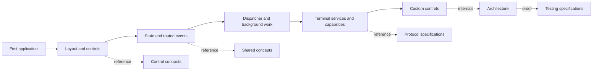

# SharpVision documentation

SharpVision is a retained, mutable .NET 10 terminal UI library. Its
documentation is both a user guide and the normative product contract: a
behavior is complete only when specification, implementation, tests, XML
documentation, and showcase evidence agree.

## Choose a path

| Goal                               | Start here                                                                            | Continue with                                                                          |
| ---------------------------------- | ------------------------------------------------------------------------------------- | -------------------------------------------------------------------------------------- |
| Build a first application          | [First application](walkthroughs/first-application.md#build-your-first-application)   | [Layout and controls](walkthroughs/layout-and-controls.md#compose-layout-and-controls) |
| React to input and update state    | [State and events](walkthroughs/state-and-events.md#state-input-and-events)           | [Input routing](concepts/input-routing.md#input-routing-contract)                      |
| Bind controls to model state       | [Data binding](concepts/data-binding.md#data-binding-contract)                        | [State and events](walkthroughs/state-and-events.md#state-input-and-events)            |
| Add keyboard access keys           | [Access keys](concepts/access-keys.md#access-key-contract)                            | [Focus](concepts/focus.md#focus-contract)                                              |
| Choose existing files              | [File picker](dialogs/file-picker-dialog.md#filepickerdialog-contract)                | [Dialogs](dialogs/index.md#dialog-catalog)                                             |
| Display terminal-safe images       | [Image control](controls/display/image.md#image-contract)                             | [ImageSource ownership](concepts/images.md#imagesource-ownership-contract)             |
| Update the UI from background work | [Background work](walkthroughs/background-work.md#background-work-and-the-dispatcher) | [Threading](concepts/threading.md#threading-contract)                                  |
| Use terminal capabilities safely   | [Terminal services](walkthroughs/terminal-services.md#use-terminal-services)          | [Coverage matrix](protocols/coverage-matrix.md#coverage)                               |
| Build a reusable component         | [Custom controls](walkthroughs/custom-controls.md#build-a-custom-control)             | [Control catalog](controls/index.md#control-catalog)                                   |
| Understand floating UI             | [Floating surfaces](concepts/floating-surfaces.md#floating-surface-contract)          | [Modality](concepts/modality.md#modality-contract)                                     |
| Understand the implementation      | [Architecture map](architecture/index.md#architecture-map)                            | [Terminal backends](architecture/terminal-backends.md#terminal-backend-contract)       |
| Verify or contribute behavior      | [Testing map](testing/index.md#test-map)                                              | [Contributing](../CONTRIBUTING.md)                                                     |

The solid path is the recommended learning order. Dotted links lead from a
task-oriented walkthrough to the section that owns the detailed contract.

## Documentation sets

- [Walkthroughs](walkthroughs/index.md#walkthroughs) teach complete tasks with
  C# examples and then link to the relevant contracts.
- [Control API specifications](controls/index.md#control-catalog) explain each
  component's purpose, properties, defaults, validation, events, layout,
  interaction, example, and expected behavior.
- [Dialog API specifications](dialogs/index.md#dialog-catalog) define complete
  modal tasks, typed options and results, ownership, interaction, and cleanup.
- [Shared concepts](concepts/index.md#concept-map) define layout, focus, input,
  styling, threading, Unicode geometry, scrolling, hosting, and lifecycle.
- [Architecture](architecture/index.md#architecture-map) explains dependency
  direction, ownership, runtime ordering, rendering, capabilities, memory, and
  failure boundaries.
- [Terminal protocols](protocols/index.md#protocol-families) define wire
  grammar, bounds, recovery, detection, fallback, security, and typed surfaces.
- [Feature support](features/index.md#feature-support) is the reader-facing map
  from common capabilities to their authoritative support evidence.
- [Testing](testing/index.md#test-map) defines what counts as proof for control,
  protocol, Unicode, rendering, integration, performance, and pseudoterminal
  behavior.

## Normative contracts

The [protocol coverage matrix](protocols/coverage-matrix.md#coverage) states
what the current code proves. The
[runtime routing contract](protocols/runtime-routing.md#runtime-routing-contract)
owns how parsed input, replies, and bounded extension strings reach their
consumers. The
[project structure](architecture/project-structure.md#project-structure-contract)
owns dependency direction, while the
[terminal backend contract](architecture/terminal-backends.md#terminal-backend-contract)
separates physical connections, fixed emulator identity, protocol extensions,
capability authorization, and renderer-owned graphics, and the
[discovery pipeline](architecture/discovery-pipeline.md#discovery-pipeline-contract)
owns evidence precedence and backend resolution. The
[invalidation contract](concepts/invalidation.md#invalidation-contract) owns
phase dependencies, propagation, coalescing, update scheduling, and retry. The
[rendering pipeline](architecture/rendering-pipeline.md#rendering-pipeline-contract)
owns cell drawing, damage, and terminal output.

Cross-document references target the section that owns a rule. Walkthroughs and
examples illustrate those rules; they do not silently create new behavior.

## Documentation contract

- [Documentation structure](documentation-contract.md#documentation-contract)
  defines the required section spine, API tables, proof formatting, ownership,
  and validation rules for every document kind.
- Protocol documents define sources, grammar, limits, detection, fallback,
  security, typed surfaces, support state, and expected behavior.
- Architecture documents define ownership and cross-layer flow.
- Concept documents define behavior shared by several controls or layers.
- Control documents define one public control API or authoring role each.
- Dialog documents define one complete modal task and its typed result.
- Testing documents define acceptable correctness evidence.
- Walkthroughs assemble public APIs into complete, copyable tasks.

Repository participation is defined by [Contributing](../CONTRIBUTING.md),
[Security](../SECURITY.md), [Support](../SUPPORT.md), and the
[Code of Conduct](../CODE_OF_CONDUCT.md). The
[continuous-integration contract](testing/continuous-integration.md#continuous-integration-contract)
defines the public quality gate.
