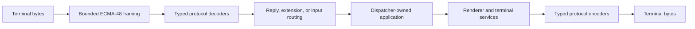

# Terminal protocol specifications

## Protocol families

Terminal support is a bounded pipeline, not a bag of escape sequences. Input is
framed incrementally, decoded into typed values, routed to its owner, and then
serialized onto the dispatcher. Output travels through typed services or the
renderer before the session writes bytes and restores modes in reverse order.

[Runtime protocol routing](runtime-routing.md#overview) owns the middle of this
flow. The [coverage matrix](coverage-matrix.md#coverage) is the only support
summary; parser recognition alone is not implementation. The
[terminal backend hierarchy](../architecture/terminal-backends.md#backend-hierarchy)
composes these families as immutable VT, xterm, Kitty, and iTerm2 extension
metadata without copying their wire implementations. The
[discovery pipeline](../architecture/discovery-pipeline.md#overview) owns
identity evidence and optional capability refinement. The application-facing
sequence across all of these layers is specified by
[terminal integration](../architecture/terminal-integration.md#overview).

The low-level library recognizes the ECMA-48 control architecture and selected
DEC, xterm, Kitty, iTerm2, sixel, tmux, and GNU screen extensions. The
[coverage matrix](coverage-matrix.md#coverage) is the only support claim.

- [ECMA-48](ecma-48.md#overview) defines the control-function model.
- [Terminfo terminal descriptions](terminfo.md#overview) defines the primary
  retained Unix projection, full-screen suitability, and encoding precedence.
- [Termcap terminal descriptions](termcap.md#overview) defines the native legacy
  fallback used only when the requested terminfo entry is unavailable.

The terminal-description projection is bounded after the provider returns.
Native database scanning and allocation are trusted host configuration outside
SharpVision's resource guarantee; see the
[native-provider trust boundary](terminfo.md#native-provider-trust-boundary).

- [ANSI and VT](ansi-vt.md#overview) defines compatibility scope.
- [CSI](csi.md#overview) defines parameterized control sequences.
- [OSC](osc.md#overview) defines operating-system command strings.
- [DCS and string commands](dcs-strings.md#overview) defines bounded string
  parsing.
- [Runtime protocol routing](runtime-routing.md#overview) defines typed
  dispatch, owned extension values, and runtime fallback.
- [DEC private modes](dec-private-modes.md#overview) defines application modes
  and lifecycle restoration.
- [xterm](xterm.md#overview) defines the modern compatibility baseline.
- [SGR](sgr.md#overview) defines colors and text attributes.
- [Mouse reporting](mouse.md#overview) defines cell and pixel input.
- [Paste and focus](paste-focus.md#overview) defines input boundaries.
- [Synchronized output](synchronized-output.md#overview) defines atomic frame
  presentation.
- [Device attributes](device-attributes.md#overview) defines capability queries.
- [Kitty keyboard](kitty-keyboard.md#overview) defines unambiguous key events.
- [Kitty clipboard](kitty-clipboard.md#overview) defines OSC 52 and OSC 5522
  behavior.
- [Kitty graphics](kitty-graphics.md#overview) defines the image extension
  boundary.
- [iTerm2](iterm2.md#overview) defines proprietary OSC extensions.
- [Sixel](sixel.md#overview) defines DEC raster graphics boundaries.
- [tmux](tmux.md#overview) and [GNU screen](gnu-screen.md#overview) define
  multiplexer wrapping.

## Discovery and output facade

`SharpVision.Terminal.Capabilities.TerminalProtocol` names each optional feature
a `Capabilities` profile can report: `SynchronizedOutput`, `FocusReporting`,
`BracketedPaste`, `PixelMouse`, `CellMouse`, `KittyKeyboard`, `Osc52`,
`KittyClipboard`, `KittyGraphics`, `Sixel`, `ItermImages`, `StyledUnderlines`,
`UnderlineColor`, and `Overline`. `Capabilities.Support(TerminalProtocol)` maps
one named protocol to its `Feature` evidence, and `Capabilities.Features`
returns every protocol paired with its `Feature` as an
`IReadOnlyList<ProtocolSupport>`, replacing an earlier anonymous feature list.
Both members report each protocol's real `CapabilitySupport` state. Kitty
graphics may become supported only from its strict correlated APC query or
explicit caller policy; an environment name remains tentative. Sixel may become
supported from DA1 parameter 4 or explicit caller policy. iTerm2 multipart
output requires either an explicit caller override or a correlated
`OSC 1337 ; Capabilities` query reply carrying the `FILE` code, corroborated by
a `TERM_PROGRAM_VERSION` of 3.5 or newer; environment and database evidence
cannot enable it (see
[iTerm2 evidence](iterm2.md#non-retained-backend-and-selection) for the
narrowing corroborator and the `FILE`/`FOCUS_REPORTING` code-collision hazard).
The [coverage matrix](coverage-matrix.md#coverage) remains the support claim.

`SharpVision.ITerminalServices` (`Application.Terminal`) exposes the implemented
**output** protocols behind small interfaces. `Description` exposes the active
immutable metadata. `IBell.IsSupported` requires an exact described
zero-parameter `bel` program with proven non-empty output, and `Ring()` expands
it. `IsTitleSupported` gates OSC 2 to a library-proven built-in profile or gates
a database description to a complete, parameterless `TS` prefix plus `fsl`
suffix. A lone or parameterized terminfo `TS` status-line program is not treated
as OSC 2. `IClipboard` writes and requests OSC 52 selections when authoritative
`Osc52` evidence makes `IsSupported` true. Database OSC 52 evidence requires a
non-empty executable `Ms` program with exactly two string parameters. The typed
Kitty OSC 5522 extension is not yet connected to this application facade; its
[protocol page](kitty-clipboard.md#supported-features) owns that implementation
gap. Unsupported bell, title, and clipboard calls are byte-quiet no-ops. All
three post encoded bytes through the
[ordered out-of-band write path](../architecture/runtime-event-loop.md#out-of-band-protocol-writes)
so they never interleave a frame. Kitty graphics is not exposed by this facade;
semantic image placements flow through renderer-owned `IGraphicsBackend` and its
[explicit cleanup boundary](kitty-graphics.md#bounds-ownership-and-failure).
Sixel and iTerm2 likewise remain graphics implementations rather than terminal
services or emulator identities. Application uses `GraphicsBackendSelector`
lazily after profile and resize publication for semantic placements recorded by
the public [`Image` control](../controls/display/image.md#overview), and awaits
their bounded shutdown before transport disposal. Supported title calls reject
C0 and DEL control characters before expanding or queueing either built-in or
described output. Inbound consumption of protocol replies (typed responses,
capability changes, and redacted diagnostics) is unchanged and documented in
[runtime routing](runtime-routing.md#inbound-consumption-surface).
