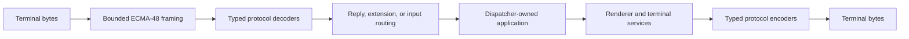
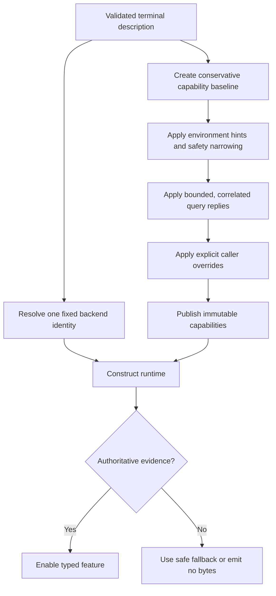

# Terminal protocol specifications

## Protocol families

A terminal protocol is a shared language between an application and the terminal
program displaying it. Most messages are short byte sequences that report input,
request a feature, or change how later output is displayed. SharpVision does not
expose those bytes to controls. It parses them into typed values on input and
produces them through typed services on output.

Four terms recur throughout these pages:

| Term                 | Meaning                                                                                                 |
| -------------------- | ------------------------------------------------------------------------------------------------------- |
| Escape sequence      | A byte sequence beginning with an escape or control introducer.                                         |
| Terminal description | A database entry, usually terminfo, that supplies commands and key sequences for a named terminal kind. |
| Capability           | A feature SharpVision may use, such as synchronized output or pixel mouse reporting.                    |
| Evidence             | A fact from a named source that supports, narrows, or rejects a capability or terminal identity.        |

Terminal support is a bounded pipeline, not a bag of escape sequences. Input is
framed incrementally, decoded into typed values, routed to its owner, and then
serialized onto the dispatcher. Output travels through typed services or the
renderer before the session writes bytes and restores modes in reverse order.

[Runtime protocol routing](runtime-routing.md#overview) owns the middle of this
flow. The [coverage matrix](coverage-matrix.md#coverage) is the only support
summary; parser recognition alone is not implementation. The
[terminal backend hierarchy](../architecture/terminal-backends.md#backend-hierarchy)
composes these families as immutable VT, xterm, Kitty, and iTerm2 extension
metadata without copying their wire implementations. The
[discovery pipeline](../architecture/discovery-pipeline.md#overview) owns
identity evidence and optional capability refinement. The application-facing
sequence across all of these layers is specified by
[terminal integration](../architecture/terminal-integration.md#overview).

The low-level library recognizes the ECMA-48 control architecture and selected
DEC, xterm, Kitty, iTerm2, sixel, tmux, and GNU screen extensions. Choose a page
by the job you are trying to understand:

| Area                          | Start here                                                                                                                     | What it explains                                                    |
| ----------------------------- | ------------------------------------------------------------------------------------------------------------------------------ | ------------------------------------------------------------------- |
| Basic control grammar         | [ECMA-48](ecma-48.md#overview)                                                                                                 | How control bytes are framed, bounded, cancelled, and recovered.    |
| Terminal descriptions         | [Terminfo](terminfo.md#overview) and [termcap](termcap.md#overview)                                                            | How named terminal commands are loaded, validated, and selected.    |
| Input                         | [Mouse](mouse.md#overview), [paste and focus](paste-focus.md#overview), and [Kitty keyboard](kitty-keyboard.md#overview)       | How terminal reports become typed application input.                |
| Display state                 | [DEC modes](dec-private-modes.md#overview), [SGR](sgr.md#overview), and [synchronized output](synchronized-output.md#overview) | How rendering modes are acquired, used, and restored.               |
| Feature discovery             | [Device attributes and queries](device-attributes.md#overview)                                                                 | How startup asks the terminal what it can safely do.                |
| Images                        | [Kitty graphics](kitty-graphics.md#overview), [iTerm2](iterm2.md#overview), and [sixel](sixel.md#overview)                     | How image support is authorized and encoded.                        |
| Multiplexers                  | [tmux](tmux.md#overview) and [GNU screen](gnu-screen.md#overview)                                                              | How messages reach a terminal through an intermediate pane manager. |
| Runtime ownership and routing | [Runtime protocol routing](runtime-routing.md#overview)                                                                        | Which layer consumes each reply, input event, or extension string.  |

The [coverage matrix](coverage-matrix.md#coverage) is the only support claim.

The terminal-description projection is bounded after the provider returns.
Native database scanning and allocation are trusted host configuration outside
SharpVision's resource guarantee; see the
[native-provider trust boundary](terminfo.md#native-provider-trust-boundary).

Lower-level reference pages cover
[ANSI and VT compatibility](ansi-vt.md#overview),
[CSI parameterized controls](csi.md#overview),
[OSC operating-system commands](osc.md#overview),
[bounded DCS and string commands](dcs-strings.md#overview), and the
[xterm compatibility baseline](xterm.md#overview). The
[Kitty clipboard page](kitty-clipboard.md#overview) distinguishes conventional
OSC 52 from Kitty's typed OSC 5522 transactions.

## Discovery and output facade

Discovery answers two separate questions:

1. **Which terminal family is this?** The backend resolver chooses one fixed VT,
   xterm, Kitty, or iTerm2 identity for the application lifetime.
2. **Which optional features are safe to use?** The capability pipeline combines
   description, environment, query, and caller-override evidence into immutable
   snapshots.

Identity does not authorize a feature, and one supported feature does not prove
terminal identity. For example, sixel support does not make a terminal an xterm,
and a terminal name containing `kitty` does not by itself authorize Kitty
graphics output.

The capability API exposes optional features without requiring callers to know
their wire spelling:

| API                                      | Result                                                         |
| ---------------------------------------- | -------------------------------------------------------------- |
| `TerminalProtocol`                       | The finite set of named optional protocol features.            |
| `Capabilities.Support(TerminalProtocol)` | The support state and origin for one named feature.            |
| `Capabilities.Features`                  | Every protocol paired with its `Feature` evidence.             |
| `Feature.Supported`                      | Whether the state reports support.                             |
| `Feature.Authoritative`                  | Whether the origin is strong enough to authorize typed output. |

`TerminalProtocol` includes synchronized output, focus, paste, cell and pixel
mouse, Kitty keyboard, xterm modifyOtherKeys keyboard, OSC 52 and Kitty
clipboard, Kitty graphics, sixel, iTerm2 images, styled underlines, underline
color, and overline. Some families have deliberately stricter evidence rules:

| Feature        | Evidence that may authorize it                                                        |
| -------------- | ------------------------------------------------------------------------------------- |
| Kitty graphics | A strict correlated APC query or explicit caller policy.                              |
| Sixel          | DA1 parameter 4 or explicit caller policy.                                            |
| iTerm2 images  | Explicit policy, or a correlated capability reply plus version 3.5-or-newer evidence. |

Environment names remain hints for these features. The
[iTerm2 evidence contract](iterm2.md#non-retained-backend-and-selection) owns
the `FILE`/`FOCUS_REPORTING` code-collision rule. The
[coverage matrix](coverage-matrix.md#coverage) remains the support claim.

`SharpVision.ITerminalServices` (`Application.Terminal`) exposes implemented
output protocols behind small interfaces:

| Service or member  | Availability rule                                                                                                    | Unsupported result |
| ------------------ | -------------------------------------------------------------------------------------------------------------------- | ------------------ |
| `Description`      | Always exposes the active immutable metadata.                                                                        | Not applicable.    |
| `IBell.Ring()`     | Requires an exact, non-empty, zero-parameter `bel` program.                                                          | Emits no bytes.    |
| `SetTitle(string)` | Requires a built-in OSC 2 profile or a complete parameterless `TS` and `fsl` pair.                                   | Emits no bytes.    |
| `IClipboard`       | Requires authoritative Kitty OSC 5522 or OSC 52 evidence; for an OSC 52 database, a valid two-argument `Ms` program. | Emits no bytes.    |

A lone or parameterized terminfo `TS` status-line program is not treated as
OSC 2. The typed Kitty OSC 5522 extension is wired through this facade: a
Kitty-authoritative profile reports clipboard support and takes the 5522 path,
falling back to OSC 52 otherwise. Its
[protocol page](kitty-clipboard.md#supported-features) owns the packet, MIME,
and permission detail. Bell, title, and clipboard bytes use the
[ordered out-of-band write path](../architecture/runtime-event-loop.md#out-of-band-protocol-writes)
so they never interleave a frame. Kitty graphics is not exposed by this facade;
semantic image placements flow through renderer-owned `IGraphicsBackend` and its
[explicit cleanup boundary](kitty-graphics.md#bounds-ownership-and-failure).
Sixel and iTerm2 likewise remain graphics implementations rather than terminal
services or emulator identities. Application uses `GraphicsBackendSelector`
lazily after profile and resize publication for semantic placements recorded by
the public [`Image` control](../controls/display/image.md#overview), and awaits
their bounded shutdown before transport disposal. Supported title calls reject
C0 and DEL control characters before expanding or queueing either built-in or
described output. Inbound consumption of protocol replies (typed responses,
capability changes, and redacted diagnostics) is unchanged and documented in
[runtime routing](runtime-routing.md#inbound-consumption-surface).
