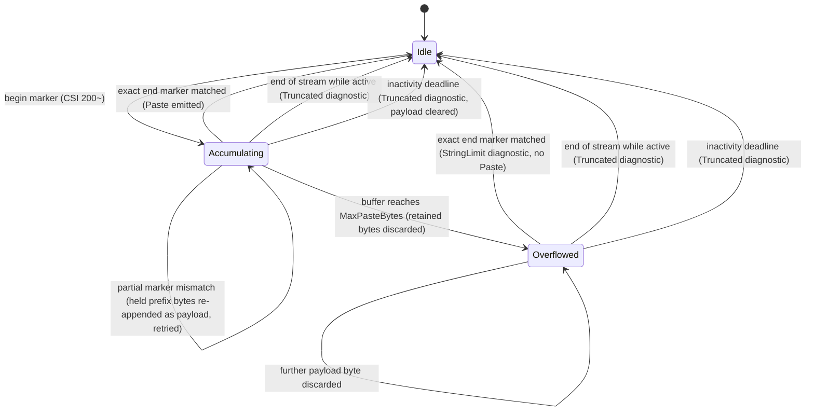

# Bracketed paste and focus reporting

## Overview

xterm private mode 2004 wraps pasted data between `CSI 200 ~` and `CSI 201 ~`.
Private mode 1004 reports focus gained as `CSI I` and focus lost as `CSI O`.
Primary source:
[XTerm Control Sequences](https://www.invisible-island.net/xterm/ctlseqs/ctlseqs.html),
accessed 2026-07-11.

Paste content is UTF-8 application data, not control input. While a paste is
active, bytes that resemble keys or escape sequences remain paste payload until
the exact end marker or a finite inactivity deadline. Payload size is bounded;
oversized input discards through the terminator or deadline without retaining
the payload.

Focus reports are typed terminal events and are distinct from control focus
inside the UI tree. Terminal focus loss may clear hover/pressed state according
to UI policy but does not synthesize arbitrary key releases.

## Supported features

Both modes are managed through lifecycle leases: fragmented begin/end markers
are decoded, immutable paste/focus events are emitted on the dispatcher, and the
modes are restored at exit.

`Input.InputDecoder` recognizes CSI 200~/201~ and switches to raw paste mode
after the begin marker. A six-byte exact matcher holds only a possible
end-marker prefix; mismatches return the held bytes to payload, so embedded ESC
and every proper marker prefix remain data. Parser callbacks are bypassed until
the exact terminator or inactivity recovery, meaning retained paste content
cannot trigger keys, focus, mouse, OSC, or CSI handling. An active multiplexer
route also leaves these bytes untouched: wrapped-looking replies remain paste
data, including their framing.

Payload retention is capped by `Input.InputOptions.MaxPasteBytes`. Overflow
clears retained bytes, discards through the terminator, reports one structural
diagnostic, and resumes ordinary decoding at the following byte. Successful
payloads are normalized to valid UTF-8 with U+FFFD for malformed subsequences,
copied into an owned `Paste`, and remain stable when decoder storage is reused.
End-of-stream drops partial payload and reports truncation.

`InputOptions.PasteTimeout` bounds inactivity, with a ten-second default and a
positive maximum of 4,294,967,294 milliseconds. Every nonempty fragment that
continues a paste refreshes `InputDecoder.PendingPasteDeadline`; an empty
fragment does not. This is not a total-duration limit. At the deadline,
`ExpirePaste()` clears payload and any partial end marker before reporting one
redacted `Truncated` diagnostic. It emits no partial `Paste` and never replays
discarded bytes as keys. Overflow has the same inactivity recovery.

`ProtocolRouter` forwards this deadline and expiry operation. `Session` wakes
without another read, checks for already available input before expiry, and
reuses one pending paste timer across fragments and successive pastes. A direct
decoder/router owner must schedule the deadline and process available bytes
before calling expiry. After expiry, new bytes resume ordinary decoding.

> [!WARNING]
>
> Overflow discards the entire paste, not the excess. The first byte past
> `MaxPasteBytes` zeroes everything retained so far, and the finished paste
> yields one `StringLimit` diagnostic and no `Paste` value at all — with the 16
> MiB default, a paste one byte over produces nothing rather than a truncated
> prefix. Size the cap for the largest paste the application must accept.

CSI I/O emit immutable gained/lost `TerminalFocus` values. They are terminal
focus only; application routing applies the separate
[UI focus policy](../concepts/input-routing.md#route-construction).

## Bounds and lifecycle

Supported input covers empty, multiline, Unicode, invalid UTF-8, embedded ESC,
every proper marker prefix, owned retention, megabyte overflow, truncation,
every byte split, idle expiration and progress, literal multiplexer envelopes,
adjacent focus/text events, and terminal focus transitions. Lifecycle cleanup is
proved by `Runtime.Session`, which enables only supported modes and restores
them in reverse even after startup, input, handler, cancellation, or cleanup
failure.

## Sources

- [XTerm Control Sequences, patch level 410](https://www.invisible-island.net/xterm/ctlseqs/ctlseqs.html)
  defines bracketed-paste mode 2004 and focus-reporting mode 1004.

Source accessed 2026-07-28.

## Expected behavior

| Layer     | Required evidence                                                                        |
| --------- | ---------------------------------------------------------------------------------------- |
| Paste     | Every marker split/prefix, embedded ESC, UTF-8, limit overflow, ownership, and recovery. |
| Focus     | Exact gain/loss events, ordering beside text, and UI-state policy.                       |
| Lifecycle | Capability-gated leases and reverse restoration after every exit/failure path.           |
