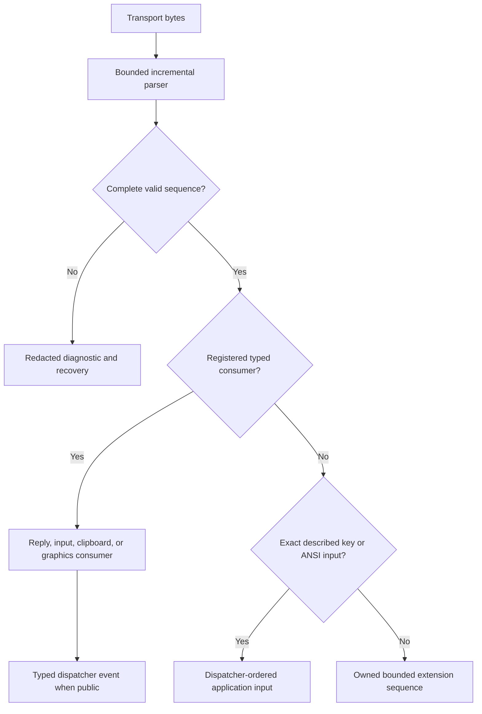

# Runtime protocol routing

## Overview

[`Parser`](ecma-48.md#streaming-grammar) owns bounded ECMA-48 framing.
`ProtocolRouter` owns the decision between typed input, typed terminal
responses, and bounded raw extension strings. Parser callback spans are
borrowed; every `ProtocolSequence` copies its header and payload before the
callback returns.

| Parsed value                           | Runtime owner                                  | Application-visible result                 |
| -------------------------------------- | ---------------------------------------------- | ------------------------------------------ |
| Key, text, mouse, paste, or focus      | Input decoders and routed UI input             | Dispatcher-ordered input event.            |
| Active startup-query reply             | Query tracker, then the response event surface | Evidence refinement plus a typed event.    |
| Valid unsolicited or late reply        | Response event surface                         | Typed event without capability mutation.   |
| Registered clipboard or graphics data  | The corresponding typed protocol consumer      | Service- or renderer-owned transaction.    |
| Unknown valid string                   | `IProtocolSink.Sequence`                       | Owned bounded sequence.                    |
| Malformed, oversized, or unrouted data | Diagnostic path                                | Redacted diagnostic; payload is discarded. |

The active terminal profile's key map is copied into immutable input options
when `Session` constructs its router. CSI, SS3, Escape, and control callbacks
first run registered reply, paste, mouse, focus, and Kitty consumers, then exact
described-key signatures, then the explicit ANSI compatibility grammar when that
built-in profile selected it. Non-signature description strings use a bounded
longest-match trie before ordinary text decoding. An unmatched retained prefix
is replayed once through the ordinary decoder, preserving byte order and
recovery.

Seven-bit `ESC O final` and eight-bit `SS3 final` compile to the same structural
signature. When the active map contains an eight-bit CSI or SS3 spelling, the
decoder recognizes only that standalone ground-state introducer; it does not
enable parser-wide C1 handling. A pending UTF-8 scalar owns `0x8F` or `0x9B` as
its continuation, while an explicit caller-supplied `AcceptEightBitControls`
policy remains independently authoritative for other C1 bytes. Escape signatures
retain their intermediate bytes; an exact described signature is checked before
an otherwise unsupported Escape intermediate sequence becomes a diagnostic.

`IProtocolSink` declares only the numeric `Response` and `Sequence` members;
every vendor reply family is an optional extension interface a sink implements
separately, for example `IPaletteResponseSink` for OSC 4/10/11 or
`IMetricsResponseSink` for window/cell geometry. `Decoder` dispatches each
decoded reply to the matching extension interface when the sink implements it,
and otherwise adapts it through the base numeric `Response` callback or a
synthetic diagnostic, so a sink is never required to implement more than
`IProtocolSink` to observe every reply in some form. Palette and metrics replies
adapt through the numeric-response callback when their extension interface is
absent. A sink without `IStatusResponseSink` or `ICapabilityResponseSink`
receives one synthetic `DiagnosticCode.Unsupported` DCS diagnostic through its
inherited input callback instead; that diagnostic has zero offset and discarded
bytes because the adapted compatibility path has no raw payload. OSC 10/11
preserve normalized red, green, blue; OSC 4 supplies index, red, green, blue;
and metrics supply width, height. Kitty graphics APC payloads beginning with `G`
dispatch to `IKittyGraphicsResponseSink`; absent that interface, the fallback
reports a redacted unsupported APC diagnostic. Built-in sinks implement every
extension interface they consume, so discovery still receives the typed value
rather than the compatibility diagnostic. `IProtocolSink.Sequence` receives
completed OSC, DCS, APC, PM, and SOS values without a registered typed consumer.
A recognized response is never emitted again as input or a raw sequence.

Validated queried metrics refine pixel-to-cell inference only after their
ordered response callback. A complete local resize grid has precedence. Earlier
pointer values are immutable and are never revisited when later geometry
arrives.

`Session` owns a `ProtocolRouter` and delivers the complete sink contract in
transport order. `Application` queues typed replies as immutable records and
raises `ResponseReceived`, `PaletteResponseReceived`, `MetricsResponseReceived`,
`StatusResponseReceived`, or `CapabilityResponseReceived` only on its
dispatcher. These records share one ordered input queue. An unregistered raw
sequence becomes a `DiagnosticCode.Unsupported` record containing its family and
byte count, never its payload.

The fixed terminal backend contributes only immutable extension-family metadata.
Existing `ProtocolRouter` consumers remain the wire implementation; they are not
recreated inside backend classes. Capability evidence still gates optional
consumers and output. Backend composition and identity are specified by the
[terminal backend contract](../architecture/terminal-backends.md#extensions-and-authorization),
while query planning, response classification, and immutable publication are
specified by the
[discovery pipeline](../architecture/discovery-pipeline.md#active-query-strategy).

`ProtocolRouter` owns decoding and ordered metric refinement; the
[capability contract](../architecture/capabilities.md#queries-and-publication)
owns query selection, transaction deadlines, and profile publication.

## Ordering and ownership

Callbacks are synchronous and remain in transport order. `Session` invokes one
sink callback at a time. `Response` owns its numeric values; palette and metrics
responses and Kitty graphics responses are self-contained owned values; and
`ProtocolSequence` owns copied parameters, intermediates, and payload bytes. No
value retains parser storage or the transport read buffer.

`PaletteResponse` and `MetricsResponse` expose validated public constructors.
Their all-zero `default` value is an explicit empty sentinel rather than a
decoded terminal reply. `StatusResponse` likewise has an empty default sentinel;
`CapabilityResponse` is a non-null owned reference. Their event payloads reject
empty or null values before changing observable state. `QueryResults` rejects an
empty response and a response assigned to the wrong family.

The application may enqueue immutable numeric responses for dispatcher-affine
services and events. It also enqueues the owned bounded status and capability
responses without retaining parser or transport buffers. It does not enqueue
unregistered raw strings. Those strings become redacted diagnostics containing
only their family and discarded byte count. Clipboard, graphics, and
notification services register typed consumers below that fallback boundary.

## Recovery and fallback

Malformed, interrupted, truncated, and oversized sequences retain the
[parser recovery contract](ecma-48.md#streaming-grammar). A `Decoder` sink that
does not implement `IProtocolSink` receives `DiagnosticCode.Unsupported` for a
valid reply or string instead of silently losing it. An `IProtocolSink`
implementation that does not additionally implement `IStatusResponseSink` or
`ICapabilityResponseSink` receives the synthetic no-payload unsupported
diagnostic described above instead of silently dropping DECRQSS or XTGETTCAP.

Unknown valid strings are observable through `IProtocolSink.Sequence`; their
presence does not enable a capability. Strict mode may promote the redacted
diagnostic but cannot reinterpret the payload as user input.

## Security and bounds

The parser's parameter, intermediate, and string limits apply before routing.
Owned values cannot exceed those limits. Application diagnostics never include
raw payload bytes, clipboard data, paths, credentials, or terminal-provided
metadata.

## Inbound consumption surface

`Application` exposes seven events for consuming inbound protocol activity,
unchanged in ordering by hosting and discovery. `ResponseReceived` raises one
typed numeric `Response` (DA, DSR, DECRPM, or Kitty keyboard reply) per record.
`PaletteResponseReceived` raises OSC 4/10/11 colors, `MetricsResponseReceived`
raises window/cell geometry, `StatusResponseReceived` raises each validated
DECRQSS result, and `CapabilityResponseReceived` raises each validated XTGETTCAP
result. All five response events run on the dispatcher in mutual transport
order. Matched, wrong-identity or otherwise unsolicited, duplicate, and late DCS
values remain observable; query classification changes capability evidence, not
event delivery. `CapabilitiesChanged` raises once whenever a new immutable
`Capabilities` profile becomes active — including the startup negotiation result
— before any resulting invalidation. `Diagnostic` raises one redacted
`Diagnostic` for every malformed, unsupported, or otherwise unrouted protocol
occurrence, containing only its family and discarded byte count, never raw
payload bytes. These seven events are the complete way an application consumes
protocol replies and capability changes; there is no lower-level polling
surface.

## Sources

- [ECMA-48](ecma-48.md#overview) owns framing and recovery.
- [Device attributes](device-attributes.md#overview) owns startup-response
  correlation.
- [Terminal integration](../architecture/terminal-integration.md#protocol-routing)
  owns the application-facing end-to-end path.

## Expected behavior

Readers can rely on these observable outcomes:

- Every recognized reply and string family has the same result regardless of how
  transport reads split its bytes.
- Routed values own their data and remain valid after the source buffer is
  reused.
- Adjacent input and replies preserve transport order through the dispatcher.
- Malformed, cancelled, truncated, and oversized strings recover before the next
  valid input value.
- Matched, wrong-identity, duplicate, and late DCS replies remain observable;
  only a matched active query may refine capability evidence.
- A sink that implements only the base interface receives the documented
  compatibility diagnostic instead of silently losing an extension reply.

| Evidence layer | What remains observable                                                      |
| -------------- | ---------------------------------------------------------------------------- |
| Decoder        | Whole and fragmented inputs produce the same typed values and recovery.      |
| Ownership      | Values survive source-buffer reuse without retaining borrowed memory.        |
| Integration    | Router, session, query tracker, and dispatcher preserve order and ownership. |
| Compatibility  | Legacy sinks receive bounded, redacted fallback diagnostics.                 |
