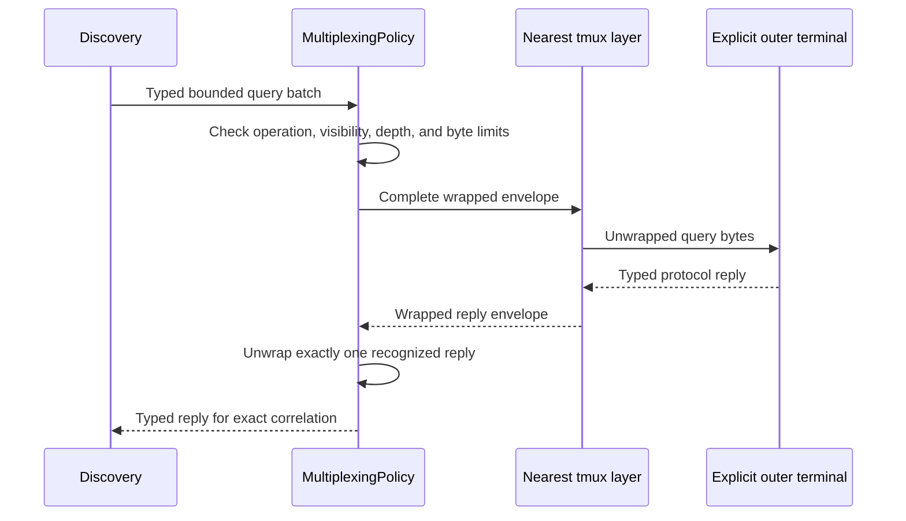

# tmux passthrough

## Overview

Primary source:
[tmux 3.7a manual](https://man7.org/linux/man-pages/man1/tmux.1.html) and
[tmux FAQ](https://github.com/tmux/tmux/wiki/FAQ), accessed 2026-07-20. With
`allow-passthrough`, a pane can wrap data for the outer terminal as
`DCS tmux ; escaped-data ST`. Embedded ESC bytes are doubled for the tmux layer.
`allow-passthrough=on` admits visible panes only; `all` also admits hidden
panes. The default is `off`.

`TERM` and `TMUX` indicate a multiplexer context, not outer-terminal features.
Capabilities use conservative filtering unless explicit queries survive or the
caller overrides the outer profile. Correlated replies must return to the
requesting pane.

## Routing policy

[`Multiplexing.MultiplexingPolicy`](../../src/SharpVision.Terminal/Multiplexing/MultiplexingPolicy.cs)
owns the nearest-to-farthest layer list, an explicit outer `TerminalProfile`,
the disabled/visible/all gate, pane visibility, approved typed operation
families, maximum depth, and maximum envelope bytes. Detection records one
nearest tmux layer from non-empty `TMUX` or `TERM=tmux-*`, but it supplies no
outer profile, approval, or enabled passthrough. A terminal name therefore
describes only the inner tmux terminal.

The default maximum is four layers with a hard maximum of sixteen. The default
envelope limit is 1 MiB with a hard maximum of 16 MiB. Construction rejects
`None` layers, unknown values, and depth overflow. A route is active only when
it has at least one layer, an explicit outer profile, an approved operation, and
a visibility-compatible passthrough mode.

The route's capability query batch and the Kitty/sixel/iTerm2 graphics backends
are the currently connected typed output operations. A route wraps the farthest
layer first, then works inward so the nearest multiplexer sees the outermost
wire envelope. Each tmux layer doubles every ESC again. It prepares the complete
bounded result before mutating the caller's destination. Each complete Kitty
APC, sixel DCS, or iTerm2 multipart OSC is routed independently. Clipboard is a
policy family reserved for its typed implementation; no route operation accepts
control strings or caller-supplied raw payloads.

A mixed route may contain at most one GNU screen layer, and that layer must be
farthest. Screen therefore receives the original CSI query batch rather than a
tmux DCS envelope. A Screen-before-tmux route, duplicate Screen layers, or any
OSC/DCS query in a Screen-containing batch is rejected before destination
mutation. See the [Screen framing limit](gnu-screen.md#dcs-framing-limit).

Startup negotiation uses the explicit outer profile as its semantic baseline
without replacing the active inner description, programs, or key map. Its
capability evidence is not reinterpreted through inner `TERM`, `TMUX`, or
`TERM_PROGRAM` hints. Its complete typed batch crosses the selected route once.
The bounded input seam recognizes only the configured outer prefix, retains at
most the envelope limit across arbitrary fragmentation, peels each configured
layer, and accepts only one complete recognized DA, mode, Kitty keyboard, cursor
position, metrics, palette, status, or capability reply. Trailing text,
controls, raw strings, and concatenated replies reject the entire envelope
before it reaches ordinary input. Accepted bytes are routed through
`ProtocolRouter` before `QueryTracker` correlation. tmux routes admit typed CSI,
OSC, and DCS replies. Screen-containing routes admit CSI only. A complete
malformed route candidate produces one redacted diagnostic; oversized candidates
discard through the full outer recovery boundary without leaking ST bytes as
keys or text. Diagnostics and all later parser events retain raw transport byte
offsets, including outer framing and repeated ESC expansion. Wrong-family
replies remain typed and observable but cannot retire the originating query. If
bounded route encoding fails atomically, negotiation publishes absent evidence
immediately without a write, flush, active query, optional-mode lease, cleanup
sequence, or deadline wait. Absent transmitted replies preserve conservative
evidence at the original exclusive deadline.

[`TmuxWriter.WritePassthrough`](../../src/SharpVision.Terminal/Multiplexing/TmuxWriter.cs)
implements the exact one-layer grammar. `TryUnwrap` validates parser-delivered
`tmux;` payloads; `TryUnwrapEnvelope` additionally validates the complete DCS
and ST boundary. Both reject malformed input before destination mutation.

## Supported features

SharpVision provides typed passthrough wrapping for approved query, clipboard,
and graphics operations, bounded unwrapping of replies, correct ESC doubling,
nested-depth limits, and an explicit policy when passthrough is disabled.
Capability queries and Kitty/sixel/iTerm2 graphics are implemented. Clipboard
opts in only through its typed backend. Arbitrary payloads from controls are
never tunneled.

## Compatibility evidence

Pure tests cover single and safely mixed nested wrapping, rejected unsafe Screen
topologies, every reply split, repeated ESC doubling, disabled and hidden-pane
fallback, finite depth and size limits, malformed recovery, originating-query
correlation, timeout fallback, and misleading `TERM`. A real `script`-owned
pseudoterminal starts installed tmux and proves pane output relay; a missing
executable is an explicit platform skip.

## Sources

- [tmux 3.7a manual](https://man7.org/linux/man-pages/man1/tmux.1.html)
- [tmux FAQ](https://github.com/tmux/tmux/wiki/FAQ)

Sources accessed 2026-07-28.

## Expected behavior

| Layer          | Required evidence                                                                         |
| -------------- | ----------------------------------------------------------------------------------------- |
| Writer         | Exact DCS envelope, ESC doubling, nesting, operation approval, depth, and size bounds.    |
| Routing        | Pane visibility, explicit outer profile, correlation, timeout, and conservative fallback. |
| Pseudoterminal | Installed-tmux pane relay or an explicit platform skip.                                   |
