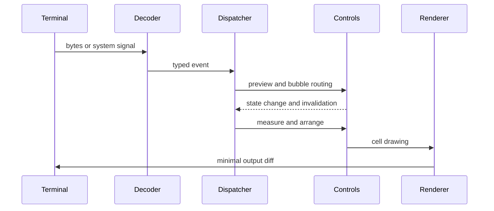

# SharpVision Foundation Design

**Status:** Approved design

**Date:** 2026-07-11

## 1. Purpose

SharpVision is a high-performance .NET 10 terminal UI library composed of a
low-level terminal engine, a traditional mutable-control toolkit, and an
interactive showcase application.

The first milestone must produce usable software rather than an architectural
shell. It includes byte-accurate terminal I/O, Unicode-aware cell rendering,
incremental screen updates, a deterministic UI dispatcher, a complete initial
control cohort, responsive layouts, automatic scrolling, and a showcase that
demonstrates every shipped control.

Documentation is normative. Public behavior, protocol support, invariants, and
known limitations must be documented alongside implementation changes.

## 2. Product Boundaries

### 2.1 Production projects

| Project                | Responsibility                                                                                                                                  |
| ---------------------- | ----------------------------------------------------------------------------------------------------------------------------------------------- |
| `SharpVision.Terminal` | Protocol encoding and decoding, transport, capability detection, Unicode cell geometry, input events, cell buffers, and terminal diff emission. |
| `SharpVision`          | Dispatcher, application lifecycle, mutable controls, layout, focus, routed input, styling, scrolling, windows, menus, and popups.               |
| `SharpVision.Showcase` | Runnable control gallery with navigation, live examples, embedded documentation, and event/state inspection.                                    |

### 2.2 Test projects

Each production project has a matching test project:

- `SharpVision.Terminal.Tests`
- `SharpVision.Tests`
- `SharpVision.Showcase.Tests`

`SharpVision` references `SharpVision.Terminal`. `SharpVision.Showcase`
references both libraries. Test projects may reference the corresponding
production project and lower-level dependencies. Production dependencies must
never point toward the showcase or test projects.

### 2.3 Dependency rule

Controls render to a cell-oriented canvas. They never emit ANSI, CSI, OSC, or
vendor-specific byte sequences. The terminal layer has no knowledge of buttons,
windows, styles, or other UI concepts.

```mermaid
flowchart LR
    Input["Terminal input bytes"] --> Decoder["Streaming decoder"]
    Decoder --> Dispatcher["UI dispatcher"]
    Dispatcher --> Controls["Mutable control tree"]
    Controls --> Layout["Measure and arrange"]
    Layout --> Canvas["Cell canvas"]
    Canvas --> Diff["Damage and frame diff"]
    Diff --> Encoder["Protocol encoder"]
    Encoder --> Output["Terminal output bytes"]
```

## 3. Core API Principles

- Types use contextual names. Prefer `Capabilities`, `Cell`, `Screen`, and
  `Button` over names with repeated `Terminal`, `SharpVision`, or `Control`
  prefixes and suffixes.
- Public methods and property setters validate their arguments before changing
  observable state.
- Public and internal members have useful XML documentation. Public API
  documentation includes examples, thrown exceptions, threading rules, and
  memory ownership where relevant.
- `Rune`, `Span<T>`, `ReadOnlySpan<T>`, `Memory<T>`, and `ReadOnlyMemory<T>` are
  preferred in performance-sensitive and protocol-facing APIs. Strings remain
  acceptable at ergonomic application boundaries.
- Important algorithms have short comments describing intent or invariants, not
  line-by-line narration.
- `Debug.Assert` records internal invariants that should be impossible to
  violate after public validation.
- Logical blocks are separated by empty lines.

## 4. Terminal Protocol Model

### 4.1 Standards scope

The protocol inventory begins with the authoritative definitions in
[ECMA-48](https://ecma-international.org/publications-and-standards/standards/ecma-48/),
[xterm control sequences](https://www.invisible-island.net/xterm/ctlseqs/ctlseqs.html),
[Kitty protocol extensions](https://sw.kovidgoyal.net/kitty/protocol-extensions/),
[Unicode text segmentation](https://www.unicode.org/reports/tr29/), and
[Unicode East Asian Width](https://www.unicode.org/reports/tr11/).

The documentation coverage matrix distinguishes four states:

1. Documented and implemented with a typed API.
2. Documented and decoded for observation.
3. Documented with an extension API and safe fallback.
4. Documented as unsupported with a specific reason.

"All known protocols" means maintaining a deliberate, sourced inventory. It does
not mean claiming that every private escape sequence ever shipped is
implemented. Undocumented or newly introduced sequences remain observable
through diagnostics and a bounded raw-extension surface.

### 4.2 Parser

The input parser is a bounded streaming state machine covering C0 and C1
controls, ESC, CSI, OSC, DCS, APC, PM, and SOS. It must:

- accept any partitioning of a sequence across transport reads;
- decode multiple events from one read;
- preserve state between reads without retaining the caller's memory;
- recover deterministically from malformed UTF-8 and malformed sequences;
- limit parameter counts, numeric magnitude, payload size, and nesting;
- expose unknown but valid sequences as diagnostic events;
- support cancellation and end-of-stream without inventing input; and
- avoid unbounded allocation for hostile payloads.

Parser limits are configurable through an immutable options value. Defaults must
be conservative enough for interactive use while accepting the supported
protocols.

### 4.3 Encoder

Typed commands encode directly into `IBufferWriter<byte>` or caller-provided
spans. Encoding must be deterministic and culture-independent. Commands that
carry arbitrary text or base64 data validate length and termination rules.

The first milestone implements the sequences required for:

- cursor positioning and visibility;
- erase, insert, delete, and scrolling operations;
- SGR colors and attributes;
- alternate-screen and terminal-mode lifecycle;
- window titles and hyperlinks;
- OSC 52 clipboard text;
- Kitty OSC 5522 clipboard requests, responses, permissions, MIME data, and
  paste events as defined by the
  [Kitty clipboard protocol](https://sw.kovidgoyal.net/kitty/clipboard/);
- focus reporting and bracketed paste;
- synchronized output;
- device attributes and capability queries;
- Kitty keyboard input; and
- common cell- and pixel-based mouse modes.

Kitty graphics, sixel, and iTerm2 image protocols receive accurate
specifications, capability hooks, and extension boundaries in this milestone.
Full image rasterization is deferred.

### 4.4 Capabilities

`Capabilities` is immutable. Detection combines environment hints, terminal
identity, multiplexer context, and bounded request/response queries. Callers may
provide explicit overrides for SSH, tmux, GNU screen, CI, testing, or terminals
whose advertised identity is inaccurate.

Unsupported features degrade safely by default. An opt-in strict diagnostics
mode promotes selected fallbacks and malformed input to exceptions during
development and testing.

Every query has a timeout and correlation strategy. Missing responses never
block application startup indefinitely.

## 5. Unicode and Cell Geometry

Text is segmented into extended grapheme clusters. A `char` is never treated as
a complete user-perceived character by default.

The width engine accounts for combining marks, variation selectors, emoji ZWJ
sequences, regional indicators, East Asian width, and a configurable ambiguous
width policy. The Unicode version and any terminal-specific overrides are
reported by the effective capabilities profile.

A wide cluster occupies one leading cell plus continuation cells. Continuation
cells cannot be addressed as independent glyphs. Overwriting, clipping, or
clearing any occupied cell damages the whole cluster and repairs the affected
range. A cluster that cannot fit at the current boundary follows the documented
wrapping or clipping policy; half-glyph output is forbidden.

Mouse events retain cell coordinates and, when present, pixel coordinates.
Conversion between them uses reported terminal cell metrics and records when a
value was inferred rather than reported.

## 6. Rendering and Transport

Rendering uses pooled front and back cell buffers, row hashes, merged damage
spans, and style-state tracking. The output encoder minimizes cursor movement,
style transitions, and redundant writes. Synchronized output is used when the
effective capabilities allow it.

Steady-state rendering must not allocate per cell. Grapheme payload storage may
use pooled frame or screen arenas with explicit ownership. Buffers returned to
pools must not remain observable through public API values.

A frame scheduler coalesces invalidations while preserving explicit flushes.
Slow transports apply bounded backpressure. Cancellation, disposal, transport
failure, and unhandled application errors all attempt to restore cursor
visibility, mouse modes, paste modes, synchronized output, and the alternate
screen. Cleanup failure is diagnostic and never masks the original exception.

## 7. Dispatcher and Runtime Events

All control state is single-thread-affine. The dispatcher owns mutation, layout,
input routing, and rendering. Background operations return through
`InvokeAsync`; invalid cross-thread access fails with a documented exception.

The runtime event flow is:

Terminal events include:

- resize;
- focus gained and lost;
- key and text input;
- mouse input with cell and optional pixel positions;
- paste and clipboard events;
- protocol responses;
- transport closure; and
- transport faults.

Application events include starting, started, stopping, stopped, idle, unhandled
exception, and frame rendered. `Idle` fires only after queued work and
invalidations are drained, immediately before the dispatcher waits. Scheduled
ticks are a separate facility for animations and time-based behavior.

Resize events enter through the dispatcher, may be coalesced during resize
storms, and always trigger root re-layout and complete damage assessment using
the latest terminal dimensions.

## 8. Traditional Control Model

Controls are ordinary mutable objects with properties, events, and explicit
parent/child ownership. There is no virtual tree, reconciliation pass, hook
system, or function-component lifecycle.

Property changes invalidate only the required stage:

- measurement when desired size may change;
- arrangement when placement may change; or
- rendering when only visual output changes.

A control has at most one parent. Child collections reject null entries,
duplicates, cycles, and children already owned elsewhere. Input supports preview
and bubble routing. Pointer capture supports pressed state, dragging, scrollbar
thumbs, and popup interactions. Focus navigation works by keyboard, mouse, and
explicit API.

The initial control cohort includes:

- text and rich text;
- button;
- check box;
- radio button and radio group behavior;
- text input;
- border;
- stack, grid, dock, overlay, and canvas panels;
- scroll view and scrollbars;
- list;
- menu and menu item;
- popup; and
- window.

Every interactive control specifies keyboard behavior, focus behavior, pointer
behavior, disabled behavior, semantic metadata, and visual-state transitions.

## 9. Styling

Styles are mutable resources with change notifications. They do not require a
virtual-tree diff. A change invalidates only controls that depend on the changed
resource.

The standard visual states are normal, hovered, pressed, focused, checked, and
disabled. State precedence is deterministic and documented. Combined states,
such as focused and checked, are expressible without duplicating the entire
style.

Colors, text attributes, borders, spacing, and control-specific appearance can
be set directly or inherited from scoped resources where inheritance is
meaningful. Disabled styling never changes whether a control accepts input;
behavior derives from control state, not appearance.

## 10. Layout

Sizing supports:

- fixed terminal-cell lengths;
- percentage lengths;
- automatic content-based lengths;
- proportional remaining-space lengths;
- minimum and maximum width and height;
- margin and padding;
- horizontal and vertical alignment; and
- visible, hidden, and collapsed states.

Layout uses measure and arrange passes. Percentage values resolve against the
containing block's inner arranged size. During an unbounded measure, a
percentage behaves as content-sized for desired-size calculation and resolves
during arrangement. This rule prevents circular percentage/automatic sizing
while remaining deterministic.

Grid supports fixed, percentage, automatic, and proportional tracks, spanning,
spacing, and predictable overflow. Stack, dock, overlay, and canvas panels
follow documented clipping and z-order rules.

## 11. Scrolling

Scroll views provide automatic, always-visible, and hidden policies
independently for horizontal and vertical bars. Automatic bars appear only when
arranged content exceeds the viewport, and the second bar is reconsidered after
the first consumes space.

Scrolling supports:

- mouse wheels and high-resolution pixel deltas;
- keyboard line, page, home, and end commands;
- scrollbar buttons, track clicks, and draggable thumbs;
- programmatic offsets and bring-into-view;
- nested scrolling that propagates unused delta to an ancestor;
- resize and content changes without invalid offsets;
- focus, hovered, pressed, and disabled visuals; and
- grapheme-safe horizontal clipping.

Offsets are clamped after every extent or viewport change. Thumb size and
position remain stable for zero-sized and very large extents.

## 12. Rich Text

`RichText` is a control whose content is a traditional mutable collection of
inline elements. The first milestone includes styled text runs, line breaks,
semantic emphasis, hyperlinks, wrapping, alignment, selection, and link
activation events.

Inline content is not raw ANSI. Styling is represented by typed values so that
measurement, clipping, selection, accessibility metadata, and fallback remain
correct. Rich text uses the same grapheme and cell-width engine as every other
control.

## 13. Showcase

`SharpVision.Showcase` is a responsive terminal application and an executable
specification of the public control API.

Its root window has:

- a sidebar containing every shipped control category and control;
- keyboard and pointer selection;
- a main pane that displays several interactive property/state variants;
- `RichText` documentation for purpose, properties, events, states, and
  shortcuts;
- a live event and state log; and
- automatic scrolling when the terminal cannot fit the content.

The sidebar and main pane adapt to resize. At narrow widths the navigation may
collapse into a menu or overlay while retaining keyboard access. Every shipped
control must have a showcase page before it is considered complete.

Showcase tests drive navigation and interaction through public APIs, compare
virtual-screen output at representative sizes, and verify that all registered
controls have documentation and examples.

## 14. Error Model and Diagnostics

Programmer errors throw documented exceptions. Examples include invalid
dimensions, invalid enum values, parenting cycles, cross-thread mutation,
disposed-object use, and spans too small for APIs whose contract requires a
fixed destination.

Environmental failures use diagnostics and safe fallback where continued
operation is possible. Examples include unsupported capabilities, missing query
responses, malformed terminal input, denied clipboard permission, and transport
disconnection.

Diagnostics are structured and observable without requiring a logging framework.
Sensitive clipboard payloads and terminal query data are redacted by default.

## 15. Verification Strategy

Tests follow `MethodName_WhenThis_ThatIsExpected`. Shouldly is the assertion
library. Moq is limited to genuine interaction boundaries; deterministic fakes
are preferred for transports, clocks, dispatchers, and terminals.

Required proof includes:

- exact bytes for every typed encoder;
- typed events for every decoder;
- parser tests repeated across every possible read-fragment boundary;
- malformed and oversized sequence recovery;
- curated grapheme, width, clipping, and wide-cell repair cases;
- full virtual-screen and emitted-diff comparisons across multiple frames;
- control interaction from terminal input through final output bytes;
- resize, focus, idle, lifecycle, and shutdown behavior;
- fixed, percentage, automatic, and proportional layout interactions;
- automatic and nested scrollbar behavior;
- randomized parser recovery, layout invariants, and diff equivalence;
- pseudoterminal integration on Unix and Windows console coverage where CI
  provides the required host; and
- allocation and throughput regression checks for critical loops.

Tests must inspect final observable behavior, not merely confirm that a helper
was called.

## 16. Documentation Structure

The normative documentation root is `docs/index.md`.

- `docs/protocols/` contains one focused file per protocol or extension and a
  coverage matrix.
- `docs/architecture/` contains project structure, memory ownership, event loop,
  rendering, capability detection, failure behavior, and diagrams.
- `docs/controls/` contains one public API specification per control, grouped by
  control category.
- `docs/concepts/` contains styling, layout, scrolling, focus, input routing,
  Unicode geometry, threading, lifecycle, and safe degradation.
- `docs/testing/` contains the correctness model, terminal fixtures, randomized
  testing, integration environments, and performance gates.

Links appear inline at the sentence and section where the dependency matters. CI
validates Markdown style, formatting, local file links, and section anchors.

## 17. Agent Guardrails

Root `AGENTS.md` defines source, documentation, and testing rules for the entire
repository. Domain skills live under `.codex/skills/`:

- `terminal-protocols`
- `unicode-cell-geometry`
- `terminal-rendering`
- `ui-controls`
- `layout-input-events`
- `testing-quality`
- `docs-specifications`

Each skill points to normative documentation, defines the invariants for its
domain, gives focused verification commands, and requires relevant docs to be
updated in the same change as behavior. Skills route work; they do not duplicate
large portions of the specifications.

## 18. Tooling and Quality Gates

The repository adapts the strict .NET, EditorConfig, Markdown, Prettier,
Makefile, package, and CI discipline from
`/Users/alex/Development/nostalgia-es-1841-emulator` while replacing all
repository-specific names and paths.

The local quality interface is:

- `make format`
- `make lint`
- `make build`
- `make test`

CI runs the equivalent commands from a clean restore and treats warnings as
errors. Formatting and documentation rules are installed before implementation
expands so that new code begins inside the intended guardrails.

## 19. First-Milestone Acceptance

The milestone is complete only when:

1. All production and matching test projects build on .NET 10.
2. The documented first protocol cohort is implemented and byte-tested.
3. Unicode cell geometry and incremental rendering pass deterministic and
   randomized tests.
4. The dispatcher, lifecycle events, resize behavior, layout, styling, focus,
   input routing, and scrolling work together end to end.
5. Every initial control has complete API documentation, interaction tests, and
   a showcase page.
6. The showcase remains usable at documented minimum, typical, and large
   terminal sizes.
7. Root guardrails and all domain skills exist and route to current specs.
8. `make format`, `make lint`, `make build`, and `make test` pass from the
   repository root.

## 20. Explicit Non-Goals

The first milestone does not implement a general-purpose terminal emulator, full
image rasterization, remote GUI transport, browser rendering, or a React-style
virtual component tree. These exclusions do not prevent later additions behind
the established terminal and canvas boundaries.
