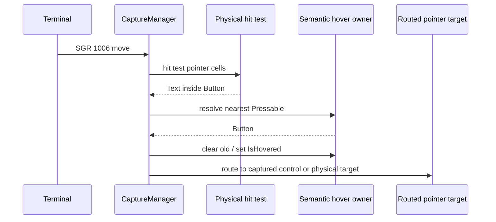

# Hover interaction contract design

## Purpose

SharpVision must make pointer hover an observable, deterministic interaction
state for traditional controls. A user moving over a Button, CheckBox,
RadioButton, sidebar entry, ScrollBar, menu item, or other interactive control
must receive a visible hover response when the active terminal reports pointer
motion. The behavior must remain correct while a separate control owns pointer
capture and must degrade safely to keyboard interaction when mouse motion is
unsupported or ignored.

This design establishes the reusable library contract and the visual policy used
by the SharpVision Showcase. It does not impose a visual theme on applications.

## Existing behavior and gap

The terminal layer already decodes SGR mouse motion and the UI layer already
stores `Control.IsHovered` with a `State.Hovered` appearance overlay. The
showcase currently requests xterm button-event tracking (`1002`), however, which
only reports motion while a pointer button is held. Passive movement therefore
cannot update hover.

In addition, ordinary hit testing can return a content child such as `Text`
inside a `Button`. Applying the hovered state only to that leaf leaves the
semantic composite control unaware of the pointer. The Button cannot therefore
render an appropriate hover treatment even when a move report arrives.

## Terminal policy

The executable showcase will request xterm any-event mouse tracking (`1003`)
with SGR cell coordinates (`1006`). This asks a compatible terminal to report
all pointer motion, including movement with no buttons held. The terminal
runtime continues to restore mouse tracking and coordinate modes on shutdown in
its existing reverse lease order.

The general runtime defaults remain conservative. Applications opt in by setting
their own typed runtime options; the showcase is an explicit interactive host
and is therefore allowed to request `1003`. If a terminal lacks or ignores the
mode, no synthetic hover state is invented: pointer click and keyboard behavior
remain available according to the reports actually received.

## Semantic hover ownership

Pointer dispatch and hover resolution are related but distinct:

1. Pointer dispatch targets the captured control while exclusive capture is
   active; this preserves drag, selection, scrollbar, and press behavior.
2. Hover always starts from the physical screen hit-test target on every
   non-leave pointer report, even while another control is captured.
3. The physical target resolves to its nearest eligible semantic hover owner. A
   pressable composite owns hover for all of its visual content, so a Text child
   inside a Button, CheckBox, RadioButton, or sidebar item hovers that
   composite. An interactive leaf remains its own hover owner.
4. A terminal leave report, unavailable subtree, disposal, or terminal-focus
   loss clears hover synchronously. No stale visual state survives a detached,
   disabled, hidden, collapsed, or disposed target.

The capture manager retains one public current hover owner. It clears the
previous owner before setting the new owner, invalidating only render state when
the value changes. Pressed state remains governed by the existing pressable
state machine and physical bounds; hover never activates a control.

## Showcase visual policy

The Showcase will supply explicit `State.Hovered`, `State.Focused`,
`State.Pressed`, and `State.Disabled` overlays for its interactive samples and
sidebar entries. Hover communicates availability with a brighter border or
surface; focus uses a strong accent; pressed uses an inset or shifted treatment;
disabled uses muted text and a visibly low-emphasis surface. These are showcase
styles, not new application-wide defaults.

Each showcase recipe will demonstrate the live state through a framed and
shadowed specimen. RichText guidance above each specimen explains how to invoke
the behavior and links to the relevant control or input contract through OSC 8
when the terminal supports hyperlinks.

## Verification

Tests must prove the following observable behavior:

- Runtime mode encoding emits `CSI ? 1003 h` followed by `CSI ? 1006 h` for the
  Showcase policy.
- A no-button SGR motion report moves hover between physical targets and clears
  the previous owner.
- A Text child inside a Button, CheckBox, RadioButton, or sidebar item resolves
  to the enclosing pressable hover owner.
- Drag capture continues routing to its captured control while hover tracks the
  physical target and clears when the pointer leaves the window.
- Disabled, hidden, collapsed, detached, and disposed controls never retain or
  gain hover state.
- State changes invalidate rendering without unnecessarily measuring or
  arranging layout.
- Virtual frame tests prove distinct hover, focus, pressed, and disabled cells
  for the showcase controls.
- The tmux showcase smoke test injects a no-button SGR move, observes a changed
  visual state, then proves leave cleanup.

The normal repository gates remain required: formatting, linting, Release build,
the full test suite, and the live tmux capture.

## Scope boundaries

This work does not add alpha compositing or transparent cell backgrounds. A
future preserve-background drawing mode is separate from hover behavior. This
work also does not change terminal-library mouse defaults for ordinary hosts,
nor does it change activation, focus traversal, or pointer-capture ownership.
