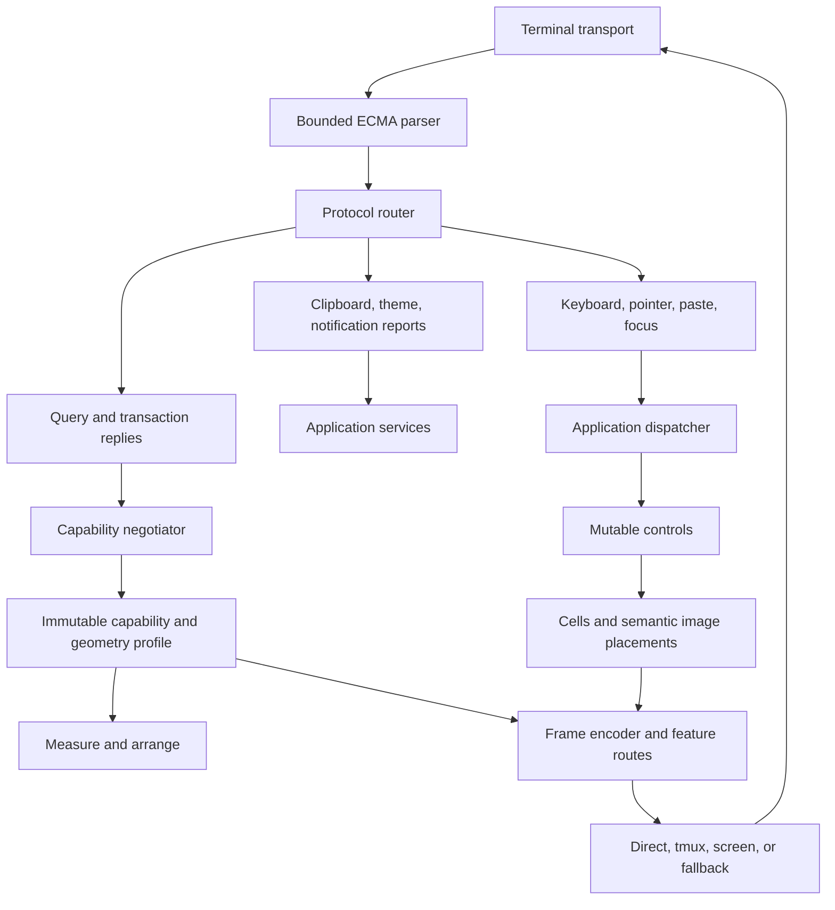
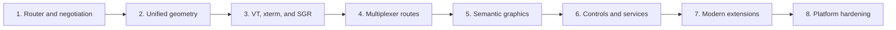

# Terminal Protocol and Cell Geometry Expansion Design

**Status:** Approved design

**Date:** 2026-07-12

**Applies to:** `SharpVision.Terminal`, `SharpVision`, `SharpVision.Showcase`,
tests, and protocol documentation

## Purpose

SharpVision already has a credible terminal core: bounded incremental parsing,
typed input, Unicode 17 grapheme and width data, cell-buffer rendering, frame
diffing, and exact-byte protocol tests. The remaining weakness is not one
missing encoder such as sixel. The library lacks the shared runtime paths that
turn terminal replies, negotiated capabilities, cell geometry, graphics, and
multiplexer routing into reliable application behavior.

This design defines a dependency-ordered expansion from low-level protocol
handling through public controls. It prevents isolated protocol helpers from
becoming dead APIs and makes terminal behavior observable, bounded, and testable
at every layer.

Detailed implementation plans are written separately for each vertical slice
after this design is accepted. Each plan must preserve the dependencies and
acceptance criteria in this document.

## Scope

The program covers:

- ECMA-48, DEC, xterm, Kitty, iTerm2, WezTerm, VTE/Konsole, and Windows Terminal
  behavior used by modern interactive terminal applications.
- tmux and GNU screen passthrough, reply routing, nesting, and capability
  constraints.
- Unicode grapheme segmentation, terminal cell width, explicit-width text,
  wide-cell ownership, cell-to-pixel conversion, hit testing, and selection.
- Capability queries, asynchronous replies, timeouts, overrides, and immutable
  capability snapshots.
- Sixel, Kitty graphics, and iTerm2 inline images through a semantic image model
  and an `Image` control.
- Clipboard, pointer shape, notifications, theme reports, and related runtime
  services.
- Unix terminal modes, Windows console modes, suspend/resume, PTY verification,
  and bounded cleanup.
- Unit, randomized, parser-fragmentation, virtual-screen, integration, showcase,
  tmux, screen, and platform tests.

## Non-goals

The following protocols are catalogued but intentionally unsupported in this
program:

- terminal file-transfer protocols;
- arbitrary terminal-side command or remote-control protocols;
- shell-integration prompt and command markers;
- Tektronix, ReGIS, and downloadable character sets;
- terminal-emulator completeness unrelated to interactive TUI behavior;
- reading image content from a terminal-supplied filesystem path.

Adding one of these families requires a separate security and product design.

## Compatibility target

The supported environment is a modern interactive terminal, directly or through
a multiplexer:

- xterm;
- Kitty;
- iTerm2;
- WezTerm;
- Windows Terminal;
- VTE-based terminals and Konsole;
- tmux;
- GNU screen.

Behavior must degrade conservatively when the terminal is unidentified, a query
times out, or a multiplexer blocks a feature. Environment variables and terminal
names are hints, not proof of protocol support.

## Audit method and evidence

The audit traced behavior through four layers:

1. parser and encoder implementations;
2. runtime and application integration;
3. controls, layout, and rendering consumers;
4. exact-byte, virtual-screen, and live-terminal tests.

The current focused baseline passed 257 tests:

| Area                          | Passing tests |
| ----------------------------- | ------------: |
| Unicode and cell geometry     |            33 |
| Protocol parsing and encoding |           134 |
| Rendering and frame diffing   |            90 |

A Release showcase build and tmux capture also completed without warnings. A
live tmux 3.6a cursor-position probe measured the following cell advances:

| Input                      | Observed columns |
| -------------------------- | ---------------: |
| ASCII                      |                1 |
| Decomposed accented letter |                1 |
| CJK wide character         |                2 |
| Family ZWJ emoji           |                2 |
| Keycap emoji               |                2 |
| Flag emoji                 |                2 |
| Ambiguous-width character  |                1 |
| Orphan combining mark      |                0 |
| Orphan ZWJ                 |                0 |
| Orphan variation selector  |                0 |

The final three results expose a correctness defect: a base-less cluster cannot
be emitted as raw zero-advance text while the frame claims that it owns one
cell.

## Current support inventory

### Strong foundations

- Unicode 17.0.0 data with UAX #29 revision 47 grapheme segmentation and UAX #11
  revision 44 width classification.
- Official Unicode grapheme-break conformance fixtures.
- Incremental and bounded ECMA-48 parsing across arbitrary read fragmentation.
- Typed common CSI, SGR, OSC, keyboard, mouse, paste, and focus behavior.
- Legacy and Kitty keyboard input.
- Cell and pixel mouse coordinates at the low-level decoder boundary.
- OSC 52 and Kitty clipboard protocol helpers.
- Cell buffers, wide-cell repair, frame diffing, synchronized output, and
  virtual-screen tests.

### Partial support

- Query encoders and a query tracker exist, but no runtime negotiator owns query
  emission, reply correlation, timeout, and capability publication.
- Typed terminal responses are recognized, but the normal input path consumes or
  discards them instead of routing them to runtime services.
- Capability data exists, but most encoders and layout consumers do not receive
  it.
- Cell metrics exist, but integer division loses uneven pixel geometry.
- Clipboard helpers exist, but applications and text controls do not expose a
  complete copy/read transaction service.
- tmux and GNU screen documentation and framing APIs are under active work in
  the current working tree. That work provides safe framing primitives; it does
  not yet provide negotiated routing, reply handling, nested limits, or runtime
  integration. The implementation program preserves and verifies that work
  before building on it.

### Missing support

- A full protocol router for input, replies, OSC payloads, DCS payloads, and
  diagnostics.
- Runtime capability negotiation and feature-route selection.
- One application-wide Unicode and geometry policy.
- Correct presentation of base-less zero-width clusters.
- Exact cell/pixel conversion when dimensions are not evenly divisible.
- Capability-aware SGR and output degradation.
- Core VT/xterm modes and reports listed in the gap register below.
- Semantic images and Sixel, Kitty, and iTerm2 graphics backends.
- Image controls, graphics lifecycle, and fallback rendering.
- Runtime-owned Unix and Windows terminal modes.
- Independent terminal-model and PTY proof for the expanded behavior.

## Critical defects to correct first

1. `Input.Adapter` discards OSC and DCS payloads. Clipboard replies, capability
   replies, graphics acknowledgements, and notifications therefore cannot reach
   runtime consumers.
2. `Input.Decoder` consumes typed CSI responses without handing them to a query
   owner.
3. `Application.StartRender` constructs frames with the default narrow
   ambiguous-width policy instead of the active terminal policy.
4. Controls independently call width measurement with defaults, allowing layout,
   cursor placement, selection, and rendering to disagree.
5. Pixel mouse input without known metrics fabricates cell `(0, 0)` and can be
   routed to the wrong control.
6. Cell metrics use integer division, losing fractional boundaries across the
   terminal surface.
7. The renderer only consults capabilities for synchronized output. Color and
   style degradation described by documentation is not enforced by encoding.
8. Terminal raw mode is managed by showcase-specific shell execution and is a
   Windows no-op instead of a runtime responsibility.
9. The test virtual screen shares production width logic, weakening it as an
   independent oracle for width defects.

## Design principles

- No protocol support claim exists until typed implementation, integration,
  documentation, and tests agree.
- Controls render semantic cells and placements; they never emit escape bytes.
- Queries, replies, and unsolicited reports share one bounded router.
- Capability snapshots are immutable and dispatcher-published.
- One geometry policy governs measurement, arrangement, rendering, selection,
  pointer conversion, and cursor placement.
- Unsupported features use deterministic fallbacks rather than hopeful escape
  emission.
- Multiplexer passthrough is feature-specific and allowlisted.
- Image memory and terminal placements have explicit ownership and lifetime.
- Cleanup executes from `finally` paths and preserves the original failure.
- Every parser and retained resource has a documented upper bound.

## Target architecture

The parser remains a syntax machine. The router assigns typed meaning and
ownership. Runtime services correlate asynchronous transactions. Controls and
layout consume the published profile but remain independent of terminal escape
syntax.

## Vertical slice 1: protocol routing and capability negotiation

### Protocol router

Add a router above the existing parser. The existing input decoder remains a
compatibility facade, while the application runtime uses the router directly.

The router must deliver typed events for:

- keyboard, mouse, focus, and paste input;
- device attributes and status reports;
- cursor, window, cell-size, and terminal-version reports;
- OSC clipboard replies;
- color and theme reports;
- Kitty graphics and notification acknowledgements;
- DCS capability and status-string replies;
- unknown, malformed, interrupted, and oversized sequences.

The sink contract separates user input from protocol transactions so a late
reply can never become text input. Unknown sequences produce bounded diagnostics
and conservative recovery. Diagnostics contain protocol family, reason, and
bounded metadata; they do not retain untrusted payloads.

Expected production areas:

- `src/SharpVision.Terminal/Protocols/Router.cs`
- `src/SharpVision.Terminal/Protocols/IRouterSink.cs`
- typed response values under `Protocols/Responses/`
- compatibility changes in `Input/Adapter.cs` and `Input/Decoder.cs`

### Capability negotiator

Add a runtime negotiator that owns query order, correlation, deadlines, and
publication. It uses a monotonic clock and never blocks user input while waiting
for replies.

Negotiation order is:

1. establish terminal identity and outer multiplexer identity;
2. query baseline device attributes and version information;
3. query cell/window geometry;
4. query style and color capabilities where safe;
5. query graphics and modern-extension support with non-mutating probes;
6. publish an immutable snapshot;
7. continue accepting late or unsolicited reports through controlled profile
   updates.

Explicit application overrides have final precedence. Verified replies outrank
environment hints. Hints outrank conservative defaults. A timed-out or malformed
reply cannot enable a feature.

The capability model gains an effective route for each nontrivial feature:

- direct terminal output;
- tmux passthrough;
- GNU screen passthrough;
- native multiplexer behavior;
- unavailable with fallback.

The application publishes profile changes on its dispatcher. Geometry-affecting
changes invalidate measure, arrange, and render. Encoding-only changes
invalidate render. A profile change during a frame applies to the next frame.

Expected production areas:

- `src/SharpVision.Terminal/Capabilities/Negotiator.cs`
- `src/SharpVision.Terminal/Capabilities/NegotiationOptions.cs`
- `src/SharpVision.Terminal/Capabilities/Route.cs`
- extensions to `Capabilities`, `Feature`, `Queries`, and `QueryTracker`
- runtime startup and shutdown integration

### Slice acceptance

- No OSC, DCS, or typed CSI reply is silently discarded.
- Representative replies pass every read-fragment boundary test.
- Simultaneous user input and out-of-order replies retain their types and order.
- Timeouts use a deterministic fake clock and do not pause input dispatch.
- Capability publication is immutable, dispatcher-affine, and covered by exact
  precedence tests.

## Vertical slice 2: unified Unicode and cell/pixel geometry

### Application-wide geometry profile

Introduce one immutable geometry profile carrying:

- Unicode data version;
- ambiguous-width policy;
- emoji and terminal-specific width policy;
- base-less cluster presentation policy;
- measured cell/window dimensions;
- explicit-width text availability;
- coordinate-conversion rules.

Pass the profile through measure, arrange, frame creation, canvas operations,
text editing, selection, hit testing, scrolling, and cursor placement. Remove
control-local default width decisions. Capability changes that alter geometry
cause a complete layout invalidation.

### Grapheme ownership

Cell ownership is defined for an entire extended grapheme cluster. A cluster is
never split during wrapping or clipping. Wide-cell continuation cells cannot be
drawn, selected, or cleared independently.

Base-less zero-width clusters use a safe visible presentation. The initial
policy substitutes a replacement presentation with one cell of owned width; the
source text remains available to editing controls. Raw combining marks, joiners,
and variation selectors are never emitted alone while claiming cell ownership.

Kitty explicit-width text is a later encoding choice within this geometry model;
it does not create a second measurement model.

### Rectangular ownership

Generalize frame ownership from a lead cell plus one horizontal continuation to
a rectangular span. Ordinary text remains one row high. This supports:

- wide grapheme clusters;
- semantic image placements;
- Kitty Unicode placeholders;
- future scaled text without corrupting damage tracking.

The first explicit-width text implementation supports scale 1. Multi-row and
multi-column scaled text is enabled only after rectangular ownership, clipping,
selection, and diff equivalence are proven.

### Exact pixel conversion

Store total pixel and cell dimensions instead of only truncated per-cell sizes.
Map boundaries by rational arithmetic:

`cell = floor(pixel * cellCount / pixelCount)`

and clamp only after validating the coordinate domain. This preserves every
column and row when pixel dimensions are uneven. If metrics are unavailable,
pixel-only pointer input retains its pixel coordinate and exposes no fabricated
cell coordinate. Cell-based routing waits for a real mapping or uses a
documented pixel-aware target.

Expected production areas:

- Unicode geometry profile and cluster measurement types
- `Dimensions` and `CellMetrics`
- `Frame`, `Canvas`, damage tracking, and cursor encoding
- text, table, menu, combo box, window, rich-text, and input controls
- selection, pointer routing, and scrolling

### Slice acceptance

- All controls and render paths use the same injected geometry profile.
- Combining marks, variation selectors, ZWJ sequences, emoji, ambiguous width,
  clipping, wrapping, and wide-cell repair have focused and randomized tests.
- Orphan zero-width inputs never alter a preceding cell in emitted output.
- Pixel-to-cell tests cover every coordinate for uneven dimensions and prove
  monotonic, bounded mapping.
- The independent terminal model does not call production width code.

## Vertical slice 3: core VT, xterm, and style completion

Implement the following protocol families as typed state and exact encoders or
decoders, not ad hoc byte constants:

### Modes and cursor state

- DECSTBM top and bottom margins;
- DECOM origin mode;
- DECAWM automatic wrap mode;
- DECCKM cursor-key mode;
- application and numeric keypad modes;
- DECSC and DECRC save/restore state;
- DECSCUSR cursor style;
- OSC 12 cursor color;
- cursor visibility and shape restoration.

### Tabs and movement

- HTS tab-stop creation;
- TBC tab clearing;
- CHT and CBT forward/backward tab movement;
- deterministic reset and resize behavior for tab stops.

### Reports and capability requests

- primary, secondary, and tertiary device attributes;
- DSR operating status and cursor-position reports;
- XTVERSION terminal version query;
- XTWINOPS cell/window character and pixel reports;
- DECRQSS status-string requests;
- XTGETTCAP terminfo capability requests;
- report parsing through the protocol router.

### Style and color

- underline variants through SGR `4:x`;
- underline color and reset through SGR 58/59;
- overline;
- distinct slow and rapid blink;
- semantic 16-color, 256-color, and true-color degradation;
- capability-aware emission of unsupported attributes;
- deterministic style reset and transition minimization.

Rectangle operations are implemented after the fundamental margin, origin, wrap,
and report state is proven because their clipping semantics depend on that
state.

The encoder receives the capability profile. It chooses the highest supported
representation and never emits a documented-unsupported attribute. Color
degradation is deterministic and testable.

### Slice acceptance

- Every encoder has exact-byte tests and public validation tests.
- Every report decoder has all-fragment-boundary tests.
- Renderer tests cover state transitions across frames, resize, and fallback.
- Documentation names the governing primary source and supported version.
- Terminal state is restored after normal exit, cancellation, and failure.

## Vertical slice 4: tmux and GNU screen routing

The current working tree's tmux and screen framing work is treated as a
prerequisite to preserve and verify. This slice completes the behavior around
those primitives.

Add:

- active outer-terminal and nesting detection;
- a feature allowlist for passthrough;
- per-feature direct, passthrough, native, and fallback route selection;
- reply unwrapping and return to the normal protocol router;
- strict nesting depth and expanded-payload limits;
- tmux ESC escaping and screen DCS framing validation;
- safe refusal when the multiplexer does not advertise passthrough;
- live direct, one-level, and supported nested smoke tests.

Graphics, clipboard, notification, and capability queries request routes from
the profile. They do not call tmux or screen helpers directly.

### Slice acceptance

- Wrapping and unwrapping are transactional and exact-byte tested.
- Malformed escape pairs, truncated wrappers, nested overflow, and oversized
  payloads recover without leaking payload bytes into user input.
- Replies traverse wrapper, parser, router, and transaction owner end to end.
- tmux and screen smoke tests prove at least one safe query and one output
  feature where supported by the installed versions.

## Vertical slice 5: semantic images and graphics backends

### Core image model

Add a transport-independent image value supporting owned RGBA pixels and owned
encoded PNG data. Core SharpVision does not require an image-decoder package.
Callers that supply unsupported encoded formats receive validation failure
before observable state changes.

`Canvas.DrawImage` records a semantic placement containing:

- stable image identity;
- source image and source rectangle;
- destination cell rectangle;
- fit mode;
- clipping rectangle;
- z-order relative to cells where the backend supports it;
- alternate text and cell fallback;
- lifetime and replacement policy.

The renderer chooses a backend from the capability route, tracks uploaded image
and placement identifiers, emits deletes, and invalidates affected damage when
the backend or capability profile changes.

### Sixel backend

Implement:

- RGBA-to-indexed palette conversion with deterministic quantization;
- transparency policy;
- raster attributes;
- sixel bands and repeat introducers;
- palette definition and private/shared palette policy;
- bounded dimensions, colors, payload, and working memory;
- cursor save, placement, restoration, and reserved-cell behavior;
- cancellation and cleanup.

Sixel does not promise arbitrary compositing or placement layering. The semantic
renderer reserves the destination cells, emits a deterministic fallback when
placement cannot be honored, and redraws according to backend limitations.

### Kitty graphics backend

Implement:

- direct PNG and RGBA transmission;
- chunked APC payloads;
- non-mutating capability query;
- stable image and placement identifiers;
- transmit, place, update, and delete operations;
- acknowledgements and errors through the router;
- Unicode placeholder placement using U+10EEEE and combining diacritics;
- required geometry and underline-color encoding for placeholders;
- bounded pending transactions and retained image state.

### iTerm2 inline-image backend

Implement memory-only inline image transfer with:

- base64 payload encoding;
- cell and pixel dimension options;
- aspect-ratio policy;
- bounded metadata and payload;
- cursor and reserved-cell semantics;
- fallback when inline image support is unverified.

Terminal-supplied paths are never opened. The library does not implement file
download or upload commands.

### Slice acceptance

- Each backend has exact-byte golden tests and payload-boundary tests.
- Sixel decoding tests compare the encoded result with a reference pixel model.
- Kitty tests cover chunking, acknowledgements, errors, placements, and deletes.
- Image state is released on replacement, frame removal, capability loss, and
  application shutdown.
- Diff tests prove unchanged images emit no redundant upload.
- Fallback output produces a coherent cell-only virtual screen.

## Vertical slice 6: controls and application services

### Image control

Add a mutable `Image` control with:

- source;
- stretch, fit, fill, and no-scale modes;
- horizontal and vertical alignment;
- alternate text;
- deterministic cell fallback;
- source and destination clipping;
- measurement based on known pixel/cell geometry;
- render invalidation for source and visual changes;
- layout invalidation only when intrinsic size behavior changes.

The control renders semantic image placements and cells. It does not know which
terminal graphics protocol is selected.

### Clipboard service

Add an application clipboard service that owns OSC 52 and Kitty clipboard
transactions, size policy, timeout, and fallback. Wire copy, cut, and paste
commands through `TextInput` and selection-capable controls. Clipboard reads are
opt-in because many terminals require permission or disable them.

### Pointer and notification services

Add:

- pointer-shape selection through Kitty OSC 22 based on hover, capture, and
  control semantics;
- notification submission through Kitty OSC 99 with acknowledgement and close
  events;
- theme/color report observation for styling services;
- conservative no-op behavior when unsupported.

Multiple cursors, drag-and-drop reports, and scrollback-control extensions are
added only after the same router, capability, and service boundaries are in
production. They do not bypass dispatcher affinity or control input routing.

### Showcase

Add showcase pages for:

- geometry and Unicode stress cases;
- capability inspection and route display;
- style and color degradation;
- clipboard transactions;
- Sixel, Kitty, and iTerm2 image rendering with a procedural RGBA asset;
- image fit, fill, clipping, fallback, and resize;
- pointer shapes and notifications when supported.

Every page has a representative screen test. Live demos display the selected
backend and fallback so unsupported terminals remain understandable.

## Vertical slice 7: modern text and interaction extensions

### Explicit-width and scaled text

Implement Kitty OSC 66 explicit-width text at scale 1 after unified geometry is
complete. It provides a negotiated encoding for clusters whose terminal width
would otherwise disagree with the frame. The semantic cell model remains the
source of truth.

Scaled multi-cell text follows rectangular ownership. It must prove clipping,
wrapping, selection, cursor placement, damage, and fallback before public
support is claimed.

### Unicode text behavior beyond width

Add:

- UAX #14 line-breaking data and rules for wrapping controls;
- UAX #29 word-boundary behavior for navigation and selection;
- current RGI emoji fixtures in addition to general grapheme conformance;
- an explicit bidirectional-text policy and documented limitations;
- terminal-width disagreement tests and explicit-width fallback policy.

The first bidirectional policy is logical-order rendering with explicit
documentation. Visual reordering requires its own control, editing, selection,
and accessibility design before support can be claimed.

### Other modern extensions

After the service boundaries are proven, add typed support for:

- terminal theme changes;
- Kitty multiple-cursor commands;
- drag-and-drop payloads;
- terminal scrollback controls where safe and reversible.

Each extension remains independently negotiable and independently removable
without changing control APIs.

## Vertical slice 8: host modes, lifecycle, and hardening

Move terminal-mode ownership into the runtime.

### Unix

- configure termios without invoking a shell process;
- preserve and restore the exact original state;
- handle resize, suspend, resume, cancellation, and abrupt initialization
  failure;
- restore mouse, paste, focus, keyboard, cursor, and synchronized-output modes
  in reverse acquisition order.

### Windows

- configure console input/output modes through supported native APIs;
- retain and restore the original modes;
- verify ConPTY behavior in platform CI;
- keep redirected or unsupported handles on a safe non-interactive path.

### Resource bounds

Set validated defaults and configurable hard ceilings for:

- parser sequence length;
- OSC, DCS, APC, and passthrough payload length;
- passthrough nesting depth and expansion;
- outstanding query and graphics transactions;
- image dimensions, pixels, palette size, and encoded bytes;
- retained uploads and placements;
- diagnostic payload excerpts.

Strict mode may promote diagnostics to exceptions but cannot alter valid output
or disable cleanup.

## Complete gap register

| Priority | Missing or incomplete item         | New behavior and primary consumers                           | Completion proof                                |
| -------- | ---------------------------------- | ------------------------------------------------------------ | ----------------------------------------------- |
| P0       | OSC/DCS/reply routing              | Router feeds negotiation, clipboard, graphics, notifications | Fragmentation and end-to-end dispatch tests     |
| P0       | Runtime negotiation                | Immutable profile drives application startup and updates     | Fake-clock, ordering, timeout, precedence tests |
| P0       | Unified width policy               | Layout, controls, frames, cursor, selection share geometry   | Cross-layer Unicode screen tests                |
| P0       | Base-less cluster safety           | Safe presentation protects prior cells                       | Exact emitted bytes and live cursor probe       |
| P0       | Exact pixel mapping                | Pointer routing and image sizing use rational dimensions     | Exhaustive uneven-grid property tests           |
| P0       | Capability-aware encoder           | Renderer degrades color/style/protocol output                | Exact bytes for every profile tier              |
| P0       | Runtime host modes                 | Application owns Unix/Windows raw-mode lifecycle             | Failure, cancellation, suspend/resume tests     |
| P1       | DEC margins/origin/wrap            | Correct scrolling regions and cursor semantics               | State-machine and PTY tests                     |
| P1       | Cursor/keypad modes                | Input/output modes remain synchronized                       | Exact bytes and restoration tests               |
| P1       | Tab-stop protocols                 | Text layout and terminal state agree                         | Reset, resize, movement tests                   |
| P1       | DA3/DSR/XTVERSION                  | Identification and health reports reach negotiator           | Every-boundary response tests                   |
| P1       | DECRQSS/XTGETTCAP                  | Verified style and terminfo capabilities                     | Bounded hex/status parsing tests                |
| P1       | XTWINOPS geometry                  | Cell/window dimensions update geometry profile               | Query/reply and resize integration tests        |
| P1       | Underline variants/color           | Rich text and focus visuals gain supported styles            | Exact SGR transition tests                      |
| P1       | Overline/blink distinction         | Rich text can express documented attributes                  | Capability fallback tests                       |
| P1       | Color degradation                  | All controls render predictably on lower color tiers         | Golden palette and frame tests                  |
| P1       | tmux routing policy                | Protocol services select safe passthrough routes             | Direct and tmux PTY smoke tests                 |
| P1       | screen routing policy              | Protocol services select safe passthrough routes             | Direct and screen PTY smoke tests               |
| P1       | Nested passthrough limits          | Malformed/recursive wrappers remain bounded                  | Adversarial parser tests                        |
| P1       | Clipboard integration              | TextInput and selections use one transaction service         | Dispatcher-to-output-to-reply tests             |
| P1       | Independent terminal oracle        | Tests can detect production width/render defects             | Deliberate mutation and equivalence tests       |
| P2       | Semantic image model               | Canvas and renderer gain protocol-free placements            | Ownership, clipping, damage tests               |
| P2       | Sixel                              | Image control works on Sixel terminals                       | Reference decode, exact bytes, live smoke       |
| P2       | Kitty graphics                     | Efficient upload/place/delete and placeholders               | Chunk, ack, lifecycle, live smoke tests         |
| P2       | iTerm2 inline images               | Memory images render on iTerm2                               | Exact encoding and live smoke tests             |
| P2       | Image control                      | Applications get fit/fill/stretch/fallback behavior          | Control, layout, showcase screen tests          |
| P2       | Image lifecycle/cache              | Unchanged frames reuse uploads; removals delete              | Multi-frame diff and bounded-memory tests       |
| P2       | Procedural graphics showcase       | Users can inspect support without external assets            | Virtual screen and tmux capture                 |
| P3       | Kitty OSC 66 width                 | Terminal output can honor explicit cluster width             | Geometry and exact-byte tests                   |
| P3       | Rectangular scaled text            | Damage/layout support multi-cell text ownership              | Randomized clipping/diff tests                  |
| P3       | UAX #14 line breaking              | Wrapping controls handle Unicode line opportunities          | Official conformance fixtures                   |
| P3       | UAX #29 word boundaries            | Editing/navigation select Unicode words correctly            | Official conformance fixtures                   |
| P3       | RGI emoji fixtures                 | Emoji width behavior tracks current sequences                | Generated Unicode-versioned tests               |
| P3       | Bidi policy                        | Text behavior is explicit and deterministic                  | Logical-order layout/editing tests              |
| P3       | OSC 22 pointer shapes              | Hover/capture communicates pointer intent                    | Service and exact-byte tests                    |
| P3       | OSC 99 notifications               | Applications send and observe notifications                  | Transaction and fallback tests                  |
| P3       | Theme reports                      | Styling reacts to supported terminal theme changes           | Router-to-style integration tests               |
| P4       | Multiple cursors                   | Advanced editors can request negotiated cursors              | Capability and lifecycle tests                  |
| P4       | Drag and drop                      | Controls receive bounded typed drops                         | Security and routed-input tests                 |
| P4       | Scrollback controls                | Full-screen apps coordinate supported scrollback             | Reversibility and fallback tests                |
| Deferred | Rectangle operations               | Terminal state utilities gain typed rectangle commands       | Exact-byte and clipping tests                   |
| Excluded | File transfer/remote control       | No application consumer in this program                      | Explicit unsupported matrix entries             |
| Excluded | Shell markers/Tektronix/ReGIS/DRCS | Avoid unrelated emulator-completeness scope                  | Explicit unsupported matrix entries             |

Priority is dependency order, not a promise that all P4 extensions ship in the
same release. A coverage-matrix entry changes from unsupported or partial only
when its completion proof passes.

## Production impact map

| Area                                | Changes                                                 | Benefiting behavior                          |
| ----------------------------------- | ------------------------------------------------------- | -------------------------------------------- |
| `SharpVision.Terminal/Parsing`      | Preserve complete sequences and recovery metadata       | All reply and extension protocols            |
| `SharpVision.Terminal/Protocols`    | Router, typed reports, core VT/xterm completion         | Negotiation, diagnostics, terminal state     |
| `SharpVision.Terminal/Capabilities` | Negotiator, immutable profiles, feature routes          | Safe output and multiplexer behavior         |
| `SharpVision.Terminal/Unicode`      | Shared geometry, cluster presentation, line/word rules  | Layout, input, selection, rendering          |
| `SharpVision.Terminal/Input`        | Router compatibility, nullable cell mapping             | Correct pointer and reply handling           |
| `SharpVision.Terminal/Graphics`     | Image values and three encoders                         | Semantic image rendering                     |
| `SharpVision.Terminal/Rendering`    | Capability-aware SGR, rectangular ownership, placements | Correct fallback, damage, graphics lifecycle |
| `SharpVision.Terminal/Runtime`      | Host modes, negotiation, cleanup                        | Cross-platform application reliability       |
| `SharpVision` application           | Profile publication and services                        | Dispatcher-safe capability changes           |
| `SharpVision` controls              | Shared geometry, clipboard commands, `Image`            | User-visible fidelity and features           |
| `SharpVision.Showcase`              | Protocol, Unicode, image, service pages                 | Discoverability and live verification        |
| `tests`                             | Independent oracle, PTY, randomized, platform suites    | Regression proof across layers               |
| `docs`                              | One protocol file per family and synchronized matrices  | Accurate public support contract             |

## Error, fallback, and security behavior

- Malformed and interrupted sequences recover at a bounded parser boundary and
  cannot become partial user text.
- Unknown sequences generate bounded diagnostics and otherwise have no effect.
- Query timeout means unsupported or unverified; it never enables a feature.
- Passthrough is allowlisted by feature and limited by nesting depth and
  expanded size.
- Clipboard reads are opt-in and size-limited. Clipboard data is not included in
  diagnostics.
- Image pixels, dimensions, metadata, payloads, pending transactions, uploads,
  and placements are bounded before allocation or mutation.
- Terminal-supplied paths are treated as untrusted text and never opened.
- Graphics errors remove or fall back from the affected placement without
  corrupting the cell frame.
- Capability loss selects a cell fallback on the next frame and releases remote
  graphics state.
- Cleanup failure is reported without hiding the original exception.

## Test and verification strategy

The proof ladder for every slice is:

1. public validation and exact-byte unit tests;
2. every possible parser read-fragment boundary;
3. malformed, interrupted, oversized, and randomized recovery tests;
4. deterministic transaction and fake-clock tests;
5. randomized geometry, ownership, clipping, and frame-diff equivalence;
6. independent virtual-terminal tests that do not reuse production width logic;
7. end-to-end dispatcher-to-final-output tests;
8. PTY tests for direct terminals and available multiplexers;
9. showcase screen tests and live captures;
10. allocation, throughput, and bounded-memory checks;
11. repository gates: `make format`, `make lint`, `make build`, and `make test`.

tmux and screen tests must report the installed version and skip only when the
executable or required advertised feature is absent. A skipped environmental
smoke test does not replace deterministic protocol coverage.

Windows console and ConPTY behavior runs in Windows CI. Unix termios,
suspend/resume, and PTY behavior runs in Unix CI. No platform is considered
covered solely through mocks.

## Documentation strategy

- Keep one focused normative document per protocol or extension.
- Record the primary source, source version, and access date in each protocol
  document.
- Update the coverage matrix only with typed implementation and passing proof.
- Link geometry, rendering, control, and protocol documents at each semantic
  boundary.
- Document fallback, limits, cleanup, and multiplexer routing alongside valid
  behavior.
- Add public API documentation for each new type and member in the same change.
- Keep showcase behavior and screenshots synchronized with the public support
  claim.

## Delivery sequence and phase gates

Each phase gate requires:

- focused tests passing;
- affected normative docs updated;
- coverage matrix accurate;
- showcase updated for user-visible behavior;
- no new warnings, analyzer failures, Markdown failures, or broken links;
- retained memory and parser bounds measured;
- unrelated user work left untouched.

The program may deliver multiple small commits inside a phase. A higher phase
does not bypass an incomplete lower-layer dependency.

## Primary sources

All sources were checked on 2026-07-12. Implementation protocol documents must
pin the exact supported source revision or terminal version where the source
provides one.

- [ECMA-48, Control Functions for Coded Character Sets, fifth edition](https://ecma-international.org/publications-and-standards/standards/ecma-48/)
- [xterm control sequences, current patch documentation](https://invisible-island.net/xterm/ctlseqs/ctlseqs.html)
- [Kitty protocol extensions](https://sw.kovidgoyal.net/kitty/protocol-extensions/)
- [Kitty graphics protocol](https://sw.kovidgoyal.net/kitty/graphics-protocol/)
- [Kitty text sizing protocol](https://sw.kovidgoyal.net/kitty/text-sizing-protocol/)
- [Kitty desktop notifications](https://sw.kovidgoyal.net/kitty/desktop-notifications/)
- [iTerm2 proprietary escape codes](https://iterm2.com/documentation-escape-codes.html)
- [WezTerm escape sequence documentation](https://wezterm.org/escape-sequences.html)
- [Windows Terminal Sixel tracking and release documentation](https://github.com/microsoft/terminal)
- [tmux manual, passthrough and terminal features](https://man.openbsd.org/tmux)
- [GNU screen control sequences](https://www.gnu.org/software/screen/manual/html_node/Control-Sequences.html)
- [ncurses terminfo database and capability documentation](https://invisible-island.net/ncurses/man/terminfo.5.html)
- [Unicode Standard Annex #29, Unicode Text Segmentation, revision 47](https://www.unicode.org/reports/tr29/tr29-47.html)
- [Unicode Standard Annex #11, East Asian Width, revision 44](https://www.unicode.org/reports/tr11/tr11-44.html)
- [Unicode Standard Annex #14, Unicode Line Breaking Algorithm](https://www.unicode.org/reports/tr14/)
- [Unicode Emoji, version 17.0](https://www.unicode.org/reports/tr51/)

## Decision record

The approved approach is dependency-ordered vertical slices. A graphics-first
adapter was rejected because it would duplicate missing negotiation, routing,
geometry, and lifecycle seams. A terminal-emulator-completeness sweep was
rejected because it would spend substantial effort on protocols without
SharpVision control or runtime consumers.

The first implementation plan therefore starts with protocol routing and
capability negotiation. Graphics work begins only after replies, routes, and
geometry are shared runtime services. That ordering is the shortest path to
user-visible features that remain correct under resize, fallback, multiplexers,
Unicode, and failure. 🔥
