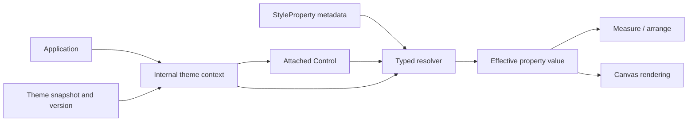

# Extensible Theming System Design

**Status:** Approved design

**Date:** 2026-07-12

## 1. Purpose

SharpVision shall provide application-wide themes composed of styles targeted at
control types. A style for `Control` supplies common values, a style for a
derived control overrides only the values it defines, and every remaining value
continues to resolve through the control's CLR inheritance chain.

The styling engine must not contain a catalog, switch, generated table, or
special case for the controls shipped by SharpVision. A third-party assembly
must be able to define a control, register its styleable properties, add a style
for that control to any theme, and receive the same inheritance, validation,
state resolution, invalidation, and serialization behavior as built-in controls.

This design replaces the current ancestor-control `Style` inheritance model.
Type-based theme inheritance and explicit per-instance overrides form one
deterministic cascade. There is no second visual-tree cascade competing with it.

## 2. Scope

This change includes:

- a public, typed style-property registration API;
- mutable control styles targeted at arbitrary `Control` subclasses;
- mutable themes keyed by control type;
- deterministic inheritance and visual-state overlays;
- local values and per-instance styles;
- application-wide theme ownership and runtime switching;
- base `Control` fill, border, and shadow behavior;
- class-specific defaults such as Button chrome;
- frozen `White` and `Dark` standard themes;
- a format-neutral metadata boundary for later JSON and YAML loaders;
- public third-party extension examples and tests;
- normative concept, control, runtime, testing, and showcase updates.

The first implementation does not include a JSON or YAML parser. It establishes
stable names, metadata, validation, and resolver boundaries so serializers can
be added without changing control or theme semantics.

## 3. Chosen architecture

SharpVision shall use typed style-property metadata and a type-keyed theme
registry. Mirrored classes such as `ButtonStyle` and `ListStyle` are rejected
because every third-party control hierarchy would need a parallel style-class
hierarchy. String/object dictionaries are rejected because they move type and
validation failures from compilation or mutation time into rendering.

The runtime ownership is:



Controls inherit an internal theme context when attached. They do not retain a
reference to `Application`, know about built-in themes, or query global static
state.

## 4. Style properties

### 4.1 Metadata

`StyleProperty<T>` is a public immutable metadata object. Registration records:

- the declaring control type;
- a stable, non-empty serialized property name;
- the value type `T`;
- the default value;
- the earliest affected phase: measure, arrange, or render;
- a validation delegate when the complete type domain is not valid; and
- optional format-neutral conversion metadata for future serializers.

Registration is generic over the declaring control type. It rejects a declaring
type that does not derive from `Control`, an empty name, and duplicate names on
the same declaring type. A failed registration changes no registry state.

Property identity at runtime is the metadata instance, not its string name.
Names are used for diagnostics and serialization only, so rendering never
performs string lookup.

### 4.2 Class defaults

A style property may define a class-default override for a derived control type.
The most-derived registered override wins. This permits `Control` to default to
no border or shadow while `Button` defaults to rounded border chrome and a
compact shadow.

Class-default overrides are registered during type initialization. They validate
the value before publication and reject duplicate metadata for the same property
and control type. A third-party control can register its own defaults without
SharpVision knowing that type exists.

Class defaults are not local values. A theme or per-instance style can override
them normally.

### 4.3 Control author API

`Control` exposes protected typed operations for reading, setting, and clearing
style-property values. A conventional CLR property remains the normal public
control API:

```csharp
public static StyleProperty<LabelPlacement> LabelPlacementProperty { get; } =
    StyleProperty<LabelPlacement>.Register<MyControl>(
        "label-placement",
        LabelPlacement.Left,
        Impact.Measure,
        ValidateLabelPlacement);

public LabelPlacement LabelPlacement
{
    get => GetValue(LabelPlacementProperty);
    set => SetValue(LabelPlacementProperty, value);
}
```

`Control.ClearValue(StyleProperty<T>)` is public so an application can remove a
local override and rejoin the theme cascade. Reading or clearing a property
whose declaring type is not assignable from the control's runtime type throws
before state changes.

A local setter validates first, records an explicit local value even when it is
equal to the current themed value, invalidates the metadata's affected phase,
and raises the CLR property notification. Recording equal local values matters
because the value must remain stable across later theme changes.

## 5. Control styles

`IControlStyle` is the non-generic public contract used by `Control.Style` and
theme storage. `ControlStyle<TControl>` implements that contract, targets one
specific control type, and provides typed `Set`, `Remove`, and `TryGet`
operations for normal and visual-state values. The distinct names preserve the
repository's one-type-per-file convention without generic-arity filename
collisions.

A style may set a property declared by its target type or any base control type.
For example, `ControlStyle<List>` may set `Control.PaddingProperty` and a
List-specific scrollbar property. It may not set a Button-specific property.
Target/property mismatches throw before the style changes.

Styles are mutable resources with atomic snapshot publication and a `Changed`
event carrying the target type and earliest invalidation impact. Rendering and
layout read immutable snapshots; mutation never exposes a half-written style.

Only render-impact properties may be defined for hovered, focused, checked,
pressed, or disabled states. Measure- and arrange-impact properties are normal
state values only. This prevents hover or focus from moving a control under the
pointer and creating a layout/state feedback loop.

`Control.Style` is a nullable per-instance style overlay. Its target must be
assignable from the control's runtime type. It applies only to that control and
does not flow to descendants.

An attached control subscribes only to its current per-instance style. Style
mutation invalidates the metadata's earliest affected phase on the owning
dispatcher. Replacement, detach, and disposal remove the previous subscription,
and reattachment subscribes exactly once.

## 6. Theme collection and inheritance

`Theme` owns at most one `IControlStyle` for each target control type. Public
generic operations add, replace, remove, and query styles without a built-in
control list. Theme mutation subscribes and unsubscribes style resources
atomically and raises one `Changed` event with the earliest affected phase.

Resolution first builds one merged styled value. It starts with the registered
property default and most-derived class-default metadata. For each visual state
independently, it overlays theme styles from `Control` through the exact runtime
control type, then overlays the control's per-instance `Style`. It resolves the
merged normal value and applies active state layers in this order:

1. hovered;
2. focused;
3. checked or selected;
4. pressed; and
5. disabled.

The final item has the highest conflict precedence. Properties absent from a
higher state remain supplied by lower states or the inheritance cascade. This
means a `Control` disabled-state value continues to apply to a disabled List
when the List style overrides only normal-state properties.

An explicit local value is applied after the complete styled value and therefore
wins over every theme, per-instance style, class default, and active visual
state. Clearing it exposes the currently resolved styled value immediately.

A theme caches the applicable base-to-derived style chain for each runtime
control type. Theme mutation publishes a new version and clears affected caches.
Per-frame rendering does not walk reflection metadata or allocate a merged
dictionary.

## 7. Theme mutation and freezing

Themes and styles may be assembled on any thread before use. Mutations publish
immutable snapshots under a short internal synchronization boundary, then raise
change notification outside that boundary. No user callback runs under a lock.

An active application may observe a theme change from another thread. The
application posts the resulting invalidation to its dispatcher; it never mutates
the control tree on the notifying thread.

`Theme.Freeze` atomically replaces every referenced style with a private frozen
snapshot, removes subscriptions to the mutable inputs, and freezes the theme
collection. Freezing one theme therefore does not freeze a style object that a
caller also uses elsewhere. Mutation of a frozen theme or its captured styles
throws `InvalidOperationException` before changing state. `Theme.Clone` returns
an unfrozen, independent copy suitable for customization.

The standard themes are frozen shared resources. This prevents one application
from changing another application's standard theme accidentally.

## 8. Application integration

`Application` accepts an optional theme during construction and exposes a
non-null `Theme` property. The default is `Themes.Dark`, matching SharpVision's
terminal-first presentation. Passing or assigning null throws
`ArgumentNullException`.

Changing `Application.Theme` is dispatcher-affine. The setter unsubscribes the
old theme, publishes the new theme through the internal context, subscribes the
new theme, and invalidates the complete attached control tree atomically.

Every theme replacement redraws every visible control. Because themes can change
margin, padding, border thickness, label placement, and other geometry,
replacement conservatively invalidates measure for the entire tree. A later
mutation of the active theme uses the precise impact carried by the change but
still invalidates every potentially matching control in the tree.

Controls attached after a theme switch receive the current context. Detached
controls resolve local values, per-instance styles, and class defaults without
an application theme. Disposal removes theme subscriptions before releasing the
tree.

After a theme-context change, each affected control raises one `PropertyChanged`
notification with an empty property name to signal that any effective
style-backed CLR property may have changed. Local property values do not receive
individual false change notifications.

## 9. Base Control chrome

The following common properties are registered by `Control` and therefore can be
used in a style for any control:

- `Margin` and `Padding`;
- `Foreground`, `Background`, and text `Attributes`;
- `FillMode`, selecting transparent preservation or opaque space fill;
- `BorderThickness` with independently enabled zero-or-one-cell edges;
- `BorderStyle` using the validated `Glyphs` value;
- `BorderColor` and border attributes;
- `HasShadow`, `ShadowMode`, and signed `ShadowOffset`;
- `ShadowGlyph`, shadow foreground/background, and shadow attributes.

The base class defaults to transparent fill, zero border thickness, and no
shadow. Border thickness participates in measure and arrange. The content box is
the arranged border box deflated first by active border edges and then by
padding. Deflation saturates at zero.

Shadow is visual overflow. It never contributes to desired size, arrangement,
pointer hit testing, or focus geometry. It is clipped by the owning ancestor and
frame according to the existing visual-overflow contract.

Rendering order for one control is:

1. shadow footprint behind the control body;
2. optional opaque body fill;
3. border edges and corners;
4. the control's own content; and
5. owned descendants within the content clip.

Tiny bounds draw only complete cells that exist. Partial borders never invent a
corner edge. Shadow and border drawing preserve the canvas's wide-grapheme
repair invariants.

`Border` and `Shadow` remain available as capacity-one decorators for explicit
composition. They and base `Control` chrome use the same internal renderer and
geometry helpers; Button, Window, and other controls do not retain private
copies of border or shadow rasterization.

`Button` overrides class defaults rather than assigning constructor-local
values. Its defaults are one-cell rounded border edges, one horizontal padding
cell on each side, and a `(1, 1)` composite shadow. Themes and local values may
replace or disable each default. Controls that do not override these metadata
values retain the borderless, shadowless base defaults.

## 10. Standard themes

`Themes.White` and `Themes.Dark` expose frozen `Theme` instances. Both use only
the portable 16-color indexed palette for their required base values. Terminal
capability degradation remains the terminal renderer's responsibility.

| Role                        | White      | Dark       |
| --------------------------- | ---------- | ---------- |
| Control foreground          | indexed 0  | indexed 15 |
| Control background          | indexed 15 | indexed 0  |
| Border                      | indexed 8  | indexed 8  |
| Hover foreground            | indexed 4  | indexed 14 |
| Focus                       | underline  | underline  |
| Checked/selected foreground | indexed 15 | indexed 15 |
| Checked/selected background | indexed 4  | indexed 4  |
| Disabled foreground         | indexed 8  | indexed 8  |
| Shadow foreground           | indexed 8  | indexed 8  |

The standard theme builder is ordinary consumer code over the public `Theme` and
`ControlStyle<TControl>` API. It may reference built-in controls because it
defines styles for them; the theme engine itself may not reference or enumerate
the built-in control set.

Every shipped control with control-specific visual properties registers those
properties through the same public mechanism. The standard themes may define
styles for Button, CheckBox, RadioButton, TextInput, List, ScrollBar, Menu,
MenuItem, Popup, Window, Table, ComboBox, and later controls without changing
the resolver.

A `ControlStyle<List>` in each standard theme intentionally overrides only its
List-specific selection and scrollbar appearance. Its foreground, background,
attributes, border, spacing, and shadow values continue to come from the
applicable base-control styles unless explicitly changed.

## 11. Third-party control contract

A third-party library needs only to:

1. derive a normal mutable control from `Control`, `Container`, or another
   extensible base;
2. register each styleable property with a stable name and validation;
3. implement conventional CLR property wrappers through the protected value
   operations;
4. read effective property values during layout or rendering; and
5. add `ControlStyle<ThirdPartyControl>` to any theme.

No registration call into `Application`, no SharpVision source generator, and no
change to a SharpVision-owned catalog is required. Tests must define a control
in the test assembly and prove base-style inheritance, custom-property
resolution, local override/clear behavior, theme switching, and rendering.

## 12. Serialization boundary

Each serializable control type has a stable external identifier supplied to a
serializer type resolver. Each style property has a stable name scoped to its
declaring control identifier. Visual-state names use the public `State` names.

A future format maps naturally to this shape:

```yaml
name: dark-custom
styles:
  sharpvision.control:
    normal:
      foreground: ansi.white
      background: ansi.black
      border-color: ansi.bright-black
  acme.status-panel:
    normal:
      label-placement: right
```

The serializer receives an extensible resolver that maps stable control
identifiers to CLR types and value converters. SharpVision supplies mappings for
its own controls. Third-party libraries or applications supply their own
mappings. Assembly-qualified CLR names are not persisted because assembly
versions and load contexts are not a stable file format.

Unknown control identifiers, property names, states, enum names, invalid colors,
and values rejected by property validation produce path-qualified load errors.
Loading is transactional: no live `Theme` is modified unless the entire document
validates.

JSON and YAML loaders must eventually produce the same in-memory `Theme`; no
format-specific behavior is allowed in control resolution.

## 13. Validation and error behavior

All public registration, mutation, assignment, and local-value APIs validate
every argument before observable state changes. In particular:

- null metadata, styles, themes, and delegates are rejected where required;
- unknown state bits and combined style-definition states are rejected;
- invalid enum values, colors, attributes, border edges, offsets, and glyphs
  retain their existing typed validation;
- border and shadow glyphs must be printable one-cell Runes;
- a style cannot contain a property outside its target control hierarchy;
- a per-instance style cannot target an unrelated control;
- frozen resources cannot be changed; and
- attached per-control mutation remains dispatcher-affine.

Change handlers are invoked only after a complete new snapshot commits. An
exception from one observer does not roll back a committed resource, and the
application routes dispatcher callback failures through its existing unhandled
exception policy.

## 14. Correctness evidence

Focused tests shall prove:

- property registration, validation, duplicate rejection, and class defaults;
- every precedence level and clearing an explicit local value;
- `Control -> intermediate base -> exact type` inheritance with sparse styles;
- deterministic combined-state precedence;
- rejection of geometry properties in non-normal states;
- style replacement, mutation, subscription cleanup, freezing, and cloning;
- one test-assembly control with a custom style property and custom style;
- detached, attached, reparented, theme-switched, and disposed controls;
- off-dispatcher theme assignment and posted cross-thread theme mutation;
- measure invalidation for spacing, border, and label-placement changes;
- render-only invalidation for colors and visual states;
- exact White and Dark semantic cells for representative controls;
- base border and shadow rendering, partial edges, signed offsets, tiny bounds,
  clipping, z-order, and wide-grapheme repair;
- Button's class defaults and theme overrides;
- switching themes during an in-flight render followed by the newest complete
  frame; and
- final terminal bytes through the application, dispatcher, layout, canvas,
  renderer, and transport path.

The showcase adds a live White/Dark switch and a page that displays inherited
base styling beside exact control overrides. The page includes a demonstration
control defined outside the built-in theme engine so extensibility is visible,
not merely asserted.

Before completion, the focused suites and the repository gates `make format`,
`make lint`, `make build`, and `make test` must pass with zero warnings and the
configured minimum test count.

## 15. Migration

The existing `SharpVision.Styling.Style`, `Appearance`, and ancestor lookup are
replaced by the typed property and control-style model. Existing normal and
visual-state colors migrate to common `Control` style properties. Direct control
properties migrate to local style-property values without changing their
conventional CLR surface.

Constructor assignments that currently establish visual defaults, including
Button padding and chrome, migrate to class-default metadata so a theme can
override them. Button and Window border/shadow code migrates to the shared base
chrome path. Existing `Border` and `Shadow` public behavior remains available
through the shared implementation.

Documentation shall give type inheritance one normative home in
`docs/concepts/styling.md`; control documents link to that section and specify
only their own properties and class defaults.

## 16. Non-goals

This system does not introduce virtual trees, function controls, reconciliation,
selectors, CSS specificity, arbitrary descendant selectors, runtime reflection
over control members, or behavior changes driven by visual appearance. A
disabled-looking style does not disable input. Themes describe typed
presentation values; controls retain ownership of state and behavior.
