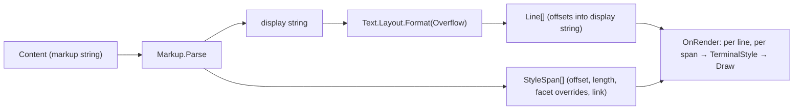

# Unified Text with inline markup — design

**Date:** 2026-07-15
**Status:** Approved (brainstorming); two defaults noted below are vetoable at
plan review.

## Problem

The library ships two overlapping display controls:

- `Text` — a plain UTF-16 string with `Wrapping`, `Trimming`, `TextAlignment`,
  and `AmbiguousWidth`, laid out through `SharpVision.Text.Layout.Format`.
- `RichText` — a mutable `Inlines` collection of `Run` / `Hyperlink` /
  `LineBreak` objects, each carrying `Foreground` / `Background` / `Attributes`
  / `Underline` / `UnderlineColor`, reusing the same layout engine for word
  wrap and rendering each inline by source offset.

Two controls, two mental models, and a verbose object model (`new Run("x") {
Attributes = ... }`) for what is usually a short styled string. Callers who want
"a red bold word inside a sentence" must assemble a collection.

## Goal

Collapse both controls into a single `Text` whose `Content` string is **inline
markup**. Delete the object model (`Inline`, `Inlines`, `Run`, `LineBreak`, the
`Hyperlink` inline). Expose overflow as one discoverable enum. Preserve the
existing grapheme-safe layout engine, cell fidelity, alignment, ambiguous-width
policy, and OSC 8 hyperlink metadata.

## Decisions (from brainstorming)

1. **One control; content is always markup.** A literal `<` is escaped. No
   second "plain" property and no mode flag.
2. **Grammar shape:** HTML-style named tags with an optional `=value`
   (`<red>`, `<b>`, `<fg=#ff8800>`, `<link=…>`). One tag = one style facet.
3. **Lenient and overlapping; never throws.** `</name>` closes the nearest
   still-open `<name>`, so overlapping ranges (`<u><b>x</u></b>`) work as
   written; unknown/malformed tags and stray closes degrade to literal text;
   unclosed tags auto-close at end of content.
4. **Overflow is one enum**, replacing `Wrapping` × `Trimming`.
5. **Hard delete** the old model and enums; migrate all call sites and docs in
   the same change.

## Public API

```csharp
namespace SharpVision.Controls;

public sealed class Text : Control
{
    public Text();
    public Text(string content);              // content is markup

    public string    Content        { get; set; }  // markup; setter never throws on bad markup
    public Overflow  Overflow       { get; set; }  // replaces Wrapping + Trimming
    public Alignment TextAlignment  { get; set; }
    public Ambiguous AmbiguousWidth { get; set; }
    public ReadOnlyMemory<Line> Lines { get; }      // committed line metrics (unchanged shape)

    public static string Escape(string value);      // backslash-escapes markup metacharacters
}
```

```csharp
namespace SharpVision.Text;

public enum Overflow
{
    Wrap,          // word wrap onto multiple lines (default)
    WrapAnywhere,  // break between graphemes, mid-word allowed
    Clip,          // single line, cut at the last fitting grapheme
    Ellipsis,      // single line, trailing … (word-aware, grapheme fallback)
    Visible,       // single line, report full width, let a scroll container clip
}
```

- **Default `Overflow.Wrap`.** This changes today's plain-`Text` default (which
  does not wrap) but matches `RichText`'s current default and is the safest
  behavior for arbitrary content inside a bounded box. *Vetoable:* default to
  `Visible` if we want to preserve today's label behavior.
- **Deleted types:** `RichText`, `Inline`, `Inlines`, `Run`, `LineBreak`, the
  `Hyperlink` inline, and the `Wrapping` / `Trimming` enums.
- `SharpVision.Text.Layout.Format` is refactored to accept `Overflow` in place
  of the `(Wrapping, Trimming)` pair.

## Markup grammar

Metacharacters are `<`, `>`, and `\`. A tag is `<name>`, `<name=value>`, or a
close `</name>` / generic `</>`. Names and named values are case-insensitive.

### Tags

| Facet | Tags |
| --- | --- |
| Attributes (bare) | `b`/`bold`, `d`/`dim`, `i`/`italic`, `u`/`underline`, `s`/`strike`, `reverse`, `blink`, `rapidblink`, `hidden`/`conceal`, `overline` |
| Foreground | bare color/role name (`<red>`, `<brightblue>`, `<accent>`, `<error>`) or `<fg=value>` |
| Background | `<bg=value>` |
| Underline color | `<uc=value>` |
| Underline shape | `<u=straight\|double\|curly\|dotted\|dashed>` |
| Hyperlink | `<link=target>text</link>` → OSC 8 metadata; never auto-opens |
| Line break | literal `\n` / `\r\n` in the string, or the void tag `<br>` |

- One tag carries at most one value, so the parser is `name` + optional single
  `value`; combine facets by stacking tags. `<u>` (bare) is the straight-line
  attribute; `<u=curly>` selects a typed shape.
- **Close semantics:** `</name>` closes the nearest still-open tag of that
  name; `</>` closes the most-recently-opened tag. Overlap is allowed and
  meaningful because facets are independent.

### Value forms (colors)

- Named ANSI: `black … white`, `brightblack … brightwhite` → palette indices
  0–15.
- Theme role: `foreground`, `background`, `surface`, `border`, `accent`,
  `muted`, `selectionbackground`, `selectionforeground`, `error`, `warning`,
  `success`, `info` → `Color.Role(...)` (resolved late by the active theme).
- Palette index: `0`–`255` → `Color.Indexed`.
- Hex: `#f80` or `#ff8800` → `Color.Rgb`.

### Escaping

- Literal `<` → `\<`; literal `\` → `\\`. `>` is literal outside a tag.
- `Text.Escape(value)` backslash-escapes `<` and `\` so dynamic or
  user-supplied strings interpolate safely.

### Lenient recovery (never throws)

- `<` always begins a tag (per decision 1). If the run to the next unescaped `>`
  is not a known, well-formed tag — unknown name, missing `>`, bad value — the
  raw characters are emitted as **literal text**, so no content is silently
  lost.
- Stray `</name>` with no matching open tag is ignored.
- Tags still open at end of content auto-close there.

### `<br>` convenience

Included as documented sugar for a hard line break, equivalent to a literal
newline. *Vetoable:* drop it and rely on newlines only if we prefer a smaller
tag surface.

## Internal architecture



- **Parser** (`SharpVision.Text.Markup`, a static class) walks the markup once,
  maintaining a stack of open facet tags. It emits a **display string** (the
  visible text with tags removed and escapes resolved) plus a sequence of
  **non-overlapping** `StyleSpan`s covering the display string, each a fully
  resolved delta over the inherited style (nullable `Foreground` / `Background`
  / `UnderlineColor`, `Attributes`, `Underline`, and an optional link target).
  Overlapping tags flatten into adjacent spans at every facet boundary.
- **`StyleSpan`** is a `readonly struct` in its own file (`Offset`, `Length`,
  and the resolved facet fields).
- **Layout** reuses `Text.Layout.Format` over the display string. Because spans
  index into that single string, word wrap crosses style boundaries for free —
  the mechanism `RichText` already relies on.
- **Render** mirrors `RichText`'s offset-based path: for each `Line`, walk
  graphemes, find the covering `StyleSpan` by source offset, overlay its facets
  on `ResolvedStyle` (reusing `Decoration.Resolve`), and draw runs with the
  correct `BackgroundMode`.
- **Caching** keeps `Text`'s current invalidation model: re-parse only when
  `Content` changes; re-layout on width/overflow/ambiguous change; re-align on
  alignment change.

## Migration

- Rewrite `RichTextPane`, `TablePane`, and `Doc.cs` to build markup strings.
- Merge `docs/controls/display/rich-text.md` into
  `docs/controls/display/text.md`; update the `Text` contract, the coverage
  matrix, and any inline links.
- Remove the deleted types' tests; fold still-relevant assertions into the new
  `Text` tests.

## Testing

- **Parser** (unit + randomized/property, per AGENTS parser guidance): every tag
  and value form; fg via bare name and `<fg=>`; `<bg=>`, `<uc=>`, underline
  shapes; links; overlap; `</>` generic close; auto-close at end; unknown /
  malformed → literal; escaping `\<` and `\\`; `Text.Escape` round-trips.
- **Overflow:** all five modes, mapping to layout, exact cells, resize reflow,
  `Visible` reports full width.
- **Render:** styled runs across word wrap, combining marks, variation
  selectors, ZWJ and wide clusters never split, alignment, OSC 8 metadata on
  cells, exact emitted bytes across frames.
- **Showcase:** the merged `Text` page plus a representative screen test.

## Non-goals

- No Markdown/CommonMark compatibility — this is a small inline markup, not a
  document language.
- No marquee/scroll or alternate-text overflow (considered and rejected under
  "swap").
- No programmatic object model; markup strings plus `Text.Escape` are the only
  authoring surface.
