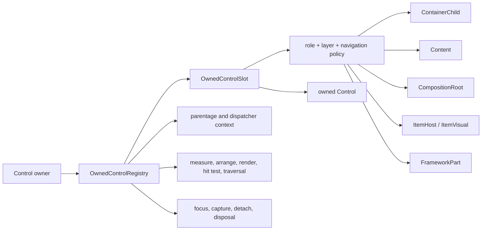
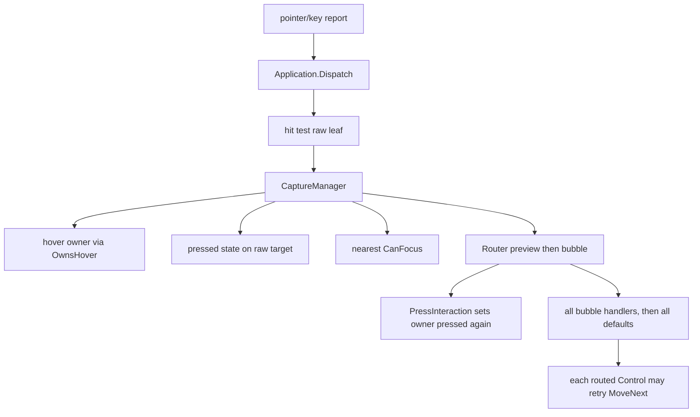
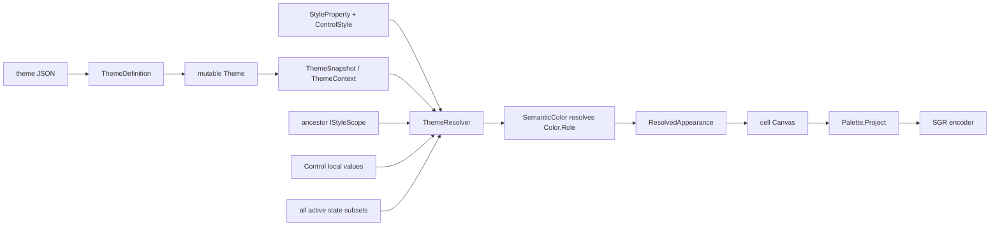
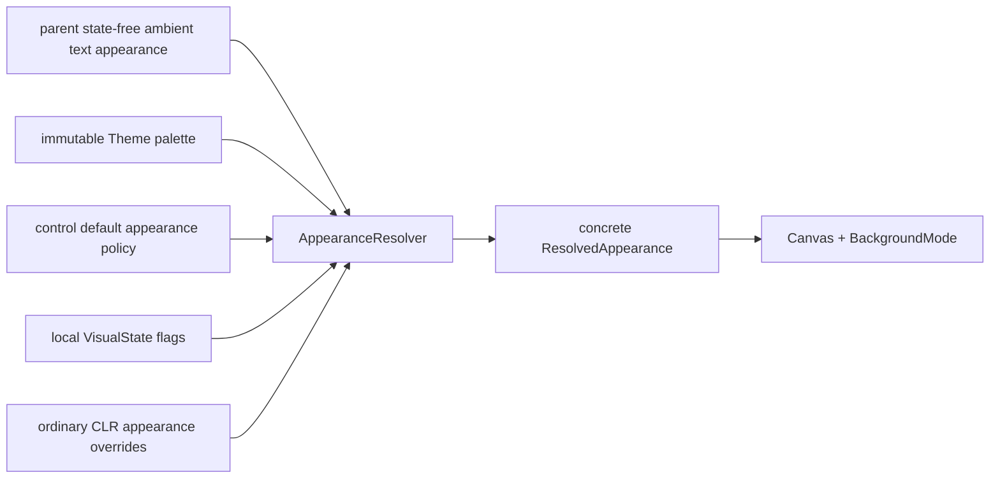

# Control Architecture Streamlining Design

## Executive decision

SharpVision should keep its retained mutable control tree, dispatcher affinity,
central owned-control registry, and distinct authoring roles. Those are the
right foundations for a terminal UI library.

The surrounding state and appearance architecture should be replaced rather than
patched:

- one manager owns keyboard focus;
- one manager owns physical pointer presence and capture;
- a control behavior owns semantic pressed/current/selected state;
- Tab traverses widgets hierarchically while arrows navigate inside a widget;
- visual states are local, render-only facts rather than recursively inherited
  style selectors;
- ordinary CLR properties replace the generic dependency-property and style
  cascade;
- an immutable semantic palette replaces type-indexed mutable theme styles;
- terminal colors remain concrete and encodable, while UI theme colors are a
  separate type;
- intrinsic border, fill, and shadow rendering becomes non-skippable.

This is a controlled breaking convergence, not a compatibility-preserving bug
fix. It deliberately removes public mechanisms whose flexibility is currently
larger than their demonstrated value. The result is closer to Delphi VCL and
WinForms where that helps authoring, without importing native-window handles,
message plumbing, or platform-specific control hierarchies.

## Scope and assumptions

This design covers:

- the `Control` inheritance and composition model;
- owned private parts and semantic item hosts;
- focus, pointer-over, capture, press, selection, current-item, Tab, and arrow
  navigation;
- visual-state assembly and invalidation;
- theme, appearance, color, transparency, border, fill, and shadow semantics;
- the control-specific policies needed by lists, menus, radio groups, tabs,
  navigation views, combo boxes, popups, and windows;
- migration, compatibility, documentation, showcase, and verification work.

It preserves the project requirements that controls are traditional mutable
objects, all mutation is dispatcher-affine, controls draw semantic cells rather
than escape sequences, ownership is exclusive, and docs/tests/showcase output
are part of the behavior contract.

The design assumes the library can take a deliberate public API break. A
compatibility package or long obsolete period would preserve the architecture
being removed and is therefore outside this convergence.

## Evidence reviewed

The audit followed the current source, normative docs, nearest tests, recent
style/state repair commits, and the dirty worktree without modifying it. The
three concurrent local changes in `Expander.cs`, `ExpanderPane.cs`, and
`MenuItem.cs` remain user-owned and must be reconciled before their migration
tasks begin.

The useful framework lessons come from primary documentation:

- VCL separates lightweight controls from focusable windowed controls, makes
  focus eligibility queryable, and defines tab position among siblings through
  [`TControl`](https://docwiki.embarcadero.com/Libraries/Athens/en/Vcl.Controls.TControl),
  [`TGraphicControl`](https://docwiki.embarcadero.com/Libraries/Athens/en/Vcl.Controls.TGraphicControl),
  [`TWinControl`](https://docwiki.embarcadero.com/Libraries/Athens/en/Vcl.Controls.TWinControl),
  [`CanFocus`](https://docwiki.embarcadero.com/Libraries/Athens/en/Vcl.Controls.TWinControl.CanFocus),
  [`TabOrder`](https://docwiki.embarcadero.com/Libraries/Sydney/en/Vcl.Controls.TWinControl.TabOrder),
  and
  [`TabStop`](https://docwiki.embarcadero.com/Libraries/Athens/en/Vcl.Controls.TWinControl.TabStop).
- VCL uses ambient-style opt-in such as
  [`ParentColor`](https://docwiki.embarcadero.com/Libraries/Sydney/en/Vcl.Controls.TControl.ParentColor)
  rather than a descendant selector cascade.
- WinForms distinguishes custom drawn controls from composite `UserControl`
  authoring, exposes ambient properties on `Control`, treats dialog keys before
  ordinary key input, and reports pointer-capture loss. See
  [`Control`](https://learn.microsoft.com/en-us/dotnet/api/system.windows.forms.control?view=windowsdesktop-10.0),
  [custom controls](https://learn.microsoft.com/en-us/dotnet/desktop/winforms/controls-design/custom-controls-overview),
  [`UserControl`](https://learn.microsoft.com/en-us/dotnet/desktop/winforms/controls-design/usercontrol-overview),
  [keyboard preprocessing](https://learn.microsoft.com/en-us/dotnet/desktop/winforms/input-keyboard/overview),
  and
  [`MouseCaptureChanged`](https://learn.microsoft.com/en-us/dotnet/api/system.windows.forms.control.mousecapturechanged?view=windowsdesktop-10.0).

The transferable ideas are retained objects, explicit properties/events,
parent-local tab order, focus-within, ambient text appearance, and a clear
custom-versus-composite distinction. The native handle split is not
transferable: every SharpVision control is already a virtual cell control.

## Current mental map

### Inheritance roles

```text
Control
├── Container                         public multi-child panel
│   ├── Canvas
│   ├── Dock
│   ├── Grid
│   ├── Overlay
│   ├── Stack
│   └── TablePresenter                internal realization panel
├── ContentControl                    caller-replaceable single content
│   ├── Expander
│   ├── GroupBox
│   ├── Popup
│   ├── Prism
│   ├── TabItem
│   ├── Window
│   └── Pressable                     activating single-content face
│       ├── Button
│       ├── CheckBox
│       ├── MenuItem
│       ├── NavigationViewItem
│       ├── RadioButton
│       └── ListItem                  internal realization
├── CompositeControl                  constructor-owned private root
│   ├── NavigationView
│   └── Screen
├── ItemsControl                      semantic collection + private host
│   ├── List
│   ├── Menu
│   ├── TabControl
│   └── Table
└── Direct controls
    ├── ComboBox, TextInput, ScrollBar
    ├── Text, FigletText, ProgressBar, Separator
    └── MenuSeparator, NavigationViewGroup, NavigationViewSeparator
```

The parallel authoring roles are intentional. `ItemsControl` must not derive
from `CompositeControl`: doing so would expose two competing initialization
contracts and let item-control authors create invalid permanent roots. Shared
implementation belongs in an internal helper, not public inheritance.

### Composition and ownership



This registry is worth preserving. It models public children, replaceable
content, permanent composition roots, realized item visuals, popups, and
generated scrollbars without pretending that every owner is a panel.

Its metadata is currently only half alive. `OwnedControlRole` is recorded but
does not consistently drive navigation, state boundaries, or framework-part
exposure; `ItemVisual` is effectively unused; string part keys mostly enforce
uniqueness. The target makes role metadata behavioral. Metadata that remains
ceremonial after migration should be deleted.

### Current interaction authority



The defects follow directly from this map:

- a Text child and its Button can both become pressed;
- hover, focus, capture, route target, and semantic owner can be different
  controls without one transaction describing why;
- the first Tab is dropped when no control is focused;
- a cancelled Tab traversal can be retried by every ancestor;
- an ancestor List or NavigationView can consume arrows before a nested
  TextInput receives its default behavior;
- replacing capture does not reliably notify the former owner;
- pointer-over is not recomputed after geometry or hit-test availability
  changes.

### Current appearance pipeline



The pipeline conflates six distinct concerns: terminal encodings, semantic theme
tokens, transparent composition, control defaults, local overrides, and
visual-state behavior. It also carries mutable style data through repeated
snapshots and caches even though curated theme files currently vary the palette
rather than the type-style recipe.

## Findings that require architectural change

### 1. Focus capability and focus eligibility are the same property

`Control.CanFocus` is mutable configuration today. Effective eligibility also
depends on attachment, disposal, visibility, enabled state, and ownership. A
consumer cannot ask the natural question “can it focus now?” and cannot invoke
the protected focus request from ordinary application code.

The target separates mutable `Focusable` from read-only effective `CanFocus`,
adds `Focus()`, and distinguishes direct focus from `ContainsFocus`.

### 2. Tab order is globally flattened

`FocusManager` recursively collects descendants and globally sorts by
`(TabIndex, tree order)`. A grandchild therefore competes with its parent’s
siblings. `Cycle` and `Contained` select the same scope and both wrap. Private
container scrollbars are deliberately registered as navigation participants, so
a widget silently acquires new Tab stops when its viewport overflows.

The target uses parent-local hierarchical order. Tab crosses widget boundaries;
arrows change a widget’s current item. Generated framework parts never join
public sequential navigation.

### 3. The router has the wrong default-action boundary

Every bubble handler runs before any control default. That lets composite
ancestors steal navigation keys from an editor nested inside them. Global Tab
fallback lives on every route member, so one physical key can attempt multiple
focus moves.

The target pairs each node’s bubble handlers with that node’s default behavior,
then runs application commands such as Tab exactly once.

### 4. Pointer presence, capture, and press are competing concepts

Physical hit ancestry should determine pointer-over. Capture should determine
delivery. A semantic press behavior should determine pressed/armed state. The
current `OwnsPointerState` opt-in and raw-target press mutation mix all three.

The target removes hover ownership, exposes physical `IsPointerOver`, and lets
`PressBehavior` alone own semantic `IsPressed`.

### 5. Selection is recursively copied through implementation structure

`SetSelectedState` visits every owned descendant, regardless of whether the edge
represents the selected face, a popup, a composition root, or framework chrome.
Popup then suppresses its entire visual state to avoid inherited menu selection.
CheckBox and RadioButton separately write resolved foreground into caller-owned
content to simulate appearance inheritance.

The target keeps selected/current/checked state on the semantic control or its
explicit item face only. Ambient text appearance flows through the render
context; behavior state never propagates recursively.

### 6. A visual state can change layout

State-keyed style values can carry Measure or Arrange impact. Hover or focus can
therefore move its own hit target, force another hover calculation, and
oscillate. `Control` must scan theme and scope aggregate impacts whenever state
changes. Layout-bearing properties are a tiny minority of the current style
registry and do not need this power.

The target makes state changes render-only. Margin, padding, border thickness,
scrollbar chrome, and every other geometry/configuration setting become ordinary
properties with explicit invalidation.

### 7. State-combination resolution has no total order

The resolver enumerates every subset of active flags. It compares subset size
and only the highest-ranked flag, making distinct combinations such as
`PointerOver | Pressed` and `Focused | Pressed` equal. A derived type layer can
also override a base Disabled value merely because it is applied later.

The target has named single-state overlays in one fixed order. It does not
accept arbitrary combination keys. Exceptional combinations belong to the
control behavior that understands them.

### 8. `Color.Transparent` crosses a boundary it cannot represent

Transparency is a paint operation, not a terminal color. Today
`Color.Transparent` can enter `CellStyle`. Projection maps it to indexed black
at Basic16/Indexed256, default at monochrome, and an SGR reset at true color.
Those outputs are observably different, and none means “preserve the destination
cell.” True transparent composition already exists correctly as
`BackgroundMode.Transparent` on the canvas.

The target terminal `Color` can represent only Default, Indexed, and RGB. Theme
roles move to a UI `ThemeColor`. No transparent or unresolved value can
construct a terminal `CellStyle`.

### 9. Background has three overlapping controls

A nullable Background, `FillMode`, and `Color.Transparent` all try to decide
whether to paint. The standard base theme supplies Background for every Control,
so controls using `HasOpaqueFill` become opaque even though the declared fill
default is transparent. Text, TextInput, Popup, and shared chrome then apply
different local rules.

The target has one rule: a null background paints nothing; `Color.Default`
paints the terminal default; a concrete or role-backed background paints that
color. `FillMode` is removed. Surface controls receive explicit background
defaults; base Control does not.

### 10. Intrinsic chrome is opt-in despite being a base contract

Every Control exposes border and shadow properties, but any `OnRender` override
can omit `RenderChrome`. Some controls reserve border geometry without drawing
it. Public base behavior must not depend on derived authors remembering an
undocumented call.

The target render template owns shadow, body fill, border, content, and children
in a fixed pipeline. A specialized control can override a dedicated chrome seam
but cannot accidentally skip the inherited contract.

### 11. Several inheritance choices expose false capability

- `NavigationViewGroup` manually rebuilds the ItemsControl private-host pattern.
- `NavigationViewItem : Pressable` exposes caller `Content` but does not use it.
- `Expander` duplicates press interaction because its header is the activation
  face while inherited Content is the collapsible body.
- `TabControl` mutates page visibility during measure and arrange.
- Table realization performs sequential visible mutations rather than one
  ownership transaction.

The target keeps the broad role hierarchy but corrects these local mismatches.

### 12. `Control` has become an implementation continent

`Control.cs` is over two thousand lines, with additional style/theme partials;
`Container.cs` also mixes panel ownership and scroll behavior. The public type
can remain one type while responsibilities move into internal collaborators.
Lifecycle and ownership transactions must stay coherent; splitting files only
for appearance is not the objective.

## Options considered

### Option A: stabilize the current engine

This would retain `StyleProperty<T>`, type styles, scope cascading, combination
selectors, mutable Theme, and recursive state propagation while fixing null
storage, comparator order, Popup boundaries, capture notification, and private
tab stops.

It has the lowest immediate migration cost. It also preserves the exact set of
interacting abstractions that produced the defects. It is suitable only for an
emergency patch and is rejected as the long-term architecture.

### Option B: retained controls plus palette-owned appearance

This keeps the strong ownership and control roles, introduces one authority for
each interaction concern, uses hierarchical navigation, moves configuration to
ordinary properties, and makes Theme an immutable palette. Built-in controls own
small deterministic state-to-appearance policies. Third-party controls use the
same palette and protected appearance/render seams without registering a mini
dependency-property system.

This is the recommended architecture. It removes more code than it adds, maps to
the actual curated theme format, and makes common custom-control work legible
from the class itself.

### Option C: pluggable renderer/style services

This would add an `IControlRenderer<TControl>` registry like VCL style services
and move all control drawing into replaceable renderer objects. It supports
complete skin replacement but adds registry lifetime, generic lookup, renderer
state, versioning, and third-party composition rules.

There is no demonstrated requirement for wholesale renderer replacement. This
option should be reconsidered only when palette customization and protected
render seams prove insufficient.

### Option D: copy the VCL/WinForms hierarchy

Splitting controls by native handle, recreating message preprocessing classes,
or adding a terminal analogue of every container type would import solutions to
operating-system constraints SharpVision does not have. It is rejected.

## Target architecture

### Stable authoring roles

Keep these public bases:

| Role               | Contract                                                       |
| ------------------ | -------------------------------------------------------------- |
| `Control`          | One retained visual/input/lifecycle node; no public children.  |
| `Container`        | Public ordered `Children`; a genuine layout panel only.        |
| `ContentControl`   | One caller-replaceable semantic `Content`.                     |
| `Pressable`        | A ContentControl whose whole face is one activation target.    |
| `CompositeControl` | One permanent constructor-owned private root.                  |
| `ItemsControl`     | A typed semantic collection realized through one private host. |

`ItemsControl` and `CompositeControl` remain siblings. An internal
permanent-root helper may remove duplicated pass-through code without changing
their public contracts.

The base defaults become conservative:

- `Focusable = false`;
- configured `TabStop = false` and effective read-only `IsTabStop = false`;
- `IsHitTestVisible` remains explicit per control role;
- interactive public controls opt into focus and tab behavior;
- framework parts default to no focus, no tab stop, and no public navigation
  participation.

### Behavioral ownership metadata

Each owned slot must declare policies used by the registry rather than merely
labels:

```text
Role                  semantic ownership meaning
Layer                 normal or popup render/hit-test layer
ParticipatesInLayout  parent layout pass includes the child
ParticipatesInHitTest physical pointer can reach the child
ParticipatesInTab     child contributes to hierarchical traversal
StateBoundary         no behavior-state propagation by default
AppearanceBoundary    child begins a new ambient-appearance context
FocusScopeBoundary    child begins a focus restoration/traversal scope
PartKey               typed identity for a framework part when identity matters
```

Behavior state does not propagate automatically over any role. An item owner
sets current/selected state on the realized item root explicitly. Ambient text
appearance follows ordinary parentage until an explicit AppearanceBoundary.
Render promotion (`Layer`) is independent from appearance and focus boundaries.
Screen and Window roots, plus every Popup node regardless of which ordinary
ownership slot holds it, declare their boundary policies during construction;
the resolver and focus manager read metadata rather than checking runtime type.

### Interaction target transaction

Introduce an internal immutable resolution result:

```text
PhysicalLeaf       exact hit-tested control and coordinates
PhysicalPath       leaf-to-root ancestry for pointer-over diffing
DeliveryTarget     captured control, otherwise PhysicalLeaf
FocusTarget        nearest effectively focusable semantic owner
CaptureOwner       current capture holder
```

The pointer manager commits physical state and delivery; it does not set
semantic press state or preselect an activation owner. Routed/default handling
reaches a `PressBehavior` already bound to its semantic owner; that behavior
alone owns arming, capture, pressed state, and one activation on eligible
release.

### Public focus and pointer surface

```csharp
public bool Focusable { get; set; }
public bool CanFocus { get; }
public bool Focus();
public bool TabStop { get; set; }
public bool IsTabStop { get; }

public bool IsFocused { get; }
public bool ContainsFocus { get; }

public bool IsPointerOver { get; }
public bool IsPointerDirectlyOver { get; }
public bool IsPressed { get; }
public bool HasPointerCapture { get; }
```

Remove `OwnsPointerState`/`OwnsHover`. Rename `IsHovered` to `IsPointerOver`.
Rename routed terminal `Events.Focus` and `FocusEventArgs` to
`Events.TerminalFocusChanged` and `TerminalFocusEventArgs` so they cannot be
confused with keyboard focus on a control.

Add `GotFocus`, `LostFocus`, `FocusEntered`, `FocusLeft`, `PointerEntered`,
`PointerExited`, and `LostPointerCapture`. Event arguments carry a small reason
enum only when the reason changes correct behavior or diagnostics:

- focus: Programmatic, Keyboard, Pointer, Restore, Unavailable;
- capture loss: Explicit, Transferred, Unavailable, TerminalFocusLost.

These control lifecycle events are direct, not routed. `LostFocus` and
`GotFocus` target only the old and new direct focus owners. `FocusLeft` is sent
to controls whose `ContainsFocus` changed to false, deepest old node to the
lowest-common-ancestor boundary; `FocusEntered` is sent shallow-to-deep on the
new branch; `PointerExited` and `PointerEntered` use the same branch directions.
`LostPointerCapture` targets only the former capture owner.

Focus and pointer-path state is committed before its notifications. Capture
transfer is deliberately two-phase: validate the candidate, clear the former
owner and its `HasPointerCapture`, notify that owner with Transferred while no
new owner is observable, revalidate, then commit the candidate. A callback
exception does not strand the transaction: the candidate still commits if it
remains eligible, internal cleanup finishes, and the first exception is
re-thrown. Capture requests made from the callback queue FIFO until transfer
completes.

Other focus or pointer requests made reentrantly from callbacks likewise queue
FIFO and are revalidated after the current transaction. Callback exceptions
never roll back committed state; internal cleanup and transaction release run in
`finally`, the first exception propagates, and queued work resumes on the next
dispatcher turn. Pointer enter/exit callbacks that mutate geometry queue one
coalesced re-hit rather than nesting a pointer transaction.

### Deterministic input ordering

Key input uses this order:

1. choose `Focus.Focused ?? Root` as target;
2. preview root to target;
3. at each node target to root, run that node’s bubble handlers and then that
   node’s default behavior;
4. stop ordinary ancestor processing when handled;
5. return either Complete or ContinueWithApplicationCommand;
6. run a requested application command exactly once.

Tab is consumed after one traversal attempt even when a cancellable focus event
vetoes movement. It is never retried at ancestors.

A widget default may handle its local Tab side effect and still request the one
application traversal. Menu and ComboBox snapshot the nearest stable traversal
owner outside the transient subtree plus forward/reverse direction before they
close or commit. They then return ContinueWithApplicationCommand(TabNext or
TabPrevious). Application performs traversal from that validated anchor after
cleanup; if the anchor became unavailable it repairs from the nearest live
ancestor. Shift+Tab uses the same path in reverse. Cancellation consumes the key
and does not reopen the widget.

Focus changes are transactions:

1. validate the candidate and raise cancellable Changing;
2. revalidate after callbacks;
3. compute old/new ancestry and their lowest common ancestor;
4. commit manager focus, direct `IsFocused`, `ContainsFocus`, and active-child
   restoration state atomically;
5. invalidate changed visuals once;
6. raise old direct LostFocus, old-branch FocusLeft deepest-to-shallow,
   new-branch FocusEntered shallow-to-deep, new direct GotFocus, then manager
   Changed.

Forced cleanup after hide, disable, detach, or disposal is not cancellable and
cannot strand focus. Terminal focus loss is different: it preserves logical
keyboard focus and `ContainsFocus`, suspends keyboard delivery/cursor exposure,
and releases pointer capture/pressed state. Terminal focus regain resumes the
same still-eligible logical focus without control focus events; ordinary repair
runs first if that control became unavailable while suspended.

Pointer changes are transactions:

1. record the physical pointer snapshot;
2. hit test and diff old/new physical ancestry;
3. commit pointer-over flags and exit/enter notifications;
4. select captured delivery or the physical leaf;
5. request primary-click focus for the nearest effective focus target;
6. route the pointer event;
7. let semantic behaviors change pressed/current/selected state.

After committed layout, resize, visibility, or hit-test changes, re-hit the
stored pointer position before the next rendered frame.

### Press behavior

Rename and simplify `PressInteraction` to `PressBehavior`. It directly owns one
Control rather than receiving a bundle of delegates. It:

- accepts only the control’s documented primary activation input;
- captures on eligible pointer press;
- sets `IsPressed` while armed and physically inside its activation bounds;
- disarms on exit and rearms on re-entry while captured;
- activates once on eligible inside release;
- clears on capture transfer, explicit release, disable, hide, detach, disposal,
  and terminal focus loss;
- applies the same semantic transition for keyboard activation.

It supports a protected/internal activation-bounds callback so a composite face
such as Expander’s header can reuse the behavior without pretending its body
Content is the activating face.

### Hierarchical Tab navigation

Replace the current modes with:

| Mode       | Meaning                                                                                                                       |
| ---------- | ----------------------------------------------------------------------------------------------------------------------------- |
| `Continue` | Contribute eligible self, then descendants forward; descendants, then self in reverse; leave the subtree at either boundary.  |
| `Once`     | Contribute exactly one active descendant, otherwise eligible self, otherwise the first/last eligible descendant by direction. |
| `Cycle`    | Use Continue order inside the scope, trap at both boundaries, and wrap to the opposite directional endpoint.                  |
| `None`     | Exclude descendants; eligible self still contributes. Excluding the complete node uses slot navigation metadata.              |

Remove `Contained`. During a short source migration it may be an obsolete alias
for `Cycle`, but it must not survive the convergence as a second name for the
same contract.

Traversal is recursive and parent-local:

1. sort each owner’s direct navigation participants by
   `(TabIndex, insertion order)`;
2. evaluate each child according to its navigation mode;
3. keep a descendant’s TabIndex local to its siblings;
4. remember one active descendant per `Once`/`Cycle` scope;
5. repair active descendants deterministically after hide, disable, removal,
   reparent, or disposal.

On forward entry, Once/Cycle chooses the remembered eligible descendant, then
eligible self, then first eligible descendant. Reverse entry uses remembered,
self, then last descendant. A focusable owner and focusable child are distinct
entries only in Continue/Cycle order; Once contributes one of them. An empty
scope contributes nothing. Cycle wraps only after focus is already inside it;
external entry still honors direction.

`TabStop` is caller configuration; `IsTabStop` is the read-only effective
sequential-entry result used by FocusManager. For ordinary controls it combines
TabStop, CanFocus, and ownership-slot navigation participation. For RadioButton
it additionally requires selection by the group coordinator. Changing TabStop
notifies the coordinator before publishing effective changes. A radio group has
exactly one effective entry among eligible members configured with
`TabStop = true`—checked member first, otherwise first in stable tree order—and
zero when no member opts in.

### Widget navigation policies

| Widget         | Mode / external Tab contract                                                                              | Internal navigation contract                                                                                                                     |
| -------------- | --------------------------------------------------------------------------------------------------------- | ------------------------------------------------------------------------------------------------------------------------------------------------ |
| List           | None; List is one Tab stop, while realized rows and generated bars are not.                               | Focus remains on List. `CurrentIndex` is distinct from selection. Up/Down/Home/End/Page move current without wrapping and skip unavailable rows. |
| Menu           | None; each open Menu level owns focus, while item faces are current rather than Tab stops. Tab dismisses. | Arrows wrap within the level, skip separators/unavailable items, and enter/leave submenus by documented direction.                               |
| Radio group    | Not a control scope; its coordinator makes exactly one eligible member a Tab stop.                        | Arrows focus and check the next/previous eligible member with wrapping.                                                                          |
| TabControl     | Continue; the header owner is one Tab stop and selected-page descendants follow hierarchically.           | Left/Right change tabs only while the header owner itself has focus; wrap and skip unavailable tabs.                                             |
| NavigationView | None; NavigationView is one Tab stop, item faces and generated bars are not.                              | Focus remains on NavigationView. Up/Down move current without wrapping, skip unavailable entries, and scroll current into view.                  |
| ComboBox       | None; ComboBox remains the only Tab stop while closed or open.                                            | Popup internals never enter global traversal. Arrows move current, Enter commits, Escape restores, and Tab commits/closes/continues.             |
| ScrollBar      | None; standalone ScrollBar may be one Tab stop; generated bars are excluded through slot metadata.        | Arrow/Page/Home/End adjust the standalone or owner-delegated value without exposing framework parts to traversal.                                |

Introduce one internal `ItemNavigator` over semantic entries so eligibility,
current repair, wrap policy, Home/End/Page, and roving-tab updates do not
diverge across widgets. Selection remains owned by each widget because single,
multiple, commit-on-close, and check-on-focus policies differ.

RadioButton does not borrow an ownerless item navigator. One internal
`RadioGroupCoordinator` belongs to each attached ownership root. Named groups
key by ordinal GroupName under that root; unnamed groups key by exact
OwnedControlSlot identity. OwnedControlRegistry and GroupName changes update old
and new membership snapshots in one dispatcher transaction, repair checked and
roving members, and compute effective `IsTabStop` without mutating the caller’s
TabStop setting. Movement may call the shared pure next/previous helper, but the
coordinator owns lifetime, stable tree order, regrouping, reparenting, hiding,
disabling, removal, and disposal.

### Local visual state

Rename broad `State` to `VisualState` and use these local flags:

```csharp
[Flags]
public enum VisualState
{
    Normal = 0,
    PointerOver = 1 << 0,
    FocusWithin = 1 << 1,
    Focused = 1 << 2,
    Current = 1 << 3,
    Selected = 1 << 4,
    Checked = 1 << 5,
    Indeterminate = 1 << 6,
    Pressed = 1 << 7,
    Disabled = 1 << 8,
}
```

Flags describe one control only. A parent’s selection never marks an arbitrary
child selected. `FocusWithin` is derived from focus ancestry. `PointerOver` is
derived from physical hit ancestry. `Current` is keyboard/navigation position;
`Selected` is data selection.

Built-in appearance policy applies single overlays in this fixed order:

```text
Normal → PointerOver → FocusWithin → Focused → Current → Selected
       → Checked → Indeterminate → Pressed → Disabled
```

Disabled is always last. Public APIs do not accept arbitrary state-combination
keys. State changes invalidate Render only. A behavior that genuinely changes
geometry changes an ordinary property and explicitly invalidates Measure or
Arrange.

### Appearance without a style cascade

Remove the public generic property/cascade surface:

- `StyleProperty<T>` and its interfaces/registry;
- `ControlStyle<TControl>` and snapshots;
- `IStyleScope`;
- `ThemeResolver`;
- public `Control.Style`, `GetValue`, `SetValue`, and `ClearValue`;
- theme style dictionaries, mutable change events, and versioned snapshots.

Keep `ChangeImpact` and `SetProperty` as the ordinary property mutation helper.
Move every geometry or behavioral value to a normal validated CLR property.

The appearance resolution pipeline becomes:



Resolution rules are explicit:

1. begin with the control’s normal default appearance policy;
2. inherit only the parent’s state-free normal/context text appearance when the
   policy has no value;
3. apply explicit ordinary-property overrides, including an explicitly assigned
   null Background;
4. apply active built-in overlays in fixed order, ending with Disabled;
5. resolve semantic roles through the current immutable Theme;
6. cache one concrete result for the control/theme/state/property revision.

Ordinary appearance properties retain one internal “locally assigned” bit. That
bit is not a generic style store: it only distinguishes a type/theme default
from a caller override. A setter marks the value local even when the value is
null; `ResetAppearance()` clears the local appearance overrides and returns the
control to its type/theme defaults. Property getters expose the configured
normal value. This makes `Background = null` an unambiguous request for no fill
even when a Button or ComboBox normally supplies a surface. Local properties
customize normal appearance; meaningful state customization uses typed control
properties such as SelectionForeground or CursorColor. A local normal value does
not suppress Disabled or another later semantic overlay.

Ambient fields are Foreground, text attributes, underline, and underline color.
They are inherited from the parent’s normal/context appearance before that
parent’s PointerOver, FocusWithin, Focused, Current, Selected, Checked,
Indeterminate, Pressed, or Disabled overlays. A child that is effectively
disabled applies its own Disabled overlay. Background, border, shadow, layout,
and behavior never inherit. Explicit node/slot metadata starts a new context at
Screen, Window, and Popup boundaries; the resolver contains no
`if current is Popup` type escape.

Built-in classes expose only meaningful customization. Selector owners expose
selection/current colors; editors expose cursor/selection colors; scrollbars
expose rail/thumb appearance. They do not expose a generic property bag for
unrelated configuration such as label placement or scrollbar geometry.

Third-party controls override one protected default-appearance seam and render
through `ResolvedAppearance`. Shared internal appearance profiles cover common
faces such as surface, pressable, selector, editor, and scrollbar. A public
renderer registry is not introduced.

### Theme and color boundary

Keep terminal colors concrete:

```csharp
public enum ColorKind
{
    Default,
    Indexed,
    Rgb,
}

public readonly record struct Color
{
    public static Color Default { get; }
    public static Color Indexed(int index);
    public static Color Rgb(int red, int green, int blue);
    public static Color FromHex(string value);
}
```

`ColorKind` remains because terminal encoders legitimately distinguish three
wire representations. It loses Role and Transparent. Accessors should be honest
(`Index`, `Red`, `Green`, `Blue`, plus Try methods where needed) rather than
storing an indexed value in `Red`.

Add a UI-only semantic token:

```csharp
public readonly record struct ThemeColor
{
    public static ThemeColor From(Color color);
    public static ThemeColor From(ColorRole role);

    public static implicit operator ThemeColor(Color color);
    public static implicit operator ThemeColor(ColorRole role);
}
```

`default(ThemeColor)` is valid and means the concrete terminal default color.
`From(ColorRole)` rejects an undefined enum value before assignment. The value
exposes `TryGetColor` and `TryGetRole`; it never exposes an arbitrary numeric
role id.

There is no implicit conversion from `ThemeColor` to terminal `Color`; a Theme
must resolve it. Remove `Color.Role`, `RoleId`, `ThemeColors`, and
`SemanticColor`. User code becomes concise:

```csharp
var panel = new Dock { Background = ColorRole.Surface };
var warning = new Text("Careful") { Foreground = ColorRole.Warning };
var overlay = new Menu { Background = null };
```

Theme is immutable and retains parsed metadata:

```csharp
public sealed class Theme
{
    public int Version { get; }
    public string? Name { get; }
    public string? Slug { get; }
    public ColorScheme? ColorScheme { get; }
    public string? Author { get; }
    public string? License { get; }
    public string? Source { get; }
    public ThemePalette Palette { get; }

    public Color Resolve(ThemeColor color);
}
```

`ThemePalette` defensively copies exactly one concrete terminal Color for every
defined ColorRole, rejects missing or undefined roles, exposes a validated
read-only indexer, and has value equality independent of source dictionary
order. Theme schema Version remains on Theme. Catalog display Order remains on
ThemeCatalogEntry because it is installation/catalog metadata rather than theme
identity; loaders preserve both at their respective boundary.

`ThemeBuilder.From(theme).SetColor(role, color).Build()` is the mutation path.
Application replaces one Theme reference on the dispatcher; controls clear
appearance caches and invalidate Render. Loaded metadata is not discarded.

Background semantics are singular:

- `Background is null`: do not paint the body; preserve destination cells;
- `Background == Color.Default`: paint an opaque terminal-default background;
- concrete or role-backed Background: paint the resolved color;
- transparent child glyph drawing uses `BackgroundMode.Transparent`;
- no transparent or role color reaches `CellStyle`, Palette, or SGR.

Inline text styling uses the same UI boundary. `Markup`, `Text.Style`, and
`StyleSpan` store `ThemeColor?`, including semantic open-tag roles, and Text
resolves those tokens through the active Theme while rendering. No markup role
is prematurely collapsed, and no `Color.Role` bridge remains after migration.

Remove `FillMode`. Remove the universal base Control background. Roots and
genuine surface controls declare their own defaults. Selector highlight
backgrounds are explicit selector appearance, not a base Selected cascade.

### Non-skippable render template

Control owns this sealed internal sequence:

```text
RenderCore
├── resolve local visual state and appearance
├── render shadow underlay
├── render body background
├── OnRenderContent
├── render normal-layer owned children
└── render border overlay
```

Popup-layer children remain in the application’s separate popup pass. The
precise border/content/child order is part of the rendering contract: the border
overlay is last within the normal layer, so even a documented unclipped child
cannot overwrite it. A separately promoted popup may intentionally cover
normal-layer cells in the later popup pass.

`OnRenderContent` is the ordinary custom-control seam. A narrowly scoped
`OnRenderChrome` or chrome-options seam exists for Button, Window, Popup, and
GroupBox, which have genuine specialized frames. Ordinary controls receive base
chrome automatically. Custom content no longer calls `RenderChrome`.

### Corrected component roles

- Keep NavigationView as CompositeControl because it owns distinct header, main,
  and footer composition rather than one item host.
- Change NavigationViewGroup to ItemsControl with one private item host.
- Remove NavigationViewItem’s false Content capability. Make it a direct Control
  using shared PressBehavior; Header and Glyph remain its semantic face.
- Keep Expander as ContentControl: Content is the collapsible body. Reuse
  PressBehavior with header activation bounds rather than changing its semantic
  inheritance.
- Keep Table as ItemsControl but realize a complete row/cell snapshot and swap
  ownership atomically.
- Commit TabItem visibility when selection/items change; measure and arrange
  only observe the committed selection.
- Make generated scrollbars FrameworkPart slots with focus and navigation
  disabled. A standalone ScrollBar preserves its interactive contract.

### Internal responsibility split

Extract collaborators without changing the public Control role:

- `ControlInteractionState`: atomic focus/pointer/pressed/current/selected flags
  and notifications;
- `AppearanceResolver`: ambient values, state profiles, theme resolution, and
  one cache;
- `InteractionTargetResolver`: physical, delivery, focus, and capture target
  calculation; routed PressBehavior remains the only activation authority;
- `ContainerScrollController`: extent/viewport/offset, generated bars, wheel,
  track, and drag behavior;
- `ItemNavigator`: eligibility, current repair, roving entry, directional
  movement, and wrap policy;
- `RadioGroupCoordinator`: ownership-root/named and exact-slot/unnamed radio
  membership, exclusivity, repair, and one roving Tab entry.

Keep `OwnedControlRegistry` whole unless a real transaction boundary can be
preserved. Its size reflects genuine ownership invariants.

## Compatibility and sequencing constraints

The migration must use vertical, compiling phases. It must not leave both old
and new authorities active for the same fact.

- Introduce new focus/pointer names and migrate internal callers in one phase;
  obsolete aliases may forward only until downstream control migration is
  complete.
- Move terminal Color Role/Transparent only after every UI role-bearing caller
  has a `ThemeColor` destination; alternatively introduce ThemeColor first and
  then close the terminal type in the same branch.
- Keep the old style engine behind an internal adapter only while individual
  controls move to direct appearance. Do not expose new and old customization
  paths as coequal public contracts.
- Install the render template with characterization tests before migrating
  specialized chrome.
- Execute Expander and MenuItem changes from a clean integration baseline that
  contains or deliberately supersedes the current user-owned edits.
- Update normative docs before each behavioral slice and retain the observed
  failing test before implementation.

## Acceptance criteria

The architecture convergence is complete when all of the following are true:

- initial Tab works with no prior focus and one Tab report causes at most one
  traversal attempt;
- Menu/ComboBox can finish forward/reverse Tab cleanup and request that one
  traversal from a stable outside anchor;
- Tab order is parent-local and generated parts never become public Tab stops;
- Continue/Once/Cycle/None define self, descendant, directional entry, exit, and
  wrap behavior without ambiguity;
- List, Menu, RadioButton groups, TabControl, NavigationView, and ComboBox obey
  their explicit widget policies;
- nested editors receive their arrow defaults before composite ancestors;
- `IsPointerOver` follows physical ancestry and is recomputed after layout;
- exactly one semantic control owns `IsPressed`, including capture transfer and
  loss paths;
- direct focus and `ContainsFocus` transition atomically and restore per scope;
- direct focus/pointer lifecycle events follow specified LCA order, reentrant
  requests queue, and terminal focus loss preserves logical control focus;
- selected/current/checked state never leaks through arbitrary ownership edges;
- ambient text inheritance excludes parent visual-state overlays and explicit
  Popup/Window/Screen metadata starts new appearance/focus contexts;
- all visual-state invalidation is render-only;
- the generic style property/cascade/scope system is absent from the public API;
- Theme is immutable, palette-only, and metadata-complete;
- terminal Color cannot represent Role or Transparent and every ColorKind
  projects/encodes consistently at every supported depth;
- inline markup/style spans retain ThemeColor until Text rendering and never
  reintroduce a terminal role value;
- null/default/concrete background behavior is identical across all controls;
- intrinsic border/shadow/body contracts cannot be skipped by a content
  renderer;
- normal-layer children render before the final border overlay and cannot
  overwrite it;
- the corrected inheritance roles expose no unused public capabilities;
- docs, XML documentation, tests, showcase screens, and package-consumer
  examples agree;
- `make format`, `make lint`, `make build`, and `make test` pass with zero
  warnings and no documentation failures.
