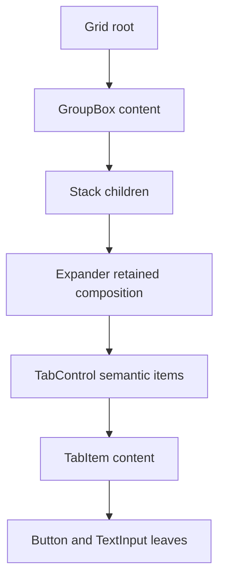

# Component behavior coverage design

## Purpose

Make the mounted `ComponentSurface` suite prove the observable behavior of every
exported concrete `Control`. The suite will drive real terminal input through
`Application`, not call focus, routing, pointer-state, or protected control
methods directly. It will cover individual controls, mixed siblings on one root,
and focusable descendants across multiple ownership levels.

The finished suite must prove mouse hover and hover removal, focus transfer,
forward and reverse Tab navigation, contract-defined arrow navigation, pressed
and released state, activation, and cleanup. A behavior that does not apply to a
passive control requires explicit negative evidence rather than an unexplained
omission.

## Current-state finding

The mounted surface harness and twenty control-family fixtures already exist,
but the control test project does not currently compile. The control
architecture merge replaced APIs including `State`, `FillMode`, `Style`, public
presentation parts, and the former tab-selection surface while retaining tests
written against those APIs. The merge also added `Prism`, removed the
`TabControlSurfaceTests` file, and left six public control types explicitly
deferred in `ComponentSurfaceCoverageTests`.

This is one reconciliation problem, not a reason to restore the retired API.
Phase zero will align the existing tests with the current documented contracts
before new coverage is judged. Unrelated worktree changes remain outside this
design and must not be overwritten.

## Alternatives

### Capability catalog plus focused fixtures

Use an executable catalog to state each control's required behavioral evidence,
retain focused per-control surface fixtures, and add dedicated composition
journeys. This is the selected approach. It guards the public catalog while
keeping failures local to the control and behavior that regressed.

### Generic factory conformance suite

Construct every control through factories and run one shared interaction
sequence. This reduces repeated test code but erases important differences
between passive, pressable, directional, collection, and transient controls.
Failures also become difficult to interpret, and complex controls require
unnatural test-only construction.

### Showcase-only journeys

Drive the complete gallery as the sole behavioral oracle. This is realistic but
brittle: showcase layout and navigation obscure the control that failed, and a
gallery page cannot efficiently enumerate held state, cancellation, disabled
state, or tiny bounds. Showcase tests remain complementary product evidence, not
the component conformance suite.

## Complete public catalog

The executable catalog will contain every exported, non-abstract type derived
from `Control`; it will permit no deferred set. The current catalog is:

- display and effects: `Text`, `FigletText`, `Prism`, `ProgressBar`, and
  `Separator`;
- layout and content: `Canvas`, `Dock`, `Grid`, `Overlay`, `Stack`, `GroupBox`,
  and `Expander`;
- direct input: `Button`, `CheckBox`, `RadioButton`, `TextInput`, `ComboBox`,
  and `ScrollBar`;
- collections and navigation: `List`, `Table`, `TabControl`, `TabItem`,
  `NavigationView`, `NavigationViewGroup`, `NavigationViewItem`, and
  `NavigationViewSeparator`;
- menus and transient layers: `Menu`, `MenuItem`, `MenuSeparator`, `Popup`, and
  `Window`.

Abstract authoring roles, collection objects, builders, and private presentation
controls are proved through their exported concrete owners. A new exported
concrete control will fail the catalog test until its required capabilities and
named evidence are added.

## Executable evidence model

The test-only catalog will map each control to its named surface fixture and
required capability flags. Evidence metadata on test methods will let the
catalog assert that every required flag has at least one mounted scenario. The
flags are:

- mounted rendering;
- pointer hover or explicit hover exclusion;
- mouse focus or explicit focus exclusion;
- forward and reverse Tab navigation or explicit Tab exclusion;
- directional keyboard behavior where the control contract assigns arrows;
- pointer press, held state, release, and cancellation where press applies;
- keyboard press and release where the control contract exposes held keyboard
  state;
- semantic activation or selection;
- disabled, hidden, or collapsed exclusion and cleanup;
- transient open, containment, dismissal, and restoration where applicable;
- composition evidence through public ownership roles.

The catalog checks evidence presence, not correctness by naming convention. Each
scenario still asserts public state, event order, focus or capture, exact
semantic cells where appearance matters, and terminal output. Whole-surface text
is a reviewable geometry oracle and never the only assertion.

Passive controls must prove that pointer motion does not make them semantic
hover or focus targets. Container-like controls prove that interactive
descendants still receive input through their layout and clipping. Arrow keys
are tested according to the control contract: for example, they move caret or
selection in `TextInput`, move current items in lists and menus, switch radio or
tab choices, adjust `ScrollBar`, and do not escape the owning component.

## Harness changes

`ComponentSurface` remains the mounted browser-like boundary. It already accepts
any detached root, so mixed and nested trees do not need a second test
framework. The harness will grow only where a failing public scenario requires
it:

- `ComponentKeyboard` will encode Shift+Tab, Escape, and distinct Kitty key
  press and release actions so held and released keyboard state can be observed;
- `ComponentPointer` will support pointer leave, absolute host-background
  movement, and held movement between different owned controls;
- `ComponentSurface` will expose dispatcher-safe assertions for the publicly
  focused control, capture owner, effective hover path, and transient layers;
- mounting and action diagnostics will identify the active root, focused
  control, capture owner, pending invalidation, and latest semantic screen;
- every action will wait for input consumption, dispatcher drain, committed
  layout, rendering, transport application, and idle without wall-clock sleeps
  or retry-to-green behavior.

Helpers must validate before emitting input and must not expose production
internals merely to make tests convenient.

## Individual control scenarios

Each control family retains a focused `*SurfaceTests` fixture. Tests will add
only cross-layer evidence; pure validation and exhaustive algorithms remain in
unit tests.

Pressable controls will expose the full state sequence:

1. pointer movement commits hover without activation;
2. primary press transfers focus and commits `Pressed`;
3. held movement outside cancels `Pressed` without activation;
4. re-entry restores held state when the contract permits it;
5. release inside activates once and commits the unpressed state before the
   semantic event;
6. release outside, disable, collapse, removal, capture loss, and terminal focus
   loss clear held state without a spurious activation.

Focusable controls will prove pointer focus, forward Tab, reverse Tab, disabled
skipping, and focus appearance. Directional controls will prove their exact
arrow policy, wrapping or clamping, disabled-item skipping, event ordering, and
that handled arrows do not move focus to an unrelated sibling.

Menus, `ComboBox`, `Popup`, and `Window` will no longer be deferred. Their
mounted scenarios will prove open state, initial focus, focus containment, arrow
navigation, hover/current separation, activation, outside-click and Escape
dismissal, capture cleanup, and documented focus restoration. A transient child
must remain in the same real `Application` path as its owner.

## Mixed-root composition journey

`ComponentCompositionSurfaceTests` will mount one ordinary root containing at
least a `Button`, `CheckBox`, radio group, `TextInput`, `List`, and `ScrollBar`.
The test will drive one continuous user journey rather than mounting each
control separately:

1. Tab from the neutral host visits every eligible control in exact tree order;
2. Shift+Tab visits the same controls in reverse order;
3. a disabled control is skipped in both directions;
4. arrows change state inside radio, editor, list, and scrollbar controls while
   unrelated focus remains unchanged;
5. pointer movement transfers hover between siblings and clears the old path;
6. press shows focused and held state on exactly one semantic owner;
7. release clears `Pressed` before one activation event;
8. clicking another component transfers focus without leaving stale hover,
   capture, or pressed state;
9. final screen cells and event order agree with all committed public state.

This journey proves inter-component coordination that isolated fixtures cannot.

## Nested composition journey

A second journey will use at least four ownership levels and all public
composition roles:

The journey will prove hit testing through every ancestor clip, exact Tab entry
and exit, arrow handling inside semantic item owners, pointer activation through
private presentation children, and correct focus-within state on ancestors.
Collapsing or removing an ancestor that owns the focused or captured leaf must
repair focus and capture before the mutation returns. Re-expansion must not
retain stale hover or pressed state. A sibling outside the nested subtree must
remain reachable in both Tab directions.

## Documentation and showcase agreement

The implementation will update the normative
[`ComponentSurface` testing contract](../../testing/controls-integration.md#mounted-component-surfaces)
and link each affected control's test obligations to the new mounted evidence.
Control documents remain the authority for whether hover, focus, arrows,
pressing, containment, dismissal, or restoration applies. Showcase pages and
screen tests will be updated only when a discovered product correction changes
observable behavior.

No control will be claimed covered solely because its type appears in the
catalog. No documented behavior will be weakened to preserve stale snapshots.

## Delivery order

1. Reconcile the merged test suite with the current public and internal API
   until the test project builds without restoring retired surfaces.
2. Add the executable capability and evidence catalog with all current controls
   and no deferrals.
3. Extend keyboard, pointer, focus, capture, and transient-layer harness support
   test-first.
4. Complete missing individual fixtures, including `Prism`, `ComboBox`, menus,
   popup, and window.
5. Add the mixed-root journey.
6. Add the nested ownership journey.
7. Update normative test obligations, affected control docs, and showcase proof.
8. Run focused fixtures followed by `make format`, `make lint`, `make build`,
   and `make test`.

Every production correction follows a visible red-green cycle. The smallest
failing mounted scenario is run before the correction, then the focused fixture,
nearest unit and showcase tests, and finally the repository gates are run after
the correction.

## Completion criteria

The work is complete only when:

- every exported concrete `Control` is present in the executable catalog with no
  deferral;
- every required capability has named mounted evidence;
- hover, focus, Tab, contract-defined arrows, press, and release are proved
  positively or excluded explicitly according to the control contract;
- mixed siblings complete the continuous root journey without stale focus,
  hover, capture, pressed state, or incorrect event order;
- four or more ownership levels complete the nested journey and repair input
  state correctly when ancestors change;
- transient controls prove containment, dismissal, cleanup, and restoration;
- discovered product defects retain focused regression tests;
- normative docs, XML documentation, tests, and showcase behavior agree; and
- all four repository quality gates pass with zero warnings, zero errors, and
  the configured minimum test counts.
