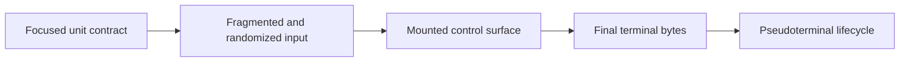

# Testing specifications

## Test map

Tests prove public behavior at increasing distances from the implementation. The
farther-right checks are slower but observe more of the real stack.

No single level replaces the others: exact-byte tests do not prove routed
control behavior, and an end-to-end test is a miserable place to diagnose a
small geometry rule.

- [Correctness model](correctness-model.md#correctness-model)
- [Public API compatibility](correctness-model.md#public-api-compatibility)
- [Continuous integration](continuous-integration.md#continuous-integration-contract)
- [Terminal protocols](terminal-protocols.md#terminal-protocol-testing)
- [Unicode and rendering](unicode-rendering.md#unicode-and-rendering-testing)
- [Rendering equivalence](rendering.md#rendering-equivalence-testing)
- [Controls and integration](controls-integration.md#control-and-integration-testing)
- [Randomized testing](randomized.md#randomized-testing)
- [Pseudoterminals](pseudoterminals.md#pseudoterminal-testing)
- [Performance](performance.md#performance-testing)
