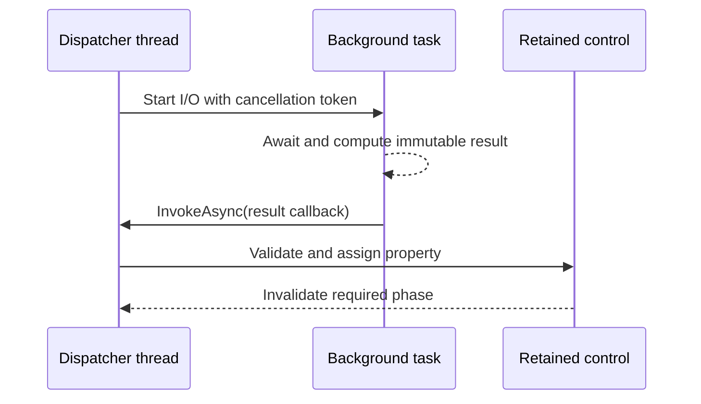

# Background work and the dispatcher

An attached control tree has one owner: `Application.Dispatcher`. Terminal
readers and background tasks may compute or perform I/O elsewhere, but they must
return immutable results to that dispatcher before touching controls.



## Load data without crossing the ownership boundary

```csharp
private async Task RefreshAsync(Application application, CancellationToken cancellationToken)
{
    _status.Content = "Loading…";

    try
    {
        var names = await Task.Run(
            () => LoadNames(cancellationToken),
            cancellationToken).ConfigureAwait(false);

        await application.Dispatcher.InvokeAsync(() =>
        {
            _list.Items = names;
            _status.Content = $"Loaded {names.Count} items";
        }, cancellationToken);
    }
    catch (OperationCanceledException) when (cancellationToken.IsCancellationRequested)
    {
        await application.Dispatcher.InvokeAsync(
            () => _status.Content = "Cancelled",
            CancellationToken.None);
    }
}
```

`names` crosses the boundary as an ordinary immutable/snapshot value. The worker
never reads or writes `_list` or `_status`. `InvokeAsync` propagates the
callback's result, cancellation, or original exception. Use `Post` only for
fire-and-observe work whose failure should follow the dispatcher's unhandled
exception policy.

## Periodic UI work

`DispatcherTimer` coalesces periods and raises `Tick` on its dispatcher:

```csharp
var timer = new DispatcherTimer(application.Dispatcher, TimeSpan.FromSeconds(1));
timer.Tick += (_, _) => clock.Content = DateTimeOffset.Now.ToString("T");
timer.Start();
```

Dispose the timer with its owner. Delayed periods are skipped instead of
replayed as a burst. The exact queue capacity, shutdown, reentrancy, timer, and
idle rules live in [threading](../concepts/threading.md#overview) and the
[runtime event loop](../architecture/runtime-event-loop.md#iteration-order).

Next, use
[capability-gated terminal services](terminal-services.md#use-terminal-services).
